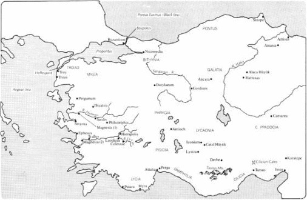

I. The Country
--------------

The term “Asia Minor” does not occur in the Bible, nor is
it known from Bible times. As a Latin phrase in its modern sense it is
first extant in Orosius (5th cent a.d.), though a Greek counterpart goes
back to Ptolemy in the 2nd century. The land to which this name has been
applied, however, plays an important part in some periods of Bible
history, and a central part in the history of the earliest Christian
mission. The term is now commonly used of the peninsula that forms the
western half of modern Asiatic Turkey, approximately W of a line from
Amisus (modern Samsun) on the Black Sea southward to the Gulf of Issus
at the northeast corner of the Mediterranean. This includes all the
countryW of about longitude 36°E; it excludes such places in eastern
Turkey as Mt. Ararat and northern Mesopotamia.

The only early name for this peninsula was the ambiguous “Asia” (later
also Gk *Anatolē*, the “east land,” whence the Byzantine and modern
“Anatolia”). The term “Asia” in different times and contexts could
variously denote the continent, the whole peninsula, or a much smaller
area on its western seaboard. The qualification “Asia Minor”
distinguished the peninsula from the continent, but this name must be
very carefully distinguished in turn from the “Asia” of the NT, which is
normally to be equated with the Roman administrative province often
known as “proconsular Asia” in the West.

### General Description ###

The country forms an elevated land-bridge
between central Asia and southeastern Europe, shaped and structured
rather like a human hand stretching west. The central plateau, like the
hollow of the palm, is bordered by a rim of coastal mountains along the
Black Sea (Pontus Euxinus) to the north and another along the
Mediterranean to the south. Eastward, too, the ranges converge into the
highland block of Armenia. West of the central plateau longitudinal
mountain ridges extend W like fingers, divided by fertile E-W river
valleys and terminating in a raggedly indented western coastline. At the
northwest corner the peninsula is separated from Europe by the Bosporus,
the Sea of Marmora (Propontis), and the Dardanelles (Hellespont).

The high central tableland lies at an altitude of 3000 to 4000 ft (900
to 1200 m), stretching across large parts of Galatia, Lycaonia, and
Cappadocia. There is much internal drainage into seasonal swamps and
ultimately into the great central depression of the salty Lake Tatta
(Tuz Gölü). The more important rivers cut their way outward through gaps
in the mountain rim. They flow mostly to the north and west: the plateau
is tilted down to these sides, and the mountains there are not so high
as the Taurus on the south and southeast. The Taurus closely follows the
contour of the south coast for most of its length, receding only where
the fertile coastal plains of Cilicia and Pamphylia interpose. It
reaches an average height of 7000 to 10,000 ft (2100 to 3000 m), but
rises to 12,000 ft (3600 m) in the hinterland of Cilicia. There are no
sizable plains below the mountains of Pontus in the north, and Sinope
offers the only sheltered anchorage of that inhospitable coast. Only on
the west is the ascent from the littoral to the plateau more gradual.
Here the river valleys of the Caicus, Hermus, Cayster, and Maeander with
their tributaries provide easy access through the Phrygian mountains to
the western edge of the plateau. These western coastlands resemble
Greece and its islands. In fact the chain of islands across the Aegean
Sea encouraged very early navigation between East and West. Greece and
Asia Minor had close relations from the earliest times.

Other major geographical features of the country are less immediately
important for the understanding of its history. Its highest mountain is
actually Mt. Argaeus (*Erciyas Daǧ*), rising almost in isolation to
12,548 ft (3823 m) near Caesarea in Cappadocia (Kayseri). The longest
river is the Halys (*Kizil Irmak*), which describes a huge bend before
escaping NE from the plateau through narrow gorges to the Black Sea. Its
valley offers no important routes. There are also notable lakes, both of
fresh and salt water, especially to the southwest, near the northern
edge of the Pisidian Taurus. These include the Limnae (*Eǧridir Gölü*)
and Lake Caralis (Beyşehir Gölü).

This brief description will give some idea of the diversity of the land,
which has remarkably varied climate and scenery. It also highlights the
fact that Asia Minor has rarely functioned as a political or cultural
unit. The western coast belongs to the Aegean world and enjoys a
typically Mediterranean climate. The plateau is largely dry and empty,
with extremes of temperature, locally diversified with ranges of bare
hills. Ancient irrigation doubtless improved this land, but it remained
largely a rural and static area, relatively slow to accept western
influences. The northern and southern coasts had largely independent
histories, both being almost isolated by their mountainous hinterlands.
Communication was by sea. The grain and metals of the southeastern
shores of the Black Sea attracted Greek commerce and colonization
despite the perils of the Straits and the treacherous storms of this
exposed coast. In the warm Mediterranean South, Pamphylia and Cilicia
prospered, but the latter had closer contact with the Semitic lands to
the southeast. While eastern Pontus had a mild and very wet climate with
prolific harvests, the highlands of the interior suffered long winters
of extreme severity.

### Routes ###

The predominantly E-W grain of the country has determined
the course of its principal roads and profoundly influenced the whole
pattern of its history. The easiest route from the Euphrates went by
Caesarea and Laodicea Combusta (Lâdik) to Apamea (Dinar), and then down
the gentle gradient of the Lycus (Çoruk Su) to the more famous Laodicea
(Col. 4:13f; Rev. 3:14–22). Thence the broad valley of the Maeander
(Büyük Menderes) led to the western ports of Miletus and Ephesus. An
important branch of the road ran from the Lycus-Maeander confluence to
the old western metropolis of Sardis, and thence down the Hermus (Gediz
Nehri) to Smyrna. A further branch led to Pergamum at the time when that
city achieved its political ascendancy.

Though this route and its ramifications marked the natural path of
trade, political considerations dictated the use of a more northerly
route over rougher gradients in early times to link the Hittite capital
of *Ḫattusas* (*Bogǎzköy*) with Sardis and the Aegean ports. This was
the course of the later Persian “Royal Road,” which thus reflected the
political realities of a much earlier time.

The few passes through the Taurus were of special importance. The famous
road through the Cilician Gates linked Tarsus and Syria with the
interior of Asia Minor and joined the great trade route westward. A
corresponding outlet to the Black Sea ran through Amasia (Amasya) to
Amisus.

The Roman peace led to a great development of the road system. An
important branch of the central route ran through Iconium and Pisidian
Antioch to Apamea, but was vulnerable to attack by the Pisidian
brigands. Augustus based on Antioch a chain of new military “colonies,”
including Lystra, linked by a military road (6 b.c.). Many of these
routes mentioned were used by the earliest Christian mission. Later the
roads NW from Ancyra (Ankara) and Dorylaeum (Eskişehir) became more
important when the political focus moved to Byzantium.

The Roman peace also opened the seas. The pirates were cleared from the
rugged western section of Cilicia. The ports of Asia Minor began to play
an important part in the new systems of integrated communication which
focused on Rome. Navigation was always essentially seasonal, and
depended on the regularity of the north and northwest winds of the
Eastern Mediterranean summer. The Aegean crossing, the coasting traffic,
and the region of the Straits all assumed a new importance. The
artificial harbor at Troas gave needed shelter near the mouth of the
Hellespont, and the crossing to Neapolis (Kavalla) in Macedonia linked
with the Egnatian Way, the principal route from Rome to the East. And in
Paul’s time Claudius (a.d. 41–54) organized the Alexandrian grain fleet
to supply Rome. Its ships beat against the wind from Egypt to gain the
shelter of Patara or Myra on the southern coast of Asia Minor (cf. Acts
27:5f). These aspects of travel illustrate further the setting of the NT
journeys.

II. History
-----------

### Early Times ###

Asia Minor has always been a bridge between peoples,
a land subject to new invaders and influences, which have repeatedly
left a lasting mark. It has rarely been the seat of a homogeneous
political unit.

Its history begins with one of the oldest town sites in the world,
recently excavated at Çatal Hüyük near Konya. The excavation revealed
remarkable Neolithic wall paintings of the 7th millennium b.c. In the
3rd millennium notable Bronze Age cultures appeared at Troy in the west
and at Alaca Hüyük, over 100 mi (160 km) ENE of Ankara, where the people
properly called *Ḫatti* flourished ca 2500–2000. The Hittites who
succeeded them at nearby *Ḫattusas* were evidently a mixed nation who
appropriated the older name but incorporated an Indo-European immigrant
element. Their empire reached its height ca 1600–1200 b.c. Winckler’s
discovery of the royal archives at *Ḫattusas* in 1906 opened a new
chapter of history. The Hittites emerged as one of the great empires of
the day, with a complex history of foreign relations with Egypt and the
Mesopotamian kingdoms. The great Assyrian trading colony at Kültepe
(Kanesh) near Kayseri had flourished even earlier (ca 1900 b.c.). Its
cuneiform tablets are the earliest samples of writing yet known from
Anatolia.

The latest phase of Hittite civilization shifts its focus to the
southeast and to Syria, where it continued into the 1st millennium. This
phase preserved the language known as “hieroglyphic Hittite,” distinct
from but resembling the Indo-European “cuneiform Hittite” (properly
Nesian), which had been the principal language of the older empire. An
important bilingual inscription of the 8th cent, in hieroglyphic and
Phoenician, has been found at Karatepe in eastern Cilicia. The study of
the several early Anatolian languages now known from the Hittite sites
is a valuable and expanding source of knowledge of the ancient Near
East. *See* Hittites.

### Phrygians, Lydians, Persians, and Greeks ###

The end of the 2nd
millennium was a time of confusion and migration. Troy was destroyed.
Phrygian and Bithynian immigrants arrived from southeastern Europe.
Greek colonial settlement began on the west coast at places like Miletus
and Ephesus, and subsequently spread from them to the Straits and the
Black Sea.

The kingdom of Phrygia was finally established in the 8th cent in an
extensive area around the west side of the central plateau, and the name
and language long persisted there. The political ascendancy of Phrygia,
centered on its capital at Gordium, was relatively short-lived, but it
made a deep impression on the early Greeks, and its king Midas loomed
large in Greek tradition.

About 700 Lydia, centered upon Sardis in the west, replaced Phrygia as
the leading power. Gyges, the traditional founder of its dynasty, became
a proverb for aggression and has been considered the prototype of
Ezekiel’s Gog (Ezk. 38–39; cf. Rev. 20:8). The last and most famous of
the Lydian kings was Croesus (ca 560–546), whose name is still
proverbial for wealth. He conquered the Greek cities of the west coast,
but then treated them generously, inaugurating a new temple of Artemis
at Ephesus. (Smyrna had earlier been destroyed by his father Alyattes.)
Yet the formidable citadel of Sardis itself fell unexpectedly to Cyrus
of Persia in 546. It became a classic example of pride before a fall:
Croesus had neglected to watch (Herodotus i.84; cf. Rev. 3:3). *See*
Sardis.

The fall of Sardis brought Persia to the Aegean. The city now became the
western metropolis of the new empire, and evidently an early and
principal seat of the Jewish Dispersion; it was probably the “Sepharad”
of Obad. 20. The land was now assigned to satraps (provincial governors)
or to native princes or Greek dynasts who recognized the suzerainty of
Persia. The repulse of the Persian attack on Greece under Xerxes in
480/479 gave freedom to the Greek cities of Asia Minor during the time
of Athenian greatness, but Sparta yielded them back to Persia in 386.

### From Alexander to the Romans ###

Alexander the Great crossed the
Hellespont in 334, winning all Asia Minor from the weakened control of
Persia after decisive battles at the Granicus in the far northwest in
334 and at Issus in 333. He briefly united the whole country under Greek
rule and began the eastward spread of Greek language and civilization.
But his premature death in 323 brought new power struggles between his
generals, the Successors (Diadochi). Most of Asia Minor fell initially
to Antigonus, but he was defeated and killed by his rivals at Ipsus in
Phrygia in 301. The country then became divided between Lysimachus of
Thrace and Seleucus, who held the remnants of Alexander’s conquests in
the East. Lysimachus was active in the West, resiting Ephesus and
refounding Smyrna, and fortifying Antigonus’ seaport foundation of
Alexandria (Troas). In 281 Seleucus defeated and killed Lysimachus at
Corupedium in Lydia, but his successors, the Seleucid kings of Syria,
lost something of the ascendancy he had won in Asia Minor. New dynasties
arose, first in Bithynia in the northwest, then at Pergamum, where
Philetaerus, the custodian of Lysimachus’ war treasure, had rebelled in
282 and placed himself under Seleucid protection.

In 278 Nicomedes I of Bithynia brought a Celtic army across the Bosporus
as allies, but they escaped his control and terrorized large tracts of
Asia Minor for many years until finally restricted to a territory on the
north-east side of Phrygia, around Ancyra and the bend of the Halys.
This land of the Gaulish Celts was named “Galatia” (the Greek for
“Gaul”). Gaulish speech persisted there in the time of Jerome (4th cent
a.d.).

The initially insignificant principality of Pergamum came to play a
focal part Attalus I (241–197) defeated the Gauls and assumed the titles
King and Soter (“savior”), giving his name to the Attalid dynasty. He
and his successors Eumenes II (197–159) and Attalus II Philadelphus
(159–138) raised Pergamum almost to a great power, but at the cost of
bringing Rome to Asia and finally becoming subservient to her. Only Rome
could curb the ambition of the Seleucid Antiochus III the Great
(223–187). When his power was broken at Magnesia (Manisa) in 190, the
Romans gave the government of a vast tract of country to their ally
Eumenes. In 133 Attalus III, the last king of Pergamum, bequeathed his
kingdom to Rome. The Romans organized their wealthy province of Asia
from its territory.

The policies and achievements of the Seleucids and Attalids had a great
bearing on the political, religious, and social conditions of the land
in NT times. Both dynasties were great founders of cities. The Seleucids
peopled the area with cities called Antioch, Seleucia, Laodicea, or
Apamea from their recurring dynastic names. They gave special privileges
to the Jews, both in the cities that they founded and in existing towns
like Tarsus and Ephesus, to which they granted new constitutions.
Antiochus III, according to Josephus (*Ant.* xii.3.4), settled two
thousand Jewish families from Mesopotamia in Lydia and Phrygia.

Thyatira and Philadelphia were Attalid frontier cities at successive
stages of the expansion of Pergamum. The Attalids developed centrally
the resources of their kingdom: they had the timber and metals of the
Troad and the command of the Hellespont. They also made state religion
an instrument of policy, exploiting more deliberately than some of the
other Hellenistic monarchs the oriental tendency to ascribe divinity to
rulers. They made of Pergamum a brilliant focus of religious
architecture, culture, and art. Later a strategic road extension SE from
Laodicea on the Lycus gave them a south coast port at Attalia in
Pamphylia (modern Antalya).

After 133 the rich new province of Asia was ruthlessly plundered by
Roman officials. About 102 the province of Cilicia was organized in
southern Asia Minor to safeguard the way to the East, though its sphere
at first did not even include the land of Cilicia proper. Mithridates VI
the Great of Pontus (115–63) emerged as Rome’s most formidable and
persistent antagonist: in 88 he briefly overran most of Asia Minor, and
was welcomed widely as a liberator. Nicomedes IV of Bithynia bequeathed
his kingdom to Rome in 74, and it became another province. Pompey
finally overthrew Mithridates and established Rome’s position in the
East. He added much of Pontus to the province of Bithynia.

Augustus brought the benefits of peace to Asia Minor and won spontaneous
acclaim there. He continued the policy of exercising influence through
native dynasties until the time was ripe for direct Roman rule of a
territory. When the client-king Amyntas of Galatia was killed fighting
the Homonades, a tribe on his southern border, in 25 b.c., Augustus made
a province of his kingdom, an area which then extended far S of the
Celtic homeland. Cappadocia was annexed in a.d. 17. There were many
subsequent major or minor alterations of the provincial boundaries. The
most important was by Vespasian, who after a.d. 72 combined Galatia with
Cappadocia into a strategic military command.

III. Asia Minor in the Old Testament
------------------------------------

Though this land lay within the perspective of the early biblical
nations it played only a peripheral part in the OT. There are scattered
references to places and peoples which may with more or less confidence
be identified here.

The most important and obvious link is with the Hittites, a people first
known from the OT. But the OT refers explicitly only to the Hittites of
Syria and Palestine, who persisted later than the Hittites of the empire
in Anatolia. Yet indications of their wider importance are not lacking.
The “sons of Heth” appear in Gen. 10:15. Their early greatness emerges
in Josh. 1:4. “Tidal king of Goiim” (“nations,” Gen. 14:1) seems to bear
a Hittite name, Tudhalias. *See* Hittites.

The repeatedly associated Meshech and Tubal (Gen. 10:2; etc.) evidently
denote nations of Asia Minor, and are referred to the Moschi and
Tibareni of Herodotus. Javan suggests the Ionians (Greeks) of the
distant coastlands (Gen. 10:2, 4; Isa. 66:19), Lud perhaps the Lydians.
Tarshish is much disputed; it is possible that in at least some places
it denotes Tarsus. These are all thought to have been ancient indigenous
names. We have already noted possible later references in Gog and
Sepharad.

The migrations of the disturbed period at the end of the 2nd millennium
have probably left their indirect mark on the ethnography of the OT. The
“sea-peoples,” who included the Philistines, evidently came from or
through the Aegean or Anatolian coastlands.

IV. Asia Minor in New Testament Times
-------------------------------------

The country was now a political and ethnic complex with
little intrinsic unity. There were old indigenous nations, whose lands
were designated by traditional names still in current use: Lydia, Mysia,
Phrygia, Pisidia, Lycaonia, etc. There were also Roman political
divisions, which sometimes cut very arbitrarily across the natural
ethnic boundaries. Some terms, notably “Galatia,” present special
difficulty, often because they had two or more senses.

The predominant language at this time was Greek, and almost all the
literate remains are in Greek or Latin. The western and coastal areas
were thoroughly hellenized, but Greek had not ousted native languages
from the remoter parts. Lycaonian was still the popular speech of Lystra
(Acts 14:11), and Phrygian and Celtic were spoken even later. In this
hinterland Hellenism was only superficial.

Roman rule continued to favor Jewish settlement, despite anti-Semitic
outbreaks at Ephesus and elsewhere. The presence of flourishing
synagogue communities in many cities attracted Gentiles who sought a
purer monotheism, and opened the way for the Christian mission. A very
rich and important synagogue of the 3rd cent a.d. has been excavated in
Sardis.

### Life and Religion ###

Greek city life in Asia Minor was superimposed
on a very different Anatolian substratum. The ancient village system had
been theocratic and matriarchal, centered on the temple, where the god,
through his priests, exercised a close supervision over his people. The
ancient gods and goddesses in whom the power and fertility of nature
were embodied and localized became fused with Olympian Greek deities,
but their alien character persisted. The goddess of Ephesus or of Sardis
was represented by a grotesque image very different from the virgin
huntress Artemis (Diana) by whose name she was called.

The unit of Greek life was the city. Thousands of surviving inscriptions
and the coins of scores of cities testify to the activities of civic
life. The city was an intricately organized entity in which citizenship,
business, social life, and religion were interwoven. The trade guilds,
for instance, often sponsored religious festivals or public
benefactions, whose pagan basis posed problems for the Christian whose
livelihood might depend on membership.

The vaunted privileges of the cities depended on the goodwill of Rome
(cf. Acts 19:40). There was spontaneous gratitude for the peace and the
facility of travel and trade that the Augustan empire had brought.
Emperor worship was the natural result, at first sanctioned only
reluctantly. Temples of Rome and Augustus were first established at
Pergamum and at Nicomedia in Bithynia (29 b.c.). Only later,
particularly under Domitian (a.d. 81–96), did the enforcement of this
cult become a matter of Roman policy.

### Paul ###

Paul was born in Tarsus, a great cosmopolitan university
and commercial city, the capital of Cilicia. Though his education may
have owed more to Jerusalem than to Tarsus, he returned there some time
after his conversion (Acts 9:30), and his subsequent travels were
largely directed to the evangelization of Asia Minor. The country thus
became a principal center of the earliest Christianity, especially when
it was displaced from Jerusalem and not yet established in Rome. A high
proportion of the NT Epistles was written to or from localities in this
land.

Paul’s first journey took him and Barnabas over the dangerous Pisidian
Taurus mountains from Perga in Pamphylia to Pisidian Antioch (Yalvaç),
and thence through Iconium (Konya) to Lystra and Derbe, in Lycaonia.
Lystra is beside Hatunsaray; the location of Derbe was identified in
1956 at Kerti Hüyük, N of Karaman. This visit marks Paul’s first coming
to provincial Galatia (cf. Gal. 4:13). He usually found an opening
through the synagogue, but at his unintended visit to Lystra he
encountered the native religious system.

The second journey went overland, doubtless by the Cilician Gates, to
revisit the same district. The route entailed crossing a section of the
land still held by the client-king Antiochus IV of Commagene. The
subsequent itinerary has been the subject of controversy. “The Phrygian
and Galatian country” (Acts 16:6), if so rendered, probably refers to
the Phrygian district which overlapped the provincial boundary of
Galatia and included Iconium and Pisidian Antioch. This concurs with the
belief that Paul’s dealings with “Galatia” were wholly with the southern
part of the extended province. This view permits an early dating of the
Epistle (ca 48/49) and a natural integration of the biographical
evidence of Gal. 1–2 with the sequence of Acts: it immediately preceded
the Council in Jerusalem. *See* Galatia.

“Asia” in Acts 16:6 was also in current usage the Roman province
(*contra* E. Haenchen, *Acts of the Apostles* [Engtr 1970]). Paul must
have seen it as a strategic target, one of the most prosperous and
sophisticated parts of the Roman world, a focus of Greek culture, whose
greatest cities had hundreds of thousands of people. Mysia and Troas lay
within Asia; the ban on preaching there did not preclude crossing the
territory. From perhaps Dorylaeum, near the border of forbidden
Bithynia, he travelled W to Troas. This was a strategic point (cf. 2
Cor. 2:12; etc.), for it was from here that Paul started for Europe,
though this is not stressed in Acts. On his return to Jerusalem, he
stopped only briefly at Ephesus (Acts 18:19–21).

Paul subsequently resided more than two years in Ephesus (ca 52–55), and
all Asia heard the word of the Lord (Acts 19:10). He reached the city
“through the upper country” (19:1), possibly by a direct hill-road that
bypassed the great crossroads of Laodicea. This accords with the
probable implication of Col. 2:1 that he had not at that date visited
the Lycus cities. The Ephesian residence and its aftermath were the
occasion of the Corinthian correspondence, and ended after a time of
special danger (cf. 1 Cor. 15:32; 2 Cor. 1:8, 10) in a journey N to
Troas *en route* again for Macedonia (2 Cor. 2:12f; cf. Acts 20:1).
*See* Ephesus. Paul returned by a coasting ship in haste to be at
Jerusalem for Pentecost. He gave Troas the longest time possible, but
then went past Ephesus, perhaps because of prospective delays in
negotiating the silting port, and called the Ephesian elders to Miletus.

Paul’s last recorded visit to Asia Minor was on his voyage as a prisoner
to Rome. The ship clung to the shores of Cilicia and Pamphylia, where a
westward coastal current offsets the northwest winds. At Myra in Lycia
the party transferred to a ship of the Alexandrian grain fleet (Acts
27:5).

The Epistles provide evidence for Paul’s later dealings with the
churches of this land. Philem. 22 shows that Paul had some hope of
visiting Colossae after release from imprisonment. In my opinion, Paul
wrote Philemon from Rome. On the hypothesis that he was in fact released
after two years, the references to Ephesus and to Troas and Miletus in
the Pastorals suggest that he had then revisited them all.

The geographical perspective helps in resolving the vexed questions
surrounding the relation of Acts with the Epistles and the reliability
of Acts itself. The classic case is the question of the usage of the
term “Galatian”: the “South Galatian” view adopted here interlocks
fruitfully with Acts. Ephesians, Colossians, and Philemon are ostensibly
linked. Ephesians may have been an encyclical to the churches of Asia,
delivered first in Ephesus and ending its course as the “letter from
Laodicea” that Paul commended to nearby Colossae (Col. 4:16). Laodicea
was then the principal city of the district and overshadowed its close
neighbors Hierapolis and Colossae (cf. Col. 4:13). All three were
important in the early Church, but Colossae (near Honaz), now deserted
and unexcavated, was the destination of two Epistles (Colossians and
Philemon). According to 1 Tim. 1:3 Paul left Timothy, himself probably a
native of Lystra (Acts 16:1), at Ephesus, and at least the first letter
was ostensibly sent there to him. Some or all of the Captivity Epistles
have often been ascribed to a hypothetical imprisonment in Ephesus, but
this is questionable.

### Peter and the General Epistles ###

1 Peter is addressed to the
“Dispersion” in Pontus, Galatia, Cappadocia, Asia, and Bithynia (1 Pet.
1:1). These names are all to be taken in their provincial sense.
Bithynia, though forbidden to Paul, must have received the gospel early.
The Roman governor Pliny found Christianity in great strength in Pontus
(rather than Bithynia proper) ca a.d. 110 (Pliny Ep x.96). F. J. A. Hort
argued long ago that the list in 1 Peter represents the sequence of
Silvanus’ projected route. The present writer has suggested that this
probably involved using the important road from Amisus on the Pontic
coast through Amasia in Pontus Galaticus, in the eastern part of what
was then the province of Galatia. This suits the provincial terminology
used before Vespasian’s reorganization. It also suggests that the Celtic
territory of North Galatia was not in view here any more than elsewhere
in the NT, for the continuation of Silvanus’ route to Asia presumably
crossed the Pauline districts of the south.

On any view of 2 Peter it seems that 2 Pet. 3:1 is intended to refer to
1 Peter and to imply a destination among the same recipients in Asia
Minor. This cannot, however, be used to shed light on the destination of
Jude.

### Johannine Literature ###

This literature poses complex problems,
but strong traditions link both the Fourth Gospel and the Epistles with
Ephesus. Irenaeus is explicit in locating the Gospel there (*Adv. haer.*
iii.l.2). The First Epistle combats a form of Docetism which is often
referred to John’s traditional opponent Cerinthus at Ephesus. It is
hazardous to argue an Asian setting from such other supposed parallels
as Nicolaitanism or the teaching opposed by Paul at Colossae.

### The Revelation ###

The book is addressed to “the seven churches of
Asia” (Rev. 1:11; 2–3). These were certainly not the only churches of
the province. Geographical considerations confirm Ramsay’s suggestion
that these seven were chosen as the best postal stages for the whole
Church in Asia, placed in sequence along the messenger’s route. On
landing from Patmos at Ephesus he went N to Smyrna (*İzmir*) and
Pergamum (Bergama), and then turned SE along the great road through
Thyatira (Akhisar) and Sardis (Sart, near Salihli) to Philadelphia
(Alaşehir) and Laodicea (near Denizli). It is possible that this route
had already long been in use for the distribution of Christian letters.
The same concern with communication is relevant to 1 Pet. 1:1 and
perhaps to Ephesians, if that was in fact an encyclical.

The words of Christ in the seven letters are full of OT language applied
to the particular needs of the named churches. They show an intimate
knowledge of the cities of Asia and are rich in local allusion,
reflecting what was probably a situation of impending persecution under
Domitian. The Sardis letter, for instance, recalls the proverbial
unpreparedness of Croesus (Rev. 3:2f), and the Laodicean letter alludes
to the tepid and emetic water of the city’s aqueduct, in contrast to the
scenic hot cascades of Hierapolis (Pamukkale) and the cold water of
Colossae (Rev. 3:15f). More important are the allusions that may shed
light on the larger historical situation of the Church in Asia:
pressures from the new enforcement of the emperor cult and from both
Jewish and antinomian opponents. The Revelation is a classic document of
an obscure phase of church history, and the study of contemporary Asia
is a focal point of approach to it.

### After the NT ###

It is beyond the scope of this article to relate
in detail the later history of the Church in Asia Minor. Yet this land
was so important that extrabiblical personalities and writings obtrude
here on biblical debates. Ignatius of Antioch (ca 115) was escorted
through Asia Minor for martyrdom in Rome, and wrote epistles from Smyrna
to the churches in Ephesus, Magnesia, and Tralles, and later from Troas
to Smyrna and Philadelphia. These letters have an obvious bearing on
three of the churches of the Revelation. W. Bauer has built a precarious
argument from silence here into his view of orthodoxy and heresy in the
early Church. Polycarp, to whom Ignatius addressed another letter, spans
the history of the church in Smyrna from the days of John to his
martyrdom there in extreme old age about a.d. 155. Philip (probably the
apostle) is said to have died at Hierapolis, where also lived Papias,
who transmitted through Eusebius traditions about the apostolic
writings.

**from International Standard Bible Encyclopedia**

