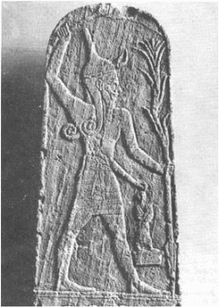

*from International Standard Bible Encyclopedia*

> **Baal** bāʹəl [Heb *ba‘al* \< Bab *Belu*. or *Bel*—‘lord’; Gk *Baal*].
The supreme fertility-god of the Canaanites.

## I. Name

In the Râs Shamrah texts, the first of which were discovered in 1929, the designation “Baal” is found about 240 times either alone or in a compound. The combination *aliyn b‘l*, referring to the same god, is specified about seventy times and mainly in those passages where sacrifices are offered to Baal. The name is most widely employed alone as a title; as such it occurs about 150 times. About twenty times Baal is called Hadad or is used in a compound form of Hadad, the Semitic storm-god of the ancient Near East who was perhaps universally known in the ancient world. Though Hadad (Addu of the Amarna Letters) and Baal were two separate gods, the *Râs Shamrah* tablets indicate no differentiation. The two names are employed as though they belonged to the same god, giving a strong indication that the characteristics of Baal were similar to those of Hadad. Hadad’s mission, as well as his symbol (the bull, a symbol of fertility), was assumed by the Canaanite Baal. Baal is further mentioned as *bn dgn*, i.e., “son of Dagan,” the fertility-god who was also worshiped by the Philistines (Jgs. 16:23; 1 Sam. 5:2). His close relationship to Hadad and Dagan leaves no doubt that
Baal was considered the fertility-god of the Ugaritic religion.

The Râs Shamrah tablets give no indication that Baal was in any sense a local god. As the word in Hebrew also means “possessor,” however, it is quite possible that when used in a religious sense the name signified the god of a particular area of land or soil. Thus the forms under which Baal was worshiped were necessarily as numerous as the communities that worshiped him. Each locality had its own Baal or divine lord who frequently took his name from the city or place to which he belonged. Hence there were Baal-meon (“Baal of Meon,” Nu. 32:38), Baal-hermon (“Baal of Hermon,” Jgs. 3:3), Baal-hazor (“Baal of Hazor,” 2 S. 13:23), Baal-peor (“Baal of Peor,” Nu. 25:3). At other times the title was affixed to the names of an individual god; thus there were Bel-Marduk (“the lord Marduk”) at Babylon, Baal-Melqart at Tyre, and Baal-gad (Josh. 11:17) in the north of Palestine. Occasionally the second element was a noun, as in Baal-berith (“lord of the covenant,” (Jgs. 9:4), Baal-zebub (“lord of flies,” 2 K. 1:2), and Baal-hamon (“lord of abundance or wealth,” Cant. 8:11). All these various forms of the fertility-god were collectively known as the Baalim (*b**e**‘ālîm*, Heb pl of Baal).

## II. Character

The Râs Shamrah tablets, as well as the statuettes and stelae found there, have produced an abundance of information relating to the character of Baal. His character as the storm-god is expressed on a sculptured stele. In his left hand he is seen grasping a thunderbolt, the extension of which converts into a spearhead, and in his right hand he is swinging a club overhead. He dons a helmet adorned with the horns of a bull, which emphasizes his role as the supreme fertility-god of the
Ugaritic religion.

The Râs Shamrah texts praise Baal as the god who has power over rain, wind, clouds, and therefore over fertility. His control over nature, however, fluctuates in accord with his victories or defeats in his encounters with Mot, god of death, sterility, and aridity. In emphasizing the cycle of the seasons the Râs Shamrah texts tell of Baal’s repeated defeats by Mot, who brings forth scorched and barren fields. During these periods of aridity Baal’s power is eclipsed, but only temporarily. Baal will be victorious again; he will defeat Mot and return to grant rich, fertile fields to his people.

After one such struggle in which Baal is defeated, he is commanded by Mot to descend to the underworld. Before he does, however, he copulates with his sister-consort, the goddess Anat, to produce an heir in order to guarantee the continued fertility of the land. Here Baal appears as a bull and Anat as a heifer. The goddess Anat laments over the death of Baal and searches for him. She finds him and returns him to the heights of Sapan, buries him there, and sacrifices seventy wild oxen, seventy bulls, seventy sheep, seventy deer, seventy wild goats, and seventy asses. Anat pleads with Mot to raise Baal from death, but he refuses. During this time, of course, the rains cease falling, the sun scorches the earth, the vegetation is burned, the fields are unproductive, and the drought continues.

Finally the time arrives for Anat to bring vengeance against the evil Mot. She attacks him, cleaves him with a sword, burns him with fire, grinds him with millstones, and sows him in the fields, so that the birds will eat his remains. The aftermath of Anat’s victory over Mot is the reappearance of Baal. But, even as the Babylonian Marduk had to defeat Tiâmat before regaining his supremacy over the gods, so Baal must recapture his rightful throne on Sapan, the mountain of the gods.
Consequently, Baal drives *Aṯtar*, the son of Asherah, from the throne and in a short but fierce battle again defeats Mot. Now the fields can once again be fertile and productive.

## III. Worship

The Canaanite religion had a strong influence on the Hebrews. During the time of Balaam and Balak, Baal was worshiped in Moab (Nu. 22:41). [5 highlights] Saul, Jonathan, and David had sons who were [5 highlights]named Esh-baal (1 Ch. 8:33), Merib-baal (8:34), and Beeliada (14:7). During Ahab’s reign, however, the name became associated with the worship and rites of the Tyrian deity introduced into Samaria by Jezebel, and its idolatrous associations accordingly caused it to fall into disrepute. Hosea (2:16) declares that henceforth the God of Israel should no longer be called Baali, “my Baal,” and that the “names of the Baals … shall be mentioned by name no more” (2:17).

Temples of Baal at Samaria and Jerusalem are mentioned in 1 K. 16:21 and 2 K. 11:18. They had been erected at the time when the Ahab dynasty endeavored to fuse the Yahweh worshipers and the Baal worshipers into a single people under the same national Tyrian god. Altars on which incense was burned to Baal were erected in the streets of Jerusalem (Jer. 11:13), apparently on the flat roofs of the houses (32:29). The temple of Baal contained an image of the god in the shape of a pillar (2 K. 10:26f). In the reign of Ahab, Baal was served by 450 priests (1 K. 18:19), as well as by prophets (2 K. 10:19). Baal worshipers wore special vestments when the ritual was performed (2 K. 10:22). The ordinary offering made to the god consisted of incense (Jer. 7:9). On extraordinary occasions the sacrifice was a human being (Jer. 19:5). At times the priests worked themselves into a state of ecstasy and slashed themselves with knives as they danced (1 K. 18:26, 28).

Being fully aware of the religious danger of the Baal cult to Israel, the prophet Elijah challenged Ahab, his pagan wife Jezebel, the prophets of Baal, and Baal himself (1 K. 18:20–29). The blood purge against the Baal worshipers continued under the leadership of Jehu and finally concluded after King Jehoram was killed. Jezebel was thrown out of a window to be trampled by the soldiers’ horses, and the remaining Baal worshipers were slaughtered in the temple (2 K. 9f). The cult was revived in Judah by Athaliah, Jezebel’s daughter (2 Ch. 17:3; 21:6; 22:2). After Athaliah was killed the temple of Baal was razed and the chief priest, Mattan, was slain before the altar (2 K. 11:18). Ahaz made molten images for the Baalim (2 Ch. 28:2); and despite Hezekiah’s reformation his son Manasseh erected altars to Baal (2 K. 21:3). During Josiah’s reform Hilkiah the chief priest was commanded to remove the vessels of Baal from the temple and destroy them, as well as to depose all the idolatrous priests. Obviously, Baalism was and continued to be a pronounced threat to the Hebrews throughout their history, perhaps more in Israel than in Judah.

## IV. Various Forms of Baal

Baal-berith (Heb *ba‘al b**e**rîṯ*; Gk *Baalberith*), “covenant Baal,” was worshiped at Shechem after the death of Gideon (Jgs. 8:33; 9:4). In Jgs. 9:46 “El” is substituted for “Baal,” and the temple is referred to as that of El-berith, “covenant god.” Whether the covenant referred to was one made between Baal and his worshipers or between the Hebrews and the Canaanites is a matter of speculation. *See* Baal-Berith.

Baal-gad (Heb *ba‘al gāḏ*; Gk *Balagada*), “Baal of good fortune,” was probably the god of a town called after his name. The place may have been located in the valley of Lebanon below Mt. Hermon (Josh. 11:17) on the northern border of the land captured by Joshua (12:7; 13:5). The god is termed simply “Gad” in Isa. 65:11, where it has been translated “Fortune” and “Destiny” by the RSV and “god of Fate” and “Fortune” by the NEB. The exact location of the town is unknown, but it may be the modern Hasbeiyah. *See* Baal-Gad.

Baal-hamon (Heb *ba‘al hāmôn*; Gk *Beelamōn*), “lord of abundance or wealth,” is mentioned only as a place where Solomon had an extremely fertile vineyard (Cant. 8:11). The site of this place is unknown.

Baal-hermon (Heb *ba‘al ḥermôn*; Gk *Balaermōn*), “Baal of Hermon,” was perhaps a place on the northern border of Israel near or on Mt. Hermon. Apparently it was not involved in war during the conquest of Israel (Jgs. 3:3; 1 Ch. 5:23). The exact site is unknown, but some scholars believe it to be another name for Baal-gad. *See* Baal-Hermon.

Baal-peor (Heb *ba‘al p**e**‘ôr*; Gk *Beelphegor*), “Baal of Peor,” was the god of the Moabite mountains who took his name from Peor. When the Israelites dwelt in Shittim they “played the harlot with the daughters of Moab,” i.e., took part in the rituals of the pagan cult and linked themselves to Baal-peor. Because of this defection 24,000 Israelites were struck and slain by a plague (Nu. 25:1–9; Dt. 4:3; Ps. 106:28; Hos. 9:10).

Baal-zebub (Heb *ba‘al z**e**ḇûḇ*; Gk *Baalmyia Theos*) is generally interpreted to mean “Baal the fly god.” Baal-zebub was the Philistine god at Ekron. King Ahaziah, having fallen through the lattice of his upper chamber and desiring to know whether or not he would die from his fall, sent messengers to Baal-zebub. By this act he kindled the wrath of God, and as a result he had to die (2 K. 1:1–17). Some have held that Baal-zebub was the god who could drive pesky flies away;
others hold that he was able to give oracles by the buzzing of a fly.
