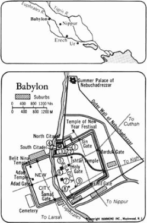

*From International Standard Bible Encyclopedia*

**Babylon** baʹbə-lon; **BABEL** bāʹbəl (Gen. 10:10; 11:9) [Heb
_bābel_—‘gate of god’; Akk _bāb–ili_, _bāb-ilāni_—‘gate of god(s)’; Gk
_Babylōn_; Pers *Babirush*]. The capital city of Babylonia.

##### I. Location

Babylon lay on the bank of the Euphrates in the land of Shinar (Gen.
10:10), in the northern area of Babylonia (now southern Iraq) called
Accad (as opposed to the southern area called Sumer). Its ruins,
covering 2100 acres (890 hectares), lie about 50 mi (80 km) S of Baghdad
and 5 mi 8 (km) N of Hillah. The ancient site is now marked by the
mounds of Bâbil to the north, *Qaṣr* (“the Citadel”) in the center, and
Merkes, *‘Amran Ibn ‘Alī Ṣaḥn*, and Homera to the south. The high water
and long flooding of the whole area render the earlier and lower ruins
inaccessible.

## II. Name

The oldest attested extrabiblical name is the Sumerian ká-dingir-ki
(usually written ká-dingir-ra, “gate of god”). This may have been
atranslation of the more commonly used later Babylonian *Bāb-ilī*, of
which an etymology based on Heb *bālal*, “confused,” is given in Gen
11:9. Throughout the OT and NT, Babylon stands theologically for the
community that is anti-God. Rarely from 2100 b.c. and frequently in the
7th cent Babylon is called TIN.TIR.KI, “wood (trees) of life,” and from
the latter period also. E.KI, “canal zone (?).” Other names applied to
at least part of the city were *ŠU.AN.NA*, “hand of heaven” or
“high-walled (?),” and the Heb *šēšaḵ* (Jer. 25:26; 51:41), which is
usually interpreted as a coded form (Athbash) by which *š* = *b*, etc.
The proposed equation with *ŠEŠ.KU* in a late king list has been
questioned, since this could be read equally well as (É).URU.KU.

##### III. Early History

*__A. Foundation__* Genesis ascribes the foundation of the city to
Nimrod prior to his building of Erech (ancient Uruk, modern Warka) and
Accad (Agade), which can be dated to the 4th and 3rd millennia b.c.
respectively. The earliest written reference extant is by
*Šar-kali-šarri* of Agade ca 2250 b.c., who claimed to have (re)built
the temple of *Anunītum* and carried out other restorations, thus
indicating an earlier foundation. A later omen text states that Sargon
(*Šarrukīn I*) of Agade (ca 2300) had plundered the city.

*__B. Old Babylonian Period__* *Šulgi* of Ur captured Babylon and placed
there his governor (*ensi*), Itur-ilu, a practice followed by his
successors in the Ur III Dynasty (ca [5 highlights]2150–2050 [5
highlights]b.c.). Thereafter invading Semites, the Amorites of the 1st
Dynasty of Babylon, took over the city. Their first ruler Sumu-abum
restored the city wall. Though few remains of this time survive the
inundation of the river, Hammurabi in the Prologue to his laws (ca 1750)
recalls how he had maintained Esagila (the temple of Marduk), which by
the time of his reign was the center of a powerful regime with wide
influence. Samsu-iluna enlarged the city, but already in his reign the
Kassites were pressing in from the northeast hills. It actually fell in
1595 to Hittite raiders under Mursilis I, who removed the statue of
Marduk and his consort *Ṣarpānītum* to *Ḫana*. (Possession of a city’s
gods [their statues] symbolized control.) The city changed hands
frequently under the Kassites (*Meli-Šipak* [*Meli-Šiḫu*] and
Marduk-aplaiddina I) amid the rivalry of the local tribes. Agumkakrime
recovered the captive statues, but that of Marduk was again removed at
the sack of the city by Tukulti-Ninurta I of Assyria (1250) and by the
*Elamite Kudur-Naḫḫunte* II (1176).

*__C. Middle Babylonian Period__* The recovery of Marduk’s statue was
the crowning achievement of Nebuchadrezzar I (1124–1103), marking an end
to foreign domination of the city. He restored it to Esagila amid much
public rejoicing and refurbished the cult places. Although Babylon
retained its independence despite the pressure of the western tribes,
this required help from the Assyrians, one of whom, Adad-apal-iddina,
was given the throne (1067–1046). By the following century, however, the
tribesmen held the suburbs and even prevented the celebration of the New
Year Festival by *Nabû-mukīn-apli* of the 8th Babylonian Dynasty.

*__D. Neo-Assyrian Supremacy__* Shalmaneser III of Assyria was called to
intervene in the strife that broke out on the death of Nabû-apla-iddina
in 852 b.c. He defeated the rebels, entered Babylon, treated the
inhabitants with respect, and offered sacrifices in Marduk’s temple.
This action inaugurated a new period of Assyrian intervention in the
southern capital, with the result, according to Herodotus, that
Sammu-ramat (Semiramis), mother of Adadnirari III, carried out
restoration work there.

The citizens’ independent spirit was never long suppressed; and Arameans
from the southern tribes seized the city, made *Erība-Marduk* their
leader, and refused to pay allegiance to the northern kingdom. To remedy
this Tiglath-pileser III began a series of campaigns to recover control.
First he won over the tribe of *Puqūdu* (Pekod of Jer. 50:21; Ezk.
23:23), who lived to the northeast, leaving Nabonassar (*Nabû-nāṣir*) as
governor of Babylon to pursue a pro-Assyrian policy until his death in
734 [5 highlights]b.c., whereupon *Ukīn-zēr* of the Amukkani tribe
seized the city.

The Assyrians then tried to gain the support of the other tribal chiefs,
including Marduk-apla-iddina (Merodach-baladan of the OT) of
*Bīt-Yakin*, who, however, took over the city on the death of
Tiglath-pileser’s successor Shalmaneser V in 721. He proclaimed the
city’s independence and maintained it for ten years. Either toward the
end of this period or more probably in 703 b.c., when he again held
Babylon, Merodach-baladan sought Hezekiah’s help against the Assyrians
(2 K. 20:12–17). Sargon II recaptured the city in 710 and celebrated the
New Year festival by taking the hands of Marduk/*Bēl* and the title
“viceroy of Marduk.”

To revenge Merodach-baladan’s later seizure of the capital, Sennacherib
marched south to remove the traitor *Bēl-ibni* and set his own son
*Aššur-nadin-šumi* on the throne. The latter was soon ousted, however,
by local revolutionaries, who in turn were defeated by Sennacherib in
689 when he besieged the city for nine months, sacked Babylon, and
removed the statue of Marduk and some of the sacred soil to Nineveh.
Though this act brought peace, it broke any trust the citizens ever had
in the Assyrians, despite Esarhaddon’s efforts to restore the decrepit
town. Esarhaddon claimed to have revoked his father’s decree imposing
“seventy years of desolation upon the city” by reversing the Babylonian
numerals for 70 to make them 11. Many refugees returned, and the city
again became a prosperous center under his son *Šamaš-šum-ukīn*
(669–648). He was isolated, however, by the surrounding tribes, who
eventually won him over to their cause. His twin brother Ashurbanipal of
Assyria laid siege to the city, which fell after four years of great
hardship. *Šamaš-šum-ukīn* died in the fire that destroyed his palace
and the citadel.

*__E. Chaldean Rulers__* Reconstruction work began under the Chaldean
Nabopolassar (*Nabû-apla-uṣur*, 626–605 [5 highlights] b.c.), who was
elected king following a popular revolt after the death of the Assyrian
nominee Kandalanu. His energetic son Nebuchadrezzar (II) with his queen
Nitocris restored not only the political prestige of Babylonia, which
for a time dominated the whole of the former Assyrian empire, but also
the capital city, to which he brought the spoils of war including the
treasures of Jerusalem and Judah (2 K 25:13–17). Texts dated to this
reign list Jehoiachin king of Judah (*Ya’ukin māt Yaḫudu*), his five
sons, and Judean craftsmen among recipients of corn and oil from the
king’s stores. It is to the city of this period, one of the glories of
the ancient world, that the extant texts and archeological remains bear
witness. Nabonidus (555–539 [5 highlights]b.c.) continued to care for
the temples of the city, though he spent ten years in Arabia, leaving
control of local affairs in the hands of his son and co-regent
Belshazzar, who died when the city fell to the Persians in 539 (Dnl
5:30).

##### IV. Description

*__A. Walls__* Babylon lay in a plain, encircled by double walls. The
inner rampart (*dūru*), called “Imgur-Enlil,” was constructed of mud
brick 6.50 m (21 ft) thick. It had large towers at intervals of 18 m (60
ft) jutting out about 3.5 and.75 m (11.5 and 2.5 ft) and rising to 10–18
m (30–60 ft). It has been estimated that there were at least a hundred
of these. The line may well have followed that laid down by Sumu-abum of
the 1st Dynasty. Over 7 m (23 ft) away lay the lower and double outer
wall (*šalḫu*) called Nimit-Enlil, 3.7 m (12 ft) thick, giving a total
defense depth of 17.4 m (57 ft). Twenty m (65 ft) outside these walls
lay a moat, widest to the east and linked with the Euphrates to the
north and south of the city, thus assuring both river passage and water
supply and a flood defense in time of war. The quay wall nearest the
city was of burnt brick set in bitumen, and this too had observation
towers. The outermost wall of the moat was of beaten earth. The inner
area, including Babylon W of the river, which remains unexcavated,
measured 8.35 sq km (3.2 sq mi) and the eastern city alone encompassed
an area of about 2.25 sq km (.87 sq mi). Nebuchadrezzar and, according
to Herodotus, his queen Nitocris made significant additions to the
defenses begun by his father. These now incorporated his “Summer Palace”
(*Bâbīl*) 2 km (1.2 mi) to the north. He also added an enlarged northern
citadel and enclosed a large area of the plain with yet a third wall,
forming an “armed camp” in which the surrounding population could take
refuge in time of war. This ran 250 m (820 ft) S of the inner walls and
projected about 1.5 km (1 mi) beyond the earlier wall systems.

Herodotus, who describes the city and walls some seventy years after the
damage done by Xerxes in 478 b.c. (i.178–187), appears to exaggerate the
size. He says that the height of the walls, beyond the moat, was 200
cubits (about 90 m or 300 ft) by 50 royal cubits thick (= 87 ft, 26.5
m). The width was sufficient for a chariot and four horses to pass along
them. Moreover, the estimate of the total length of the walls as 480
stades (about 95 km or 60 mi) is difficult to reconcile with the
archeological evidence, though the figures are close to those given by
Ctesias (300 furlongs = 68 km or 42 mi, with the walls 300 ft [90 m]
high and 60, 40, and 20 furlongs in length respectively). Herodotus
viewed the city as a rectangle. Unfortunately no excavations to confirm
this have yet been possible West of the river.

*__B. Gates__* Babylonian inscriptions give the names of the eight major
entrances to the city itself, but of these only four have been
excavated. The southwest gate of *Uraš* was probably typical in general
plan. The approach was by a dam across the moat through a wide gateway
in the outer wall with recessed tower chambers and thence by a deep
gateway in the inner wall. The other gate in the south wall was named
after Enlil, since it faced southeasterly toward his sanctuary at
Nippur. In the east wall were the gate called “Marduk is merciful to his
friend” and, S of this, the Zababa gate facing Kish. In the north wall
the Ishtar gate was specially decorated and renovated by Nebuchadrezzar
at the time of his enlargement of the citadel.

The Sin gate in the north wall and the *Šamaš* and Adad gates in the
west are known only from references in the texts. These gates may well
be identified with the five named by Herodotus as Semiramis (Ishtar),
Nineveh (Sin to the north?), Chaldean (Enlil? to the south), Kissian
(Zababa), and Zeus Belos (Marduk). He further mentions one hundred gates
of bronze in the outer walls, which may be “the well-built wide gates
with doors of bronze-covered cedar” made by Nebuchadrezzar. Excavations
show that the Ishtar gate consisted of a double tower 12 m (40 ft) high,
decorated with blue and black glazed bricks with alternate rows in
yellow relief of 575 *mušruššu* (a symbol of Marduk, a combination of a
serpent with lion’s and eagle’s legs) and the bulls of (H)adad.

*__C. Streets__* The layout of the principal streets was determined by
the line of the river and of the main gates and was virtually unchanged
from Old Babylonian times. The main thoroughfare, called *Ai-ibūr-šābū*
(“the enemy shall not prevail”), was the sacred procession way running
from the Ishtar gate SSE, parallel with the Euphrates. Completed by
Nebuchadrezzar, it ran for more than 900 m to the temple Esagila before
joining the main east-west road between that temple and the sacred area
of Etemenanki and then turning to the Nabonidus wall on the river. There
the crossing was made by a stone bridge, 6 m wide, supported by eight
piers, each 9 by 21 m (29 by 69 ft), the six amid stream being of burnt
bricks that still show traces of wearing by the current. The bridge was
123 m (403 ft) long, shortened to 115 m (377 ft) when Nabonidus built
his quay. Herodotus ascribed the bridge to Nitocris (i.186; cf. Diodorus
ii.8) and speaks of it as an “open bridge,” perhaps with a removable
center section to enable the two parts of the city to be defended
independently.

The Procession Way was 11–20 m (36–66 ft) broad and paved with colored
stone from Lebanon, red breccia, and limestone. Some paving stones were
inscribed “I Nebuchadrezzar, king of Babylon, paved this road with
mountainstone for the procession of Marduk, my lord. May Marduk my Lord
grant me eternal life.” The parapet of the raised road was decorated
with 120 lions in relief.

The other main roads intersected the city at right angles and bore names
associated with the gates from which they led: “Adad has guarded the
life of the people”; “Enlil establisher of kingship”; “Marduk is
shepherd of his land”; “Ishtar is the guardian of the folk”; “*Šamaš*
has made firm the foundation of my people”; “Sin is stablisher of the
crown of his kingdom”; “*Uraš* is judge of his people”; and “Zababa
destroys his foes.” There were also other procession streets named after
deities — Marduk (“Marduk hears him who seeks him”) and Sibitti — and
also after earlier kings (*Damiq-ilišu*).

*__D. Citadel__* The northern wall was extended in the center by
Nebuchadrezzar to form an additional defense for the palaces to the
south and to provide more accommodation. This complex appears to have
been used by his successors as a storehouse (some think as a “museum”),
for here were found objects from earlier reigns including inscriptions
of the Assyrian kings Adadnirari III and Ashurbanipal from Nineveh, a
Hittite basalt sculpture of a lion trampling a man (“the lion of
Babylon”), and a stele showing the Hittite storm-god *Tešub* from
seventh-century (b.c.) Sam’al.

*__E. Palaces__* In the southern citadel, bounded by the Imgur-Enlil
wall (N), the river (W), the Procession Way (E), and the *Libilḫegalla*
canal (which was cleared by Nebuchadrezzar and linked the Euphrates and
the Banitu canal E of the city with the canal network in the New City,
thus providing the city with a system of internal waterways), was a
massive complex of buildings covering more than 360 by 180 m (400 by 200
yds). Here lay the vast palace built by Nabopolassar and extended by his
successors. The entrance from the Procession Way led to a courtyard
(66.5 by 42.5 m, 218 by 140 ft), flanked by quarters for the royal
bodyguard, which in Nebuchadrezzar’s time largely consisted of foreign
mercenaries. A double gateway led into the second court, off which lay
reception rooms and living quarters. A wider doorway gave access to a
third court (66 by 55 m, 218 by 180 ft); to its south lay the Throne
Room, the external wall of which was decorated in blue glazed bricks
bearing white and yellow palmettes, pillars with a dado of rosettes and
lions. This large hall (52 by 17 m, 170 by 57 ft, partially restored in
1968) could have been that used for state occasions, such as
Belshazzar’s feast for a thousand persons (Dnl. 5). Two further wings of
the palace overlooking the river to the west may have been the quarters
of the king, his queen, and their personal attendants. It is more likely
that this was the building used by Belshazzar for his feast rather than
the “Palace of the Crown Prince” (*ekal mār šarri*) said to have been
used later by Xerxes.

In the northwest angle of this complex, adjacent to the Ishtar gate, lay
another large building (42 by 30 m, 140 by 98 ft) consisting of fourteen
narrow rooms leading off a long central walk. Since it was at some time
walled off from the new palace, it has been thought to have been the
substructure of that wonder of the ancient world, the Hanging Gardens of
Babylon. According to Ctesias in Diodorus (ii.10) and Strabo (xvi.1.5),
this was a series of garden-laid terraces supported by arches designed
by Nebuchadrezzar (so Berossus in Josephus Ant. x.11.1 [226]) for his
queen, to remind his new bride, Amyitis daughter of Astyages the Mede,
of her mountain-fringed homeland. This description might, however,
equally apply to the ziggurat (see G below).

The presence of administrative texts within these subterranean rooms
more likely indicates that these were palace stores. Included among the
tablets found here and dated to the tenth to thirty-fifth years of
Nebuchadrezzar (i.e., 595–570 [5 highlights]b.c.) were lists of
recipients of rations of corn and oil distributed to foreigners, men
from Judah, Ashkelon, Gebal, Egypt, Cilicia, Greece (Yamanu), and
Persia. Among the men of Judah were Jehoiachin and his sons and
craftsmen, some with such OT names as Gaddiel, Shelemiah, and Samakiah
(E. F. Weidner, *Mélanges offerts à M. Dussaud*, II [1939], 924ff).
Nebuchadrezzar also built himself a “Summer Palace” outside the main
citadel but within the defense walls. This was set 9 m (30 ft) high (it
was 100 m [328 ft] long) to catch the cooler northeast winds.

*__F. City Quarters__* Tablets name the various parts of the city, which
included the citadel itself (*ālu libbi āli*, “city within a city”) with
at least nine temples. It was described as near ká-dingir-ra, which name
also applied to the whole city. The citadel included the royal palace as
far as Esagila. Here were to be found the temples of Ishtar and
*Ninmaḫ*. Other quarters were named *Kaṣiri*, Kullab, and Kumari. The
“New City” (*ālu eššu*) lay on the west bank of the Euphrates and was
part of the Chaldean extension. Large areas within the city walls were
given up to parks and squares.

*__G. Temple Tower (Ziggurat)__* The ziggurat of Babylon,
*É-temen-an-ki* (“building [of] the foundation of heaven and earth”),
lay in the center of the city, S of the citadel, now marked by the
ruin-area *Ṣaḥn* (“the Pan”), a deep depression near the mausoleum of
*‘Amrān Ibn ‘Alī* founded a.d. 680. It lay in a square doublecasemate
walled enclosure, forming a rectangular courtyard measuring about 420 by
375 m (460 by 410 yds). Entry was by two doors in the north and ten
elaborate gateways. The enclosure was frequently repaired, and bricks
marking this activity in the reign of Esarhaddon and Ashurbanipal of
Assyria and of Nebuchadrezzar have survived. The area was subdivided
into a long narrow western court, a northern court in which towered the
ziggurat with its adjacent monumental buildings, wall shelters for the
pilgrims, housing for the priests, and storerooms. The main approach
from the Procession Way led between two long storerooms. One late
Babylonian text, the Esagila tablet AO 6555, gives the dimensions of the
courts and the names of the gates: “grand”; “the rising sun”; “the great
gate”; “gate of the guardian colossi”; “canal-gate”; and “gate of the
tower-view.”

Opposite the main gate lay the stepped tower on a platform with shrines
grouped around. The stages are given as 91 m sq by 34 m high (300 ft sq
by 110 ft high) for the lowest, the next 80 m sq by 18 m high (260 ft sq
by 60 ft high), the next three diminishing stages each 6 m (20 ft) high
and 61, 52, and 43 m (200, 170, and 140 ft) square. Originally each
stage, as at Ur, may have been of different color. The sanctuary of
Marduk (*Bēl*) on top, 15 m (50 ft) high, gave a total height of 85 m
(280 ft). However, nothing remains of the tower except the lower stairs,
the whole having been plundered for its bricks by local villagers. There
is no reason to doubt the identification of this site with the Tower of
Babel (Gen. 11:1–11), the building of which had been terminated. The
inscriptions refer only to rebuilding and repair work by the later kings
of Babylon. The common identification of the Tower of Babel with the
remains of the ziggurat at Borsippa, 7 mi (11 km) SSW, is open to
question on a number of grounds, not the least that that edifice was in
a separate city. The extant vitrified ruins there are of a temple tower
also rebuilt by Nebuchadrezzar II.

Herodotus (i.181–183) described Etemenanki, which he called the
“sanctuary” of Zeus Belos. It was, he wrote, 2 stadia  sq and was
entered through a bronze gate. The temple tower stood in the center of
the sanctuary, its sides 1 stadium (200 m, 650 ft) long, with eight
towers, one on top of the other. It also had slopes or steps rising on
each level. (*See* Babel, Tower Of.) In the large topmost temple was a
couch covered in beautiful rugs with a golden table. There was no image
of the deity, and the Chaldean priests informed Herodotus that one
unmarried native woman spent the night there to be visited by the deity.
Though Herodotus did not believe the story, it conforms to the known
Babylonian view of the sacred marriage.

*__H. Esagila__* The principal temple of Babylon, Esagila (“house of the
uplifted head”), was dedicated to the patron deity of the city Marduk.
It lay S of Etemenanki, which must have overshadowed it. The excavations
by Koldewey in the *‘Amrān Ibn ‘Alī* mound disclosed sufficient evidence
to recover the ground plan of two building complexes. The main shrine to
the west (10 by 79 m, 33 by 260 ft) was entered by four doors, one on
each side. At a lower level than the principal shrine, that of Marduk,
were chapels and niches for lesser deities around the central courtyard.
Nabopolassar claimed to have redecorated the Marduk shrine with gypsum
and silver alloy, which Nebuchadrezzar replaced with fine gold. The
walls were studded with precious stones set in gold plate, and stone and
lapis lazuli pillars supported cedar roof beams. The texts describe the
god’s gilded bedchamber adjacent to the throne room.

Herodotus (i.183) described two statues of the god, one seated. The
larger was said to be 12 ells (6 m, 20 ft) high, but Herodotus did not
see it, being told that it had been carried off by Xerxes. This was the
usual practice of those kings who wished to curb the independent
citizens of Babylon. The opposite action, that of “taking the hand of
*Bēl* (Marduk)” to lead the statue out of the *akitu* (New Year) house
and into Esagila, ensured their authority and usually acceptance by the
people. Herodotus was told that 800 talents (16.8 metric tons) of gold
were used for these statues and for the table, throne, and footstool. A
thousand talents of incense were burned annually at the festivals while
innumerable sacrificial animals were brought in to the two golden
altars, one used for large, the other for small victims.

Esagila was first mentioned by *Šulgi* of Ur, who restored it ca 2100
b.c. Sabium, Hammurabi, Samsuiluna, Ammi-ditana, *Ammi-ṣaduqa* and
Samsu-ditana all refer to their devotion to the temple during the 1st
Dynasty of Babylon (1894–1595), a care that was to be continued by every
king and conqueror of Babylon except Sennacherib. Some refer to their
dedications to Marduk and *Ṣarpānītum* or to *Nabû* and *Tašmetum* in
their twin shrine at Ezida (“house of knowledge”). One of the best-known
of these votive gifts was the diorite stele engraved with the laws of
Hammurabi and set up in Esagila as a record of the manner in which that
king had exercised justice. The standard brick inscription of
Nebuchadrezzar describes him as “provider for Esagila and Ezida.” At a
lower level in Esagila were located the shrines of Ea to the north, Anu
to the south, and elsewhere Nusku and Sin. To the east of Esagila lay a
further complex of buildings (89 by 116 m, 292 by 380 ft) the precise
purpose of which is not known.

*__I. Other Temples__* In addition to Ezida, Babylonian texts refer to
at least fifty other temples by name, Nebuchadrezzar himself claiming to
have built fifteen of them within the city. Excavations have uncovered
the temple of Ishtar of Agade (*Emašdari*) in the area of private houses
(Merkes), E of the Procession Way. This faced toward the southwest and
was rectangular in form (37 by 31 m, 111 by 102 ft) with two entrances,
S and E, leading into an inner court. The plan was similar to others of
the period (e.g., Ezida of Borsippa) with six antechambers alongside the
antechapel and shrine, which led directly off the court. This temple was
kept in order by Nebuchadrezzar and Nabonidus and lasted into the
Persian era.

Koldewey also cleared two temples E of *‘Amrān Ibn ‘Alī* in the
*Išin-Aswad* mound. One cannot be identified as yet due to the absence
of inscriptions, hence its designation “Z” temple. This was in continual
use over at least seventeen hundred years. To the east lay the shrine of
Ninurta (Epatitilla, “temple of the staff of life”) built by
Nabopolassar, according to its foundation cylinder. This was restored by
Nebuchadrezzar. Here the plan (190 by 133 m, 623 by 436 ft) differs, the
main entry being to the east, with subsidiary doors to the north and
south. Off the courtyard to the west lay three interconnected equal
shrines, each with a dais perhaps dedicated to Ninurta and his wife Gula
and son Nusku.

Near the Ishtar gate stood the well-preserved temple of *Ninmaḫ*,
goddess of the underworld, constructed by Ashurbanipal ca 646 b.c.
Outside this massive building, called *Emaḫ*, stood an altar. Passing
this to the main door on the north side, worshipers would then traverse
the courtyard, passing a well, to enter the shrine in the antechapel.
Here they would kneel before the statue of the goddess splendidly
clothed and standing on its dais. The architect, *Labāši*, had designed
the surrounding storerooms with a view to security, since many valuable
votive offerings must have been hoarded there together with the many
fertility figurines found in them. The outer wall was defended by
towers, since the shrine may have lain outside the main city defenses.
This building has now been fully restored by the Iraqi Department of
Antiquities. The cuneiform texts imply that there were many shrines in
the city, “180 open-air shrines for Ishtar” and “300 daises for the
Igigi gods and 1200 daises of the Anunnaki gods.” There were also more
than two hundred pedestals for other deities mentioned. The open-air
shrines were probably similar to those for the intercessory Lama goddess
found at crossroads at Ur.

*__J. Private Houses__* A series of mounds to the north of *Išin Aswad*
at Babylon are called locally Merkes, “trade center.” Since the levels
containing houses were easier to excavate, being on raised ground, it
was possible for Koldewey to trace occupation here almost continuously
from the Old Babylonian period to the Parthian period. Here too the
streets ran almost straight and crossed at right angles. The houses
consisted of a series of rooms around a central courtyard. They were
made of mud brick roofed with mats set over wooden beams, and many
showed signs of the fire that had raged in the destruction of the city
at the hands of the Hittites, Sennacherib, or Xerxes. Several of the
buildings had foundation walls 1.8 m (6 ft) thick; and, like “the Great
House” in Merkes, this may indicate that they supported more than one
story. Nevertheless, Herodotus’ observation that “the city was filled
with houses of three or four stories” cannot now be checked. Some houses
may have been built on higher ground than others. Moreover, his
expression *órophos* could be rendered “roofs” rather than “story.”

*__K. Documents__* Apart from the architectural remains, the decorations
of the Ishtar gate, and small objects, the most significant finds from
ancient Babylon are more than thirty thousand inscribed tablets. Since
apart from the Merkes the Old Babylonian levels have not been explored,
mainly because of the high water table of the region, most of these are
dated to the Chaldean dynasty or later. They provide an intimate
knowledge of personal dealings by merchants until the Seleucid era. Many
were obtained by locals in their illicit diggings and cannot now be
associated with their original context. These tablets are mainly
contracts and administrative documents. There are, however, a number of
literary and religious texts originating in the temples in the
post-Achaemenid period up to a.d. 100. A few of these traditional
“school-texts” are in Greek on clay tablets. These continued to be
copied long after Aramaic had become the official language written on
more perishable materials, and they include astronomical observations,
diaries, almanacs, and omens.

##### V. Later History

*__A. Fall of Babylon, 539b.c.__* In 544 Nabonidus returned from *Teimā*
to Babylon, with which he had been in contact throughout his ten-year
exile. He does not, however, appear to have taken over control of the
city itself again from Belshazzar when, according to the Babylonian
Chronicle for his seventeenth year, the gods of the chief cities of
Babylonia, except Borsippa, Kutha, and Sippar, were brought into the
capital for safekeeping. During Cyrus’ attack on Opis the citizens of
Babylon apparently revolted but were suppressed by Nabonidus with some
bloodshed. He himself fled when Sippar fell on the 15th of *Tešrītu*,
and the next day Ugbaru, the governor of Gutium, and the Persian army
entered the city without a battle. This appears to have been effected by
the strategem of diverting the river Euphrates, thus drying up the moat
defenses and enabling the enemy to enter the city by marching up the
dried-up river bed. This may also imply some collaboration with
sympathizers inside the walls. That night Belshazzar was killed (Dnl.
5:30). For the remainder of the month Persian troops occupied Esagila,
though without bearing arms or interrupting the religious ceremonies.

On the 3rd of *Araḫ-samnu* (Oct 29, 539 b.c.), sixteen days after the
capitulation, Cyrus himself entered the city amid much public acclaim,
ending the Chaldean dynasty as predicted by the Hebrew prophets (Isa.
13:21; Jer. 50f). Cyrus treated the city with great respect, returning
to their own shrines the statues of the deities brought in from other
cities. The Jews were sent home with compensatory assistance. He
appointed new governors, so ensuring peace and stable conditions
essential to the proper maintenance of the religious centers.

*__B. Achaemenid City__* In *Nisānu* 538, Cambyses II son of Cyrus II
“took the hands of *Bēl*,” but left the city under the control of a
governor, who kept the peace until Cambyses’ death in 522 b.c. There
followed the first of the recurrent revolts. *Nidintu-Bēl* seized power,
taking the emotive throne-name Nebuchadrezzar III (Oct.–Dec.
522).Darius, the legitimate king (520–485), put down a further rebellion
in the following year but spared the city, building there an arsenal, a
Persian-style columned hall (*appa danna*), as an addition to the palace
he used during his stay in the city.

Xerxes, possibly the Ahasuerus of Ezr. 4:6, maintained Babylon’s
importance as an administrative center and provincial capital, but the
town declined after an uprising that he successfully suppressed. Another
rebellion in his fourth year (482) led him to destroy the ziggurat and
to remove the statue of Marduk. The walls remained standing in good
enough repair for Herodotus, who probably visited the city ca 460 b.c.,
to describe them in detail (i.178–188), vindicated to a large measure by
subsequent researches. There is no evidence that the decree of Xerxes
imposing the worship of Ahuramazda was ever taken seriously.

Economic texts from the Egibi family and the *Murašu* archives from
Nippur (460–400 [5 highlights]b.c.) show continued activity despite
increasing inflation which more than doubled the rent on a small house,
from 15 shekels per annum under Cyrus II to almost 40 shekels in the
reign of Artaxerxes I (Longimanus, 465–424), when Ezra and Nehemiah left
Babylon to return to Jerusalem (Ezr. 7:1; Neh. 2:1). Artaxerxes II
(404–359), according to Berossus, was the first Persian ruler to
introduce the statue of Aphrodite or Anahita into the city. Artaxerxes
III (Ochus, 358–338) could be the builder or restorer of the *appa
danna* found by Koldewey.

*__C. Hellenistic Period__* After his victory at Gaugamela near Arbela
(Erbil), Oct. 1, 331 b.c., Alexander marched to Babylon, where the
Macedonian was triumphantly acclaimed, the Persian garrison offering no
opposition. He offered sacrifices to Marduk, ordered the rebuilding of
temples that Xerxes allegedly had destroyed, and then a month later
moved on to Susa. He later returned to further his elaborate plans for
the sacred city, on which he paid out 600,000 days’ wages for clearing
the rubble from the precincts of Esagila (Strabo xvi.1). This debris was
dumped on that part of the ruins now called *Ḥomera*. The Jews who had
fought in his army refused to take any part in the restoration of the
temple of *Bēl* (Josephus *CAp* i.192). Alexander also planned a new
port, but this too was thwarted by his death, June 13, 323. The Greek
theater inside the east wall (*Ḥomera*), cleared by Koldewey and Lenzen,
may have been built at this time, though it was unquestionably restored
in the time of Antiochus IV.

*__D. Seleucid-Parthians__* A king list from Babylon written soon after
175 b.c. names the successors of Alexander who ruled the city — Philip
Arrhidaeus, Antigonus, Alexander IV, and Seleucus I (323–250). Before
Seleucus died Babylon’s economic but not its religious importance had
declined sharply, a process hastened by the foundation of a new capital
at Seleucia (Tell \`Umar) on the Tigris by his successor Antiochus I, in
274 b.c.

*__E. Later City__* Babylon’s attraction as a “holy city” continued. The
satrap Hyspaosines of Characene suppressed a revolt led by a certain
Hymerus in 127 b.c. when the priests of Esagila were active. Hymerus
issued coins as “king of Babylon” in 124/23, but by the following year
Mithradates II had regained control. An independent ruler Gotarzes I was
recognized as ruler in 91–80, and the city lay in Parthian hands
(Mithradates III, 58–55) until taken over by a rebel Orodes. It remained
a center of Hellenism, despite the opposition of a significant
traditional Babylonian priestly party and of a minority of Jews, from
among whom may have come Hillel. Babylon supported the Jews in Palestine
who opposed Herod (Josephus Ant. xv.2.1–3). The close association
between these Jews in Babylon, who enjoyed self-government there in the
1st cent, and their fellows in Jerusalem is suggested in Acts 2:9–11.
Dated cuneiform texts up to a.d. 110 show that the site was still
occupied. While Babylon may have been the site of an early Christian
church (1 Pet. 5:13), there is no evidence (*see* Babylon in the NT).
When Trajan entered the city in 115 he sacrificed to Alexander’s *manes*
but made no reference to the continued existence of other religious
practices or buildings. According to Septimius Severus the site was
deserted by a.d. 200.

##### VI. Exploration and Excavation

Since the ancient city of Babylon long lay deserted and unidentified,
many early travelers, including Schiltberger (ca 1400), di Conti
(1428–1453), Rauwolf (1574), and John Eldred (1583), thought it lay
elsewhere, probably at the upstanding remains of *‘Aqar Qūf*, W of
Baghdad, which resembled the Tower of Babel. Benjamin of Tudela (12th
cent), however, considered that the ruins of Birs Nimrûd covered ancient
Babylon.

Pietro della Valle, visiting Bâbil in 1616, correctly equated it with
Babylon, as did Emmanuel Ballyet in 1755 and Carsten Niebuhr some ten
years later. Surface exploration was undertaken by C. J. Rich (1811/12,
[6 highlights]1821) and J. S. Buckingham and Mellino (1827). Ker Porter
mapped the ruins (1818), as did Coste and Flandin (1841), while
soundings were made by R. Mignan (1828) and more seriously by A. H.
Layard (1850).

The first systematic excavations were directed by a French consul,
Fresnel, with Oppert and Thomas in 1852. Their finds were regrettably
lost when a boat containing them foundered at Qurna. Work was continued
by E. Sachau in 1897/98, but it was left to the Deutsche
Orientgesellschaft under Robert Koldewey to plan and carry out
scientific excavations throughout the years 1899–1917. Work began with
the Procession Way, the temple of *Ninmaḫ*, and the palaces (1900), the
Ninurta temple (1901), the Ishtar gate (1902), the Persian buildings
(1906/07), Merkes (1908), and the rest of the *Qaṣr* (1911/12).

From 1955 to 1968 the Iraqi Department of Antiquities carried out
further clearances, especially of the Ishtar gateway, which was
partially restored together with the Procession Way and the palaces. The
*Ninmaḫ* temple was reconstructed, and a museum and rest house built on
the site, which is also partially covered by the village of Jumjummah.
The German Archaeological Institute has continued its interest in the
site by excavating the quay wall and the Greek theater.

*See also* Archeology of Mesopotamia.

*__Bibliography.__*—R. Koldewey, *Excavations at Babylon* (1914); E.
Unger, *Babylon,* *die heilige Stadt* (1931); “Babylon” in *Reallexikon
der Assyriologie*, II (1932); O. E. Ravn, *Herodutus’ Description of
Babylon* (1932); W. Andrae, *Babylon,* *die versunkene Weltstadt und ihr
Ausgräber* *Robert Koldewey* (1952); F. Wetzel, *Das Babylon der
Spätzeit* (1957); A. Parrot, *Babylon and the OT* (1958); H. J. Klengel,
in *Forschungen und Berichte*, 5 (1962); J. Neusner, *History of the
Jews in Babylonia: The Parthian Period* (1965); H. W. F. Saggs, in AOTS,
pp. 39–56.

D. J. Wiseman

