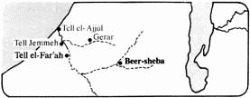

*From International Standard Bible Encyclopedia*

**Beer-Sheba**bēr-shēʹbə [Heb *b**e**’ēr šeḇa‘*; Gk
*Bērsabee*; Eusebius (Onom 166.20f) equates Gk *phrear horkismou*—‘well
of swearing’]. A site of major importance in the northern Negeb desert.

##### I. Significance of the Name

The name of this venerable town means literally “the well of seven.” The
Semitic words for “oath” and “swear an oath” are derived from the
consonantal root of the number seven, and this etymological relationship
is stressed in the biblical explanations of the name Beer-sheba. The
name was first given because there Abraham and Abimelech king of Gerar
swore an oath of mutual allegiance (Gen. 21:31), and the ritual of
swearing involved seven ewe lambs that Abraham gave to Abimelech (Gen.
21:28–30). The covenant agreement was aimed at resolving disputes
between the two parties concerning the possession of certain wells. A
similar dispute is recorded concerning Abimelech and Isaac. When
agreement was finally reached and the oath duly taken, Isaac received a
report from his servants that a new well had successfully been dug. In
honor of this occasion, Isaac named the new well *šiḇ‘â*, the numeral
seven (masc). “Therefore the name of the city is Beer-sheba to this day”
(Gen. 26:33).

##### II. Geographical Situation

The site of biblical Beer-sheba has been identified with Tell es-Seba‘,
also known as Tell el-’Imshash, “mound of the wells,” located at the
juncture of the *Wâdī Seba‘* with the *Wâdī Khelil*. The resultant
stream bed continues WSW in a winding course for about 10 mi (16 km)
before swinging northward in a wide arc past Tell el-Far‘ah (Sharuhen)
and Tell Jemmeh (probably Yurzah, known from Egyptian inscriptions),
whence it continues NW, reaching the sea near Tell el-‘Ajjûl (known from
Byzantine sources as Beth-eglaim). The western segment of this stream
bed was probably the biblical Besor; various wells, especially in the
region of Tell es-Seba‘, serve to illustrate the appropriateness of the
biblical passages cited above.

Beer-sheba is located in a topographical basin, the outline of which
resembles an hourglass. As it extends eastward from the coastal plain,
it narrows toward Beer-sheba; from there to the crest overlooking the
Dead Sea it widens once again. Thus it serves to separate the populated
region on the north, where the traditional topographical division into
longitudinal belts prevails, and the desert highlands on the south,
where the principal ridges swing round toward the southwest. Because of
this position between the Judean mountains to the north and the Negeb
highlands to the south, the Beer-sheba basin is an area of deposition
rather than of erosion. This accounts for its rich alluvial soil, and
especially its extensive regions of loess (a very fine blown sand). The
basin itself marks the southern end of the region of permanent
settlement; the 300 mm. (about 12 in) per annum rainfall line, the
border of aridity, passes through it. Below this line regular
agriculture could not be maintained without an artificial water supply.
Therefore, the southern boundary of settlement varied from N to S in
accordance with prevailing weather conditions. This territory, of which
Beer-sheba was the topographical pivot, embraced the biblical Negeb.

##### III. Chalcolithic Culture

Extensive Chalcolithic settlement in the immediate vicinity of
Beer-sheba is evidenced by numerous small mounds on both sides of the
*Wâdī es-Seba*‘. Each of these hillocks contained the remains of a small
community of underground dwellings dug in the loess. The Chalcolithic
culture of Beer-sheba evidently originated in the northern Negeb; its
latest stage is closely related to that of Tuleilat Ghassul. But
Chalcolithic culture in this region has no connection with any of the
events or peoples referred to in the Bible even though Chalcolithic
sherds have also been found at Tell es-Seba‘.

##### IV. Patriarchal Associations

More than a millennium separated the biblical patriarchs from the
Chalcolithic occupants of Beer-sheba. The Genesis accounts make no
mention of a king or even of a city at Beer-sheba. The absence of Middle
and Late Bronze Age sherds from Tell es-Seba‘and the immediate vicinity
supports the assumption that the patriarchs encountered no sedentary
population there. Accordingly, the area of Hagar’s wanderings is called
“the wilderness of Beer-sheba” (Gen. 21:14). The closest cultural and
commercial center was evidently Gerar, whose rulers enjoyed hegemony
over the Beer-sheba district. While Abraham was located on the vital
artery connecting Shur (the famous Egyptian defense line on the east)
and Kadesh (-barnea), he enjoyed the status of a sojourner at Gerar
(Gen. 20:1). At the same time, he enjoyed water rights in the Beer-sheba
area by virtue of an agreement with Abimelech, the ruler of Gerar
(21:22–32). The earliest biblical reference to the sanctity of
Beer-sheba is associated with this event. Soon after this covenant with
Abimelech, Abraham planted a tamarisk tree at Beer-sheba; the religious
nature of this act is stressed by the added statement that there he
called on the name of Yahweh the everlasting God (21:33). He evidently
continued to reside in that region for some time (cf. 22:19).

A similar situation prevailed during the sojourn of Isaac in the
territory of Gerar. Although Isaac dwelt for a time in Gerar itself
(Gen. 26:1–16), the envy of his agricultural success and renewed
disputes over water rights forced him to move, first to the “valley of
Gerar” (v 17) and finally to Beer-sheba (v 23). Here he was able to
reach an agreement with Abimelech like that formerly extended to his
father (vv 23–33). Isaac must have remained in the Beer-sheba region for
a long time; the disputes between his grown sons Jacob and Esau seem to
have taken place there (28:10). But upon his return to Canaan, Jacob
found his father at Hebron (35:27); Jacob evidently made this latter
place his own headquarters until his descent to Egypt (cf. 46:1–7).

##### V. Southern Extremity of Israelite Territory

From early in the period of settlement by the Israelite tribes
Beer-sheba was reckoned as the southernmost extremity of the territory,
as expressed in the familiar phrase “from Dan to Beer-sheba” (Jgs. 20:1;
1 S. 3:20). The same definition was applied to the territory encompassed
by Saul’s kingdom (2 S. 3:10) and maintained its validity during the
reign of David (2 S. 24:2, 15; 1 Ch. 21:2). Under Solomon it served to
distinguish Israel proper from the wider sphere of his dominions (1 K.
4:24f). Even after the fall of the northern kingdom of Israel, when
Hezekiah king of Judah sought to expand his own influence over the
entire Israelite sphere, he had a proclamation made “from Beer-sheba to
Dan” (2 Ch. 30:5). Meanwhile, Beer-sheba had represented the southern
limit of the Judean kingdom, for example, under Jehoshaphat, who had
exercised leadership “from Beer-sheba to Mount Ephraim” (2 Ch. 19:4).
Although King Josiah had extended his own authority, at least in some
measure, even as far as Galilee (2 ch 34:6), the immediate bounds of his
own Judean kingdom extended “from Geba to Beer-sheba” (2 K. 23:8).

During the postexilic period Beer-sheba continued to mark the southern
extent of Judean settlement (Neh. 11:30).

##### VI. Capital of the Negeb

Beer-sheba was assigned to the tribe of Simeon (Josh. 19:2; 1 Ch. 4:28);
but since that tribe had become so closely affiliated with Judah (Jgs.
1:3), the towns of Simeon also appear in the allotments made to Judah.
Beer-sheba and the others are listed therefore among the towns in the
“Negeb district” of Judah (Josh. 15:28; cf. vv 21, 32). Beer-sheba’s
importance as an administrative center in the premonarchial period is
underlined by Samuel’s having stationed his sons there to act as judges
(1 S. 8:2).

The role of Beer-sheba as capital of the Negeb, the southernmost
district in David’s kingdom (2 S. 24:2; 1 Ch. 21:2), is clearly seen in
the record of Joab’s census. The officials sent out to take this census
went “to the Negeb of Judah at Beer-sheba” (2 S. 24:7). The same
administrative arrangement seems to have prevailed under Solomon (1 K.
4:24). When the prophet Elijah wished to escape from the territory under
Ahab and Jezebel’s jurisdiction, he fled south; his first stop was
evidently at “Beer-sheba, which belongs to Judah” (1 K. 19:3). Perhaps
it was necessary to explain which Beer-sheba was intended so as to
distinguish this town in the Judean Negeb from another Beer-sheba in
Galilee (Josephus BJ iii.3.1).

A wife of Ahaziah king of Judah, named Zibia, came from Beer-sheba. It
was her son, Joash/Jehoash, who was rescued from Athaliah’s cruel
slaughter of the royal sons (cf. 2 K. 11:2), and who was later enthroned
by a palace coup (2 K. 12:2; 2 Ch. 24:1). Under King Jehoshaphat,
Beer-sheba was apparently still the administrative center of southern
Judah as indicated by 2 Ch. 19:4. Two allusions to Beer-sheba by the
prophet Amos indicate that a shrine was located there (Am. 5:5; 8:14).
Although Beer-sheba continued to be singled out as the southern
extremity of Judean territory during the reign of Hezekiah (2 Ch. 30:5)
and of Josiah (2 K. 23:8), it has been suggested that the capital of the
Negeb of Judah was moved late in the Iron Age to the powerful fortress
at Khirbet Gharrah, about 8 mi (13 km) E of Beer-sheba.

##### VII. Postexilic Period

The presence of a Judean population at Beer-sheba and other neighboring
towns is indicated by the book of Nehemiah (11:27), and the general
sphere of Judean occupation is said to extend from “Beer-sheba to the
Valley of Hinnom” (v 30). The presence of Judeans in Beer-sheba and the
Judean Negeb, even though the region was practically cut off from
Jerusalem by the newly arrived Edomites who had settled in the southern
Judean hill country (the Idumeans of NT times), suggests that perhaps
the residents of these towns (and of the others in Neh. 11:25–35) may
have escaped the Babylonian Exile.

##### VIII. Later History

In spite of the presence of Jewish settlements, it is quite possible
that Beer-sheba had become absorbed into Idumea during the
intertestamental period. Under the Romans Beer-sheba was a major
military center on the defense line that spanned southern Palestine from
Raphia to the Dead Sea (Eusebius Onom 50.1).

##### IX. Archeological Excavations

Besides the excavation of the prehistoric Chalcolithic settlements along
the stream bed there have been several trial digs in the modern town of
Beer-sheba when new buildings were being constructed. An extensive Iron
Age settlement was found to exist on the western bank of the *Wâdī
es-Seba*‘. Beginning in 1969, Tell es-Seba‘(Modern Hebrew Tel Beer
Sheva) became the subject of an intensive research project by the
Institute of Archaeology, Tel Aviv University, under the direction of Y.
Aharoni.

The earliest occupation (stratum VIII) is dated by painted Philistine
were to the late 12th century. Strata VII and VI represent further
occupation levels of the Early Iron Age. There premonarchial remains
have appeared mainly in the area beneath the later city gates. During
the united monarchy (stratum V) a huge, artificial platform was created
by laying down large quantities of gravel and dirt mixed with ash. A
massive solid wall with salients and recesses surrounded the city.
Stratum V was destroyed by fire; the city was rebuilt in the early 9th
cent b.c. and the solid wall and its gate were reused. Stratum IV was
also destroyed by fire.

In the late 9th or early 8th cent b.c. (stratum III) the city was
reconstructed once again along lines similar to those of the preceding
strata. However, a casemate wall was built over the remains of the
former solid wall and a new gate, somewhat smaller than the older one,
was constructed. The stratum III city seems to have suffered
considerable damage but does not show signs of having been burned. The
buildings were, for the most part, repaired and some of the floor levels
were raised for the final Israelite city (stratum II). This latter
occupation level was destroyed by a terrific conflagration (similar to
strata V and IV), and afterwards there are only traces of a poor attempt
by squatters to live for a short time among the ruins of the city
(stratum I).

During the course of excavation, almost the entire plan of this Judean
fortified center has been uncovered. In the stratum II gate house one
sees rooms with plastered walls and benches round about. Through the
streets ran a unique drainage system to carry the overflow water from
the sudden winter rainstorms to safe storage areas outside the city
gate. Inside the gate was a plaza (Heb רכַמֱִאה ראאֱכס ב֯כַֹ֦הרֿ, 2 Ch.32:6) from
which streets led in several directions through the tow. One street
followed a circular course parallel to the city wall; the zone between
the street and the wall was taken up with small dwelling units. The
inner quarters were bisected by lateral streets and contained larger
buildings of a more impressive nature. A plastered pool, probably for
ceremonial purposes, was found near the center of the town. A row of
three storehouses at one side of the gate plaza resembled in many
details the so-called stables at Megiddo, including small holes in the
corners of some of the pillars; there is no doubt today that at Megiddo
and elsewhere, the buildings of this type were for storage and not for
keeping horses.

At the northeast corner of the mound a large flight of stairs was
uncovered which seems to lead down into a water shaft. There is an
obvious depression in the mound at this point which probably denotes the
presence of an installation similar to those discovered at Megiddo and
Hazor.

Small cult objects such as figurines, miniature incense altars, a broken
kernos, etc., have come to light in various parts of the city. Of
special interest is a krater bearing the Hebrew inscription *qdš*, which
must represent the word *qōḏeš*, “holy.” Epigraphic finds have generally
been limited to incised personal names on vessels or fragments of ink
inscriptions. One complete text, from a storehouse, bears the hieratic
numerals for “fifteen” and records commodities (wine?) “from Tolad” and
“from Beth-amam.” Both (El)tolad (Josh. 15:30; 19:4; cf. 1 Ch. 4:29) and
Amam (Josh. 15:26) were towns in the Negeb (15:21).

The most astonishing discovery from the Israelite period thus far has
been the ashlar stones of a dismantled altar. The stones were found
built into a storehouse wall; horns were preserved on three of them and
a fourth showed signs of having its horn broken off. Though other stones
are still missing, the provisional reconstruction of the altar is quite
impressive. No cultic building has, as yet, been discovered, but the
only large structure oriented directly E and W (a “four-unit” dwelling
plus a deep cellar) was shown to date from stratum II; its
predecessor(s) had been completely removed down to bedrock and this
dwelling unit built in its place. Perhaps the dismantling of the altar
accompanied the obliteration of its associated temple.

The date of the great devastation by fire that marked the end of
Beer-sheba as an Israelite city is linked to the destruction of Lachish
stratum III and Arad stratum VIII, since the pottery styles are
identical in the three sites. Historically, the only reasonable date for
the fall of Lachish III is 701 b.c. in the campaign by Sennacherib.

During the Persian period practically no structures were erected on the
site, but the tell was used as a campground and for the storage of grain
in pits. About fifty Aramaic ostraca record quantities of cereals in
relation to personal names (Jewish, Edomite, and Arabian); sometimes the
texts are dated.

The Hellenistic Period (strata H III and H II) saw the construction of a
small fort with a temple nearby. Excavations uncovered many votive cult
objects, including a Mesopotamian cylinder seal and Egyptian figurines,
along with Hellenistic coins and lamps. The temple plan resembles
closely the Israelite temple at Arad and the temple (also Hellenistic in
date) at Lachish. The central axis was turned north of east, to line up
with the summer solstice. Steps found earlier were seen to lead into the
holy place; the holy of holies, if it existed, was not preserved. Two
occupation phases were evident. The construction of the first cannot be
earlier than ca 125 b.c., as evidenced by three coins of Demetrius II;
the second phase lasted until ca 95–90 b.c., since Nabatean coins of
Aretas II were present. Many cult objects, apparently discarded during
the rebuilding of the second phase, were found buried in pits beneath
the courtyard floor.

In the early Roman period (parallel to the Herodian dynasty in Judea;
stratum H I) a massive structure stood on the western quarter of the
tell. It included a deep plastered pool or cistern, water conduit(s),
and a typical hot room for a Roman-style bathhouse.

On top of the tell and over the ruins of the Herodian-period building
was erected a small fort. A coin from the age of Trajan found in the
wall of this fort shows that it was built no earlier than the first
quarter of the 2nd cent a.d.

The adjacent ridge and plateau, both lower than Tell es-Seba‘, saw
settlement at least in the late Israelite, Hellenistic, and Roman
periods. It is worthy of note that late seventh-century b.c. pottery
(like that of Arad VI and Lachish II) is entirely lacking on the high
mound but present on the plateau below as well as in the settlement
beneath modern Beer-sheba. The ostracon from Arad stratum VI concerning
a shipment of supplies to Beer-sheba and the reference to Josiah’s rule
“from Geba to Beer-sheba” (2 K. 23:8) evidently refer to one of these
unwalled towns, since the fortified city was in ruins.

##### Bibliography

Y. Aharoni, “The Negeb,” in D. Winton Thomas, ed, *Archaeology and OT
Study* (1967), pp. 384–403; IEJ, 8 (1958), 26–38; 19 (1969), 245–47; 20
(1970), 227–29; 21 (1971), 230–32; (1972), 169f; BA, 35 (1972), 111–127;
“Excavations at Tel Beer-sheba — A Preliminary Report on the First
Season (1969),” in Y. Aharoni, ed, *Excavations and Studies* (1973), pp.
13–20; ed, *Beer-sheba I: Excavations at Tel Beer-Sheba 1969–1971
Seasons* (1973); W. F. Albright, JPOS, 4 (1924), 131–161; Israel
Department of Antiquities, IEJ, 2 (1952), 253; 3 (1953), 262f; 4 (1954),
125f; 5 (1955), 125f, 174f; 6 (1956), 126f; 8 (1958), 131–33; 9 (1959),
29, 141f, 267; 10 (1960), 120f; 13 (1963), 145f, 260f; J. S. Holladay,
JBL, 96 (1977), 281–84; N. Liphschitz and Y. Waisel, IEJ, 23 (1973),
30–36; J. Perrot, IEJ, 5 (1955), 17–40, 73–84, 167–189.

A. F. Rainey

