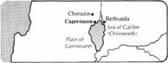

from International Standard Bible Encyclopedia

**Capernaum** (kə-pûr̀nə-um [Gk *Kapernaoum*)]. The most important city on
the northern shore of the Sea of Galilee. It was here that Jesus
established His headquarters for the major part of His public ministry
(Mt. 4:13). In Mt. 9:1 Capernaum is called “his own city.” At least
three of Jesus’ disciples came from there. Peter and Andrew, originally
from Bethsaida (Jn. 1:44), had apparently moved to Capernaum (Mk. 1:29).
It was from a tax office in the same city that Matthew rose to follow
Jesus (Mt. 9:9). Many miracles were performed in and around Capernaum:
e.g., the paralyzed servant of the centurion was healed (Mt. 8:5–13); a
paralytic, carried to Jesus by four friends and let down through the
roof, picked up his bed and walked (Mk. 2:1–12); and Peter’s
mother-in-law was cured of a fever (Mk. 1:29–31).

While we know Capernaum as an important place in Jesus’ Galilean
ministry, its larger significance is indicated by the presence of a
Roman centurion and detachment of troops (Mt. 8:5–9), a customs station
(Mt. 9:9), and a high officer of the king (Jn. 4:46). That Capernaum is
not mentioned in the OT is no argument against its prominence at a later
period, since it may have been settled after the Captivity. Its
importance is reflected in Jesus’ pronouncement of doom: “And you,
Capernaum, will you be exalted to heaven? You shall be brought down to
Hades” (Mt. 11:23).

There is no certain evidence that the name bears any relationship to the
prophet Nahum, although an inscription found near the mouth of the
Yarmuk refers to *Kephar Nahum*, “the village of Nahum.”

The question of exact location has been a matter of prolonged
discussion. Mt. 4:13 identifies the site as “Capernaum by the sea” and
Jn. 6:16–24 with Mk. 6:53 places it in or near the well-known plain of
Gennesaret. Only two sites can lay serious claim to the identification:
Khan Minyeh 5 mi (8 km) W of the Jordan River on the northeast edge of
plain of Gennesaret, and Tell *Ḥûm* about 2.5 mi (4 km) NE of Khan
Minyeh. Khan Minyeh lies inland along the great caravan road leading N
at the junction of the eastern road heading toward Bethsaida Julias.
Tell *Ḥûm* is immediately adjacent to the sea.

In an earlier period most scholars favored Khan Minyeh. Among the
various reasons proposed were: (1) The account of the disciples and
Jesus crossing the Sea of Galilee to Capernaum (Jn. 6:16–24) and coming
to shore in Gennesaret (Mt. 14:34) favors Khan Minyeh. (2) Its tollhouse
(Mk. 2:14) would be near the great trade route from Damascus to Egypt so
as to collect revenue from the passing caravans. (3) Josephus tells us
that the plain of Gennesaret was watered by the fountain of Capernaum
(BJ iii.10.8), and this must surely be the fountains at *eṭ-Ṭâbghah* 0.5
mi (0.8 km) E of Khan Minyeh. Water from this source was led by an
aqueduct around a rock cliff and into the plain at Minyeh. (4) Remains
of an ancient city have been discovered between the site and the sea.
(5) It is possible to find the name Minyeh in the designation of
Christians as *Minim*, a group the Talmud associated with Capernaum.

More recently scholars have identified Capernaum with the ruins at Tell
*Ḥûm*. Among the more important reasons are: (1) The extensive ruins at
Tell *Ḥûm* are demonstrably ancient, with pottery from the Roman period,
while the excavations at Khan Minyeh show it to be an Arab site of a
much later date. (2) The name Tell *Ḥûm* may well be a corruption of
Tankhum, a Jewish rabbi who is said to have been buried there. Less
convincing is the etymology that sees *Tell* as the designation of
*Kephar* after its fall, and *Ḥûm* as all that remains of the name
Nahum. (3) The customs house would be appropriate at Tell *Ḥ̂um* as a
place of levying taxes on the produce of the area as well as for
collecting revenue from the traffic that moved eastward along the road
to Bethsaida Julias. (4) Although the fountain of Capernaum was closer
to Khan Minyeh, it was connected topographically to Tell *Ḥûm*. As each
town in antiquity had its “territory,” that of Capernaum would be
sufficiently large to include either or both of the sites. (5) Eusebius’
*Onomasticon* (a fourth-century work on biblical topography) places
Chorazin 2 mi (3 km) from Capernaum. If Chorazin is best identified with
Kerâzeh, Tell *Ḥ̂um* must be Capernaum. (6) The pilgrim Theodosius (ca
a.d. 530) coming from the west arrived at the spring *before* he came to
Capernaum. This would be far less likely if the city were situated at
Khan Minyeh.

The Franciscans procured the site at Tell *Ḥûm* in 1894. To prevent
continuous pillaging of the ruins for building stones, they covered the
area with earth. Partially excavated, it has revealed a wealth of
material. One of the more important ruins is a third- or fourth-century
synagogue, which may well occupy the same site as the synagogue
mentioned in Lk. 7:5. It measures 65 ft (20 m) in length, is two stories
high, and is constructed of white limestone rather than the black basalt
found in abundance in the area. The “chief seats” are along the side and
are still to be seen. At the south end an ark of the law is represented
in stone. The ornamentation, which includes animals and mythological
figures, is not in accord with the strict interpretation of Jewish law.
An Aramaic inscription reads “Alphaeus, son of Zebedee, son of John,
made this column; on him be blessing.”

From the middle of the 2nd cent the region around the lake became the
citadel of rabbinic Judaism. Because Christians were not tolerated in
the area there was a serious break in tradition, which makes the
specific identification of places such as Peter’s house highly unlikely.
In the 4th cent large numbers of Christian pilgrims began visiting
Capernaum.

R. H. Mounce

