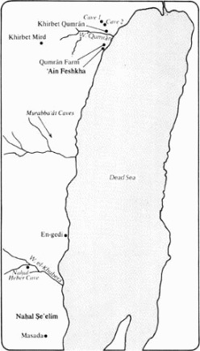

*From International Standard Bible Encyclopedia*

**Dead Sea Scrolls** The name generally given to the manuscripts and
fragments of manuscripts discovered in caves near the northwestern end
of the Dead Sea in the period between 1946 and 1956. They are also
called by several other terms, such as the \`Ain Feshka Scrolls, the
Scrolls from the Judean Desert, and — probably best of all — the Qumrân
Library (QL). The name Dead Sea Scrolls (DSS), however, has become
firmly attached in English, and likewise its equivalent in several other
languages, in spite of its imprecision. According to many experts, this
is one of the greatest recent archeological discoveries, and for
biblical studies certainly one of the greatest manuscript discoveries of
all times.

I. Discoveries
--------------

### A. Original Finds ###

The story of the “discovery” of the DSS has been
told many times, and with some significant variations.

As reconstructed by Trever, the first “discovery” was made by three
bedouin of the Ta’amireh tribe, Muhammed Ahmed el-Hamed (known as
“edh-Dhib”), Jum\`a Muhammed Khalib, and Khalil Musa, who by chance came
upon what later was to be known as Cave 1 and discovered a number of
jars, some containing manuscripts. The date is not known, but it was
probably toward the end of 1946 or early 1947. In March 1947 the scrolls
were offered to an antiquities dealer in Bethlehem, but he did not buy
them. In April, the scrolls were taken to Khalil Eskander Shahin
(“Kando”), a shoemaker and antiquities dealer in Bethlehem, who became
an intermediary in numerous sales of the materials. Meanwhile George
Isha\`ya Shamoun, a Syrian Orthodox merchant who often visited
Bethlehem, was taken to Cave 1 by bedouin, and later he and Khalil Musa
secured four scrolls. Isha\`ya had in the meantime (about April 1947)
informed St. Mark’s Monastery of the find, and the Metropolitan, Mar
Athanasius Yeshue Samuel, offered to buy them.

Four scrolls were taken to the monastery about July 5 by Jum\`a
Muhammed, Khalil Musa, and George Isha\`ya, but they were mistakenly
turned away at the gate. About July 19, Kando purchased scrolls from the
bedouin and sold them to St. Mark’s Monastery for twenty-four
Palestinian pounds (\$97.20). That same month, Fr. S. Marmardji of École
Biblique was consulted about the scrolls, and he and Fr. J. van der
Ploeg went to the monastery to see them. Van der Ploeg recalls with some
embarrassment that he mistakenly identified the scrolls as medieval.
Other scholars also examined the scrolls, but none recognized their
great value.

In addition to the four scrolls that were sold by Kando, three others
were sold by Jum\`a and Khalil to Faidi Salahi, also an antiquities
dealer. He paid seven Palestinian pounds (\$28.35) for the scrolls and
twenty piasters (about 80 cents) each for two jars. These were the first
MSS to come into the possession of recognized scholars, for two of them
were purchased by E. L. Sukenik of Hebrew University on Nov. 29 and the
third on Dec. 22, 1947. The MSS were later identified as the *Hebrew
University Isaiah Scroll* (&1QISAB;), the *Order of Warfare*, or the
*War of the Sons of Light Against the Sons of Darkness*, later called
the *War Scroll* (1QM), and the *Thanksgiving Hymns* (1QH). (For details
of the negotiations, see Yadin [Sukenik’s son], *Message of the
Scrolls*.)

Sukenik had heard about the other scrolls in the possession of St.
Mark’s Monastery, was permitted to examine them, and offered to buy
them. Fr. Butrus Sowmy, librarian of the monastery, contacted the
American School of Oriental Research in Jerusalem on Feb. 18, 1948,
seeking to get a better idea of the value of the scrolls, and he and his
brother Ibrahim took four scrolls to the school on the following day.
They were examined by J. Trever, a postdoctoral fellow at the school.
Excited by the Hebrew paleography, Trever managed to secure permission
to visit the monastery, and then was given permission to photograph the
scrolls. On Feb. 21 and 22 and again on March 6–11, he photographed
three of the scrolls, column by column, and his photographs became the
basis for the *editio princeps* of these scrolls, later identified as
the *Isaiah Scroll* (1Qisaa), the *Habakkuk Commentary* (1QpHab), and
the *Manual of Discipline* (1QS). The fourth scroll could not be opened.
From a fragment, it was named the “Lamech Scroll,” and later, when
opened by J. Biberkraut, an expert in unrolling delicate MSS (cf. BA,
19/1 [1956], 22–24), it was renamed the *Genesis Apocryphon* (1QapGen).

To understand the confusion that is found in various reports, one must
bear in mind that the British Mandate was nearing its end, and sporadic
fighting between Arabs and Jews was taking place. On Nov. 29, 1947, the
day that Sukenik purchased the first of the scrolls, the United Nations
voted to partition Palestine and establish an independent nation of the
Jews, and on May 14–15, 1948, the Mandate ended, the State of Israel
came into being, and warfare broke out on a large scale. For obvious
reasons, Fr. Sowmy took the scrolls in his possession to Beirut for
safekeeping (March 25, 1948); he returned to Jerusalem and was later
killed in the bombing that damaged St. Mark’s Monastery. Athanasius
Samuel took the four scrolls from Beirut to New York in January 1949.
Efforts were made by several institutions to purchase the scrolls, but
the Metropolitan was asking a huge sum, reportedly a million dollars,
for them. In February 1955 the Prime Minister of Israel revealed that
Yadin had secretly purchased the scrolls on July 1, 1954, for \$250,000,
and that the scrolls were in a vault in the Prime Minister’s office.
Subsequently they were moved to a building that had been built for them
near the University, known as the Shrine of the Book. All the scrolls of
the original discoveries in Cave 1 were now in Israel.

It was impossible for qualified scholars to visit and explore the cave
where the scrolls allegedly had been found, so there was much distrust
of the story told by the bedouin and repeated by many others. There were
unauthorized visits to the cave in the summer and again in the fall of
1948, and many additional fragments of scrolls and other items were
recovered. It became obvious that some controlled exploration should be
undertaken.

In September 1948 the first articles on the scrolls were published,
along with photographs, both by the American Schools of Oriental
Research and by Hebrew University, and “the Battle of the Scrolls” had
begun. For many months there was considerable discussion of the date and
authenticity of the discoveries. It is probably correct to state that
never in history had so many scholars from so many different nations
become involved in the problems associated with a single discovery.

Capt. P. Lippens, a Belgian army officer serving as observer for the
United Nations, was able to interest Major General Lash, British
commander of the Arab Legion, Colonel Ashton, archeological advisor to
the Legion, and G. L. Harding, Director General of the Department of
Antiquities of the Hashemite Kingdom of the Jordan. An expedition and a
detachment of the Arab Legion under Captain A. ez-Zeben located Cave 1,
only to find that it had been almost completely looted. Systematic
excavation was undertaken by Harding and Père R. de Vaux, director of
École Biblique, between Feb. 8 and March 5, 1949, and thousands of MS
fragments, together with jar fragments, pottery remains, and fragments
of the cloth that had wrapped the scrolls, were recovered. (For an
inventory, cf. Trever, pp. 149f) It seemed certain, although hotly
disputed by some, that the cave of the original finds had indeed been
discovered, and that the bedouin story was basically correct. The cave
was located by Harding at coordinates 1934.1287 of the Palestine Survey
Map, which is about 6.8 mi (11 km) S of Jericho, 2.2 mi (3.5 km) N of
\`Ain Feshkha, in the marly cliffs about 1.2 mi (2 km) from the
northwestern shore of the Dead Sea and about 1000 ft (305 m) above the
surface of the sea (which is 1292 ft [394 m] below sea level).

### B. Subsequent MS Discoveries ###

Materials that were obviously related
to the original finds were turning up in the hands of various
antiquities dealers. Caves in *Wâdī Murabba‘ât* as well as in Khirbet
Mird were discovered by bedouin. Meanwhile, expeditions led by École
Biblique and the American Schools were exploring the region and finding
other caves. Between March 10 and 29, teams explored the region for 5 mi
(8 km) N and S of *Wâdī Qumrân*, discovering 230 caves, of which
twenty-six contained pottery similar to that found in Cave 1, but only
one (Cave 3) contained MS fragments.

It is important, to assure that scholarly control was maintained, to
note that Cave 3 was discovered by an expedition, Cave 4 (which had been
discovered by bedouin) was excavated by a scholarly expedition, who also
discovered Cave 5, and Caves 7, 8, 9, and 10 were discovered by
archeologists working at Khirbet Qumrân. The marked relationship of the
discoveries from the various Qumrân caves (with the possible exception
of the copper scroll from Cave 3) makes it clear that the materials in
all of the caves, whether discovered by bedouin or acheological
expeditions, are of common origin. (The caves were numbered in the order
in which they were discovered.) On the other hand, the discoveries in
the caves in *Wâdī Murabba‘ât*, Khirbet Mird, and *Naḥal Ḥeber* belong
to different categories, and should not be confused with the Dead Sea
Scrolls. Caves 4, 5, 7, 8, 9, and 10 were located in the terrace around
Khirbet Qumrân, while Caves 1, 2, 3, 6, and 11 were in the cliff that
extends north and south, to the west of the Jordan Valley and the Dead
Sea. The most significant cave yields were from Caves 1, 4, and 11,
which will be discussed more fully. Cave 3 yielded the “Copper Scroll”
(3QInv or 3Q15); Cave 6 provided a quantity of papyrus fragments and
significant fragments of the “Damascus Document” (6QD CD is exemplar
from Cairo); Caves 2, 5, and 7 through 10 yielded smaller quantities of
MS fragments.

The most extensive MSS were found in Cave 1 (mentioned above) and Cave
11, which yielded at least seven MSS, including a Targum of Job
(11QtgJob), a portion of Leviticus in Paleo-Hebrew script (11QpaleoLev),
a scroll of Ezekiel (11QEzek) in bad condition, and three partial
scrolls of Psalms (QPsabc11). The large Psalms scroll (QPsa11) contains
thirty-six canonical Psalms, the Hebrew text of Ps. 151 (previously
known only from Greek, Syriac, and Old Latin texts), and eight Psalms
not otherwise known. It is possible that the “Temple Scroll” (seized by
Israelis in 1967 from a Jerusalem antiquities dealer, provisionally
identified as 11QTemple) also came from Cave 11.

In addition to the more extensive MSS or portions of MSS, great
quantities of fragments of MSS were recovered, the importance of which
is at least equal to that of the MSS that suffered lesser damage. From
Cave 1 came fragments that were at first thought to be part of the
*Manual of Discipline* (1QS), namely the *Order of the Congregation*
(QSa1 or 1Q*28a*) and the *Benedictions* (QSa1 or 1Q*28b*). There were
also fragments of commentaries on Micah, Ps. 37, and Ps. 68, as well as
fragments of the *Book of Mysteries* (1QMyst or 1Q*27*), the *Sayings of
Moses* (1QDM or 1Q*22*), and a portion of Daniel including 2:4, where
the language changes from Hebrew to Aramaic (QDana1). Cave 4 yielded
about 40,000 fragments, representing about 382 different MSS, of which
more than 100 are biblical. An international team of eight scholars
worked for several years putting together the pieces of this gigantic
jigsaw puzzle, and the result included portions of every book of the
Hebrew Bible except Esther, fragments of apocryphal works not previously
known in Hebrew, and many extrabiblical works, most of which had not
previously been known. Among the more significant discoveries are: a
*Florilegium* or collection of mesianic promises (4QFlor); a portion of
Gen. 49 with commentary, known as the *Patriarchal Blessings* (4QBless);
a document that sheds some light on the messianic beliefs of the
Community, known as the *Testimonia* (4QTestim); a commentary on Ps. 37
(4QpPs37); fragments of seven MSS of the *Damascus Document*
(4QDa-g); fragments of the *War Scroll* (4QM); and portions
of Daniel where the language changes from Aramaic to Hebrew (Dnl.
7:28–8:1, 4QDana,b).

A full inventory of the published materials from these caves can be
found in J. A. Fitzmyer, *The Dead Sea Scrolls: Major Publications and
Tools for Study* (1975), pp. 11–39. Fitzmyer also lists the published
discoveries from Masada, *Wâdī Murabba‘ā̂t*, *Naḥal Ḥeber* (*Wâdī
Ḫabra*), *Naḥal Ṣe’elim* (*Wâdī Seiyal*), *Naḥal Mishmar* (*Wâdī
Mahras*), Khirbet Mird, and pertinent texts from the Cairo Genizah (pp.
40–53), as well as lists that contain some of the unpublished materials
(p. 65). There is no published inventory of all the items discovered at
Qumrân.

### C. The “Monastery” ofQumrân ###

The region above the cliffs that flank
the northwestern shore of the Dead Sea is a shallow depression known as
el-Buqei\`a. It is cut by a seasonal river or wadi that bears several
names, but where it cuts down through the cliff it is best known as
*Wâdī Qumrân*. At the base of the cliff is a plateau or terrace formed
by the detritus from the cliff, presumably when it was eroded by an
unusual amount of water during the last Pluvial Age. *Wâdī Qumrân* has
since cut its way through this plateau that rises about 330 ft (100 m)
above the surrounding littoral. The cliff is cut by a number of similar
wadis, of which three others might be mentioned S of *Wâdī Qumrân* is
*Wâdī Nâr*, which issues from the confluence of the Kidron and Hinnom
Valleys SE of Jerusalem. S of *Wâdī Nâr* is *Wâdī Murabba‘ât*.
Considerably further S are En-gedi, *Naḥal Ḥeber*, *Naḥal Ṣe’elim*, and
Masada. About 6 mi (10 km) W of Qumrân on *Wâdī Nâr* is Khirbet Mird.
Our present interest, however, focuses on the ruins located on the
plateau at *Wâdī Qumrân*, known by the Arabic name Khirbet Qumrân (“the
ruins of Qumrân”).

The ruins had long been known, but never excavated. In 1873 the French
orientalist Canon Clermont-Ganneau noted and described a ruin near
Qumrân. A. Vincent had visited the ruins in 1906 and G. Dalman in 1914.
Dalman had identified the site — not incorrectly — as a Roman fort. When
the official examination of Cave I was being conducted (1949) the ruins
were explored, but it was concluded that there was no relationship
between the ruins and the Scrolls’ cave. But when more discoveries were
made in the vicinity it was decided to make a thorough archeological
excavation of the ruins. This was conducted in five campaigns from 1951
to 1955. Excavations were also made in the area between *Wâdī Qumrân*
and \`Ain Feshkha in a sixth campaign during 1958. Harding and de Vaux
were in charge of the excavations. (The definitive account is given by
de Vaux in *Archaeology*.)

The first season (1951) yielded coins and pottery that appeared to link
the buildings to the same period that was indicated by the jars from the
caves and by the paleography of the scrolls, namely Early Roman. After
the exciting discoveries of 1952 that included five Qumrân caves and
four Murabba‘ât caves, the archeologists returned to Khirbet Qumrân with
a new zeal. The second and third seasons revealed the nature of the
community that had occupied the ruins, and, in the light of the *Manual
of Discipline* (1QS), linked it definitely with the community of the
scrolls.

The archeologist, of course, must work from the top downward, whereas
his reconstruction of the history must be just the reverse. On the
surface of the terrace a complex of buildings and a water system cover
an area of approximately 345 ft (105 m) N-S and 250 ft (76 m) E-W. The
walls are built on a grid that runs NNE-SSW. The principal
distinguishing points for identifying corresponding areas of the
different levels are: (1) a circular cistern about 20 ft (6 m) in
diameter toward the western side of the complex; (2) the noticeably
heavier walls and height of a tower about 39 by 42 ft (12 by 13 m) in
the north-central part of the complex; and (3) a rectangular complex
about 114 by 98 ft (35 by 30 m) joined to the tower, with the tower at
its northwestern corner.

The earliest construction, identified by pottery sherds of Israelite
style (including a jar handle bearing a stamp reading *lmlk* and some
ostraca), comprised the circular cistern and the rectangular complex.
This was identified by de Vaux as probably not earlier than the 8th cent
b.c., on the basis of the pottery and the writing on the ostraca. The
site has often been identified as *‘Îr-hammelaḥ* (“City of Salt”; Josh.
15:62). At any rate, it has no connection with the DSS, for it suffered
violent destruction centuries earlier.

Level IA, on the other hand, was clearly the work of new inhabitants. At
this time the southern wall of the rectangular area was extended, a
north-south wall was joined to it (bringing the circular cistern into
this building complex), and a number of small rooms were added N of the
round cistern and W of the tower. Two rectangular cisterns, an aqueduct,
and a common settling basin were dug, one N and one E of the round
cistern. A potter’s shop was added at the southeastern corner of the
compound. Coins found in this level suggested that it was occupied
during the time of Alexander Janneus (103–76 b.c.), and was possibly
constructed in the days of John Hyrcanus (135–104 b.c.) or one of his
predecessors.

The complex came much closer to completion in Period IB (Level IB).
Workshops and storerooms were added W of the circular cistern. A large
hall — the largest in the entire compound (72 by 15 ft [22 by 4.5 m]) —
with a smaller adjoining room, was added S of the main building complex,
workshops were built at the southeastern part of the area, and a
complicated water system was installed.

An aqueduct brought the water from *Wâdī Qumrân*, where it cut through
the cliffs, to the northwestern corner of the community area. Here it
encountered piles of stones, which broke the current, and entered a
large settling basin, near which was a bath. From the basin a channel
led to the round cistern and the newer rectangular cisterns. Thence a
channel led to another settling basin, which fed a very large
rectangular cistern, 39 by 16 ft (12 by 5 m) SW of the main complex, and
a second large rectangular cistern, 59 by 10 ft (18 by 3 m), which was
dug between the main building and the new large hall. A branch channel
led to a small, square basin, and from there the channel branched to
feed a cistern E of the main building and another complex of cisterns at
the south-eastern part of the area, the largest of which was 56 by 23 ft
(17 by 7 m). Some of these cisterns and basins seem clearly to have been
associated with the potter’s shop and other workshops in that area. The
large- and medium-size cisterns had steps leading down into them. All
were plastered with clay that is impervious to water. When some of the
clay was removed, it was apparent that the cisterns had been lined with
masonry and then plastered over. Altogether there were seven (possibly
eight) cisterns, six decantation or settling basins, two smaller
cisterns described as baths, and a tank for tempering potter’s clay.
There is only one round cistern, which is also the deepest of all the
cisterns, and while it comes from the Israelite period (Iron II), it had
been thoroughly cleaned by the later occupants, for no Israelite remains
were found in it. The entire water system strongly suggests that this
was not a complex of individual residences but a commune of some sort.
The number of cisterns that cannot be explained as serving for water
storage or for industrial purposes, specifically those with steps
leading down into them and particularly those where the steps are
divided to suggest one-way traffic, suggest that some kind of ritual
bathing was a practice of the community.

The one large hall, S of the main building and separated from it by a
large cistern with divided stairway, and the smaller room that adjoins
the hall lend support to this tentative conclusion. The smaller room, 23
by 26 ft (7 by 8 m) contained 210 plates, 708 bowls in piles of twelve,
75 drinking vessels, 38 pots, 11 pitchers, and 21 small jars. The
contents identified the room as a pantry, and the adjacent structure as
a combination assembly hall and dining room.

The area W of the main building contained what appeared to be workshops
and storage rooms, and at its southern end what de Vaux described as
possibly a stable for beasts of burden. The area E of the main building
contained also workshops and a pottery industry, described by de Vaux as
“the most complete and best preserved in Palestine” (RB, 61 [1954],
567).

Between the western shop area and the large settling basin were found a
number of containers with bones of animals which obviously had been
butchered and boiled or roasted. Upon examination they proved to be from
sheep, goats, and bovines. It is not clear, however, why the bones were
carefully preserved. A likely suggestion is that the bones were the
remains of sacred meals and were considered to be too holy to be simply
thrown away.

Coins recovered from level IB included three of the time of Antiochus
VII that could be precisely dated, 132/131, 131/130, and 130/129 b.c.,
and altogether eleven Seleucid coins. After the Seleucid era Jewish
coinage was used, including 143 coins of Alexander Janneus (103–76
b.c.), one of Salome Alexandria and Hyrcanus II (76–67 b.c.), five of
Hyrcanus II (67 and 63–40 b.c.), four of Antigonus Mattathias (40–37
b.c.), and one of the third year of Herod the Great (35 b.c.).

A severe earthquake left its evidence in a cleft that runs the full
length of the compound, just E of the eastern wall of the main building,
dropping the eastern side of the cleft 20 in (50 cm.) lower than the
rest of the complex. The cisterns E of the main building were destroyed
and later abandoned. Evidence of fire is also found. The date of this
earthquake can be established from the writings of Josephus, for he
records that it occurred in the seventh year of Herod, at the time of
the battle between Octavius Caesar and Antony at Actium, i.e., in the
spring of a.d. 31 (*Ant* xv.5.2 § 121; BJ i.19.3 § 370).

Level II clearly indicated occupation by much the same group as Level I.
The buildings had been cleaned, with the result that evidence of Period
IB was removed. This debris had been placed in a dump N of the complex,
and a trench made by the archeologists recovered a quantity of remains,
including coins, from Period IB. Repairs were made where earthquake
damage occurred. The cisterns E of the main building were abandoned and
the water channel blocked. The most important alteration was the
covering over of a court alongside the rooms by the western wall of the
main building, and reconstruction of a second floor area above it. When
this subsequently collapsed (at the time of the destruction that ended
Period II, no doubt), the debris found by the excavators gave evidence
of much importance. A number of pieces of burned brick covered with
plaster were recovered, which, when reconstructed in the museum, formed
a long, low table, 16.4 by 1.3 ft (5 m by 40 cm.), and 19.6 in (50 cm.)
high, along with fragments of a bench. Also found in the debris were two
inkwells, one bronze and one pottery, from the Early Roman period. The
upper room was identified as a “scriptorium,” were the manuscripts of
the community were produced.

East of the tower was the kitchen area with five fireplaces, basins, and
other items. A mill for grinding grain was found in another area, and
there was a well-designed area for latrines.

Pottery remains, coins, etc., from Period II were plentiful, suggesting
that the end had come suddenly. This was confirmed by the widespread
destruction to the buildings, and a layer of ash that contained iron
arrowheads. All evidence suggests a military action. The testimony of
the coins, eighty-three of which were year 2 of the First Revolt, and
five of year 3 — the latest coins of Level II — dates the destruction
a.d. 68/69. An early report that a coin or coins surcharged wih “X” of
the Roman Tenth Legion had been found has been retracted by de Vaux
(*Archeology*, p. 40, n 1). The account in Josephus is not easy to
follow, but it seems certain that the Tenth Legion, or a detachment of
it under Trajan, was garrisoned at Jericho and from there moved on
Jerusalem (BJ v.1.6 § 42). We may assume that part of this legion moved
through Qumrân and on to Jerusalem via *Wâdī Nâr* or another route,
devastating the Qumrân community on the way.

Level III adds little to this study. Evidence indicates that it was
occupied for a brief period as a Roman outpost and then again, probably
by Jewish rebels, at the time of the Second Revolt. The complex of
buildings was not restored to the usage of Periods I and II.

East of the buildings, and separated from the complex by more than 165
ft (50 m), was a cemetery with more than 1100 graves, arranged neatly in
rows and sections, the bodies placed on their backs, lying N-S with the
head to the south, and the arms crossed over the pelvis or placed
alongside the bodies. At the eastern edge of the terrace was another
group of graves, less regular. Among the six bodies that were examined
here were four women and a child.

The excavations of the region betwen the ruins and ’Ain Feshkha, 2 mi (3
km) S, indicated that this was also used by the same community. Farm
buildings, stables, tool sheds, an irrigation system, and rooms that
gave evidence of being used for tanning leather were identified. The
water that flows abundantly from the springs at ’Ain Feshkha is drunk by
animals, but it appears to be too brackish for the cultivation of
cereals, although it is suitable for date palms. We may assume that the
community grew the barley or wheat that it used in el-Buqei‘a above the
edge of the cliffs.

From the number of graves, the number of dishes and bowls in the pantry,
and the period of time that Levels I and II were occupied, the size of
the community at any given time can be estimated at about two hundred
persons. The presence of skeletons of females and a child and the
provision for admission of women and children to the community suggest
that this was not strictly a monastery, but the rigors of life there and
the fact that all of the exhumed skeletons in the main part of the
cemetery were males suggest that most of the members were men.

The relevance of the excavation of Khirbet Qumrân to the dating and
interpretation of the DSS will become apparent upon examination of the
Scrolls in detail.

II. The Qumrân Community
------------------------

### A. Manuscript Evidence ###

From the caves at Qumrân came the remains of
hundreds of MSS that could be categorized as follows: canonical
scriptures, i.e., copies of the books of the Hebrew Bible (with the
exception of Esther); deuterocanonical scriptures, i.e., those in the
Apocrypha; extracanonical scriptures, sometimes classified as
pseudepigraphical; and sectarian documents, i.e., those which appear to
be the product of the community and which relate specifically to its
life and beliefs. Since some of the works not previously known seem to
be more in the category of apocryphal or pseudepigraphical writings, the
lines are not too firmly drawn, but that should present no serious
problems for this study, which will deal principally with the sectarian
literature.

The MSS that pertain uniquely to the sect are: the Manual of Discipline
(1QS), the Damascus Document (CD), the Thanksgiving Hymns or *Hôdāyôt*
(1QH), the War Scroll (&1QM;), the Order of the Congregation (QSa1 or
1Q*28a*), the Benedictions (QSa1 or 1Q*28b*), the
*p**e**šārîm* or comms on portions of Scripture such as the
Habakkuk Commentary (1QpHab), and several other more fragmentary works.
The Temple Scroll (11QTemple), not yet published at this writing, also
should be included. Possibly its choice of extracanonical documents
would tell something of the sect, but that approach is rather
subjective. *See* Plate 16.

The introduction of the Damascus Document into this list must be
justified. As soon as the Manual of Discipline (1QS) was published,
scholars began to point out its similarity to what was known as the
Zadokite Fragments or the Damascus Document. A quantity of MSS had been
discovered in the Genizah of the Ezra Synagogue in Old Cairo in 1897 and
taken to the library of Cambridge University. S. Schechter, president of
Jewish Theological Seminary, New York, identified a number of fragments
as similar in character and content, and published them (*Fragments of a
Zadokite Work* [1910]). The work drew the attention of many scholars,
and the bibliography from 1910 to 1946 (the year before the DSS came to
the attention of scholars) is voluminous (see L. Rost, *Die
Damaskusschrift* [1933]; H. H. Rowley, *Zadokite Fragments and the Dead
Sea Scrolls* [1952]). Since the provenance of these fragments was Cairo,
the *siglum* CD (for Cairo, Damascus) was assigned to the work. In spite
of striking parallels between 1QS and CD, many scholars resisted the
conclusion that CD was a product of the Qumrân community, until
fragments of the Damascus Document were recovered from Cave 5 (5QD = CD
9:7–10), Cave 6 (&6QD; = CD 4:19–21; 5:13f; 5:18–6:2; 6:20–7:1; and a
fragment not in CD), and fragments of five (or seven?) different MSS
from Cave 4 (4QDa-e). The questions of how the document got
to Cairo and how two MSS of it came to be produced in the 10th and 11th
cents have not yet been satisfactorily answered.

But can the MSS be connected with the buildings at Khirbet Qumrân and
‘Ain Feshkha? This is a crucial question, for unless it is established
beyond reasonable doubt that the documents and the building complex
belong to the same community, the one cannot be used to interpret the
other. (De Vaux has taken this up in detail in *Archeology*, pp.
91–138.) The evidence may be summarized as follows. The MSS are ancient.
From paleographic, linguistic, textual, and physico-chemical studies,
they must be dated between the 3rd cent b.c. and the Second Revolt. The
MSS were found in the caves in the immediate vicinity of Khirbet Qumrân,
in some cases in caves that were in the steep-sloping sides of the
plateau on which the buildings were located. The MSS had been deposited
in the caves in antiquity, as evidenced by dust and other material that
had covered them, and the pottery that was found in the same level in
the caves was of the same type as the pottery in the ruins. In some
cases (such as Cave 4), there was clear evidence that the caves had been
dug and the MSS placed on the fresh ground in great haste, with no signs
of previous or later occupation. Further, the evidence of the nature of
the Qumrân community as described in the MSS is in agreement with the
archeological discoveries of the Khirbet, and the coins, pottery, and
carbon-14 testing of material found with the MSS fit precisely the dates
established for the MSS by the means mentioned above. No other theory
suggested for the MSS has any support other than the ingenuity of the
theorizers, and no other explanation of the ruins can be supported by
other evidence. The MSS explain the Khirbet, and the ruins explain the
presence and contents of the MSS.

### B. Origin of the Community ###

There can be no doubt that the Qumrân
community was a Jewish sect, using the term “sect” in much the same way
it is used by Josephus and in Acts. The great quantity of Jewish
scriptures, and the stress on the Torah in the sectarian documents, make
this irrefutable. The community members thought of themselves as a
Jewish remnant, living in the “end-time of the ages,” penitents whose
God had remembered them and raised up for them a “teacher of
righteousness” (or a “righteous teacher” — the annexion of the words
[construct] can indicate either an objective genitive [what the teacher
teaches] or a descriptive genitive [the character of the teacher]). If
the figures in CD 1:3–13 are pressed literally, God’s “visitation”
occurred 390 years after the fall of Jerusalem to Nebuchadrezzar, which
could be 208/207 b.c. (from 597 b.c.) or 197/196 (from 586 b.c.), and
twenty years later God raised up the teacher of righteousness (i.e.,
189/188 or 178/177 b.c.). It should be noted that nowhere is the teacher
presented as the founder of the sect. It should also be noted that such
mathematical and chronological precision should not be demanded.

The dates thus inferred point to a time of crisis in Jerusalem.
Antiochus III the Great (223–187 b.c.) had defeated the Egyptian forces
at Paneas (Caesarea Philippi) in 198 b.c., and had taken Palestine from
the Ptolemies. His son Antiochus IV Epiphanes (175–164 b.c.) plundered
Jerusalem, exacted a large tribute from the Jews, and in 167 b.c.
erected a pagan altar at the temple where the sacred altar had stood.
Meanwhile, there was a strong movement among the Jews to end the
separation of Jews and Gentiles, to erase the marks of Judaism, and
become Greek. The story is told in great detail in 1 Maccabees. Onias
III, high priest 185–174 b.c., was a pious man, but he was deposed by
his brother Jason who sought to complete the hellenization of the Jews
(2 Macc. 4:7–26). Such was the background of the revolt led by
Mattathias of the Hasmonean line, who was joined by the Hasideans
(*ḥ**a**sîḏîm*, “faithful/pious ones”). This is not the place
to give the details of the period that followed, but simply to note that
it is in the time of John Hyrcanus (134–104) that Josephus first
mentions the Pharisees and Sadducees. The Pharisees
(*p**e**rûšîyim*, “separated ones”) are perhaps the
successors of the Hasidim, for when the Hasmoneans (Macabbees) took over
the political power, the Hasidim separated themselves from the
Hasmoneans. The name “Sadducees” is the source of much discussion. The
best etymology seems to be *ṣ**e**ḏôqîyim* or
*b**e**nê ṣāḏôq*; in other words, they claimed descent from
Zadok (cf. 2 S. 8:17; Ezk. 40:46; 44:15; etc.) to support their claim to
the priesthood. (See R. North, CBQ, 17 [1955], 173.) A good case can be
made for the division of the Hasidim (or the Pharisees) into several
groups, one of which was the Essenes. It is therefore reasonable to
assume that the original of which Qumrân was a direct descendant (or one
of several descendants) came into existence in the period of the
struggle against the hellenizers. Attempts to identify the teacher of
righteousness or the “wicked priest” of Qumrân literature with
historical persons, however, have not been convincing (discussed more
fully in LaSor, “A Preliminary Reconstruction of Judaism in the Time of
the Second Temple in the Light of the Published Qumran Materials” [Th.D.
diss, University of Southern California, 1956]).

Against this brief historical background, some of the statements in the
DSS take on a richer meaning. The Qumrânians were “the Penitents of
Israel who go out from the Land of Judah,” to “dwell in the land of
Damascus” (CD 6:5f). Whether Damascus is to be understood literally or,
as some hold, to be taken as a reference to Qumrân is not clear. The
community took the reference to the “sons of Zadok” in Ezk. 44:15 as
applying to itself (CD 3:21–4:2). It expressed contempt for the “priests
of Jerusalem” (1QpHab 9:4f), particularly for “the wicked priest” who
“did works of abominations and defiled the temple of God” (12:7–9).
Possibly the same wicked priest is referred to as “the man of the lie”
(2:11f) and “the preacher of the lie” (10:9).

### C. Names for the Community ###

The most common term, used more than a
hundred times, is “the Community” (*hayyaḥaḏ*), often combined with
another term such as “the Counsel of the Community” or “the men of the
Community.” Another common term is “the Counsel” (*hā‘ēṣâ*). The word
also means “advice,” and is used in this sense, but terms such as “the
Counsel of the Community,” “the Counsel of the Torah,” and “the Counsel
of the Fellowship of Israel” indicate that it is also a proper noun. The
term “the Congregation” (*hā‘ēḏâ*) is used in compound terms, both for
Qumrân and for those outside. Compare the terms “the Congregation of
Israel,” “the Holy Congregation,” and “the Congregation of God” with the
terms “the Congregation of Belial,” “the Congregation of Men of
Unrighteousness,” and the Congregation of Nothing.” Another term, also
translated “congregation,” but preferably “the Assembly,” is *qāhāl*.
This occurs alone, “the Assembly,” and in compounds, “the Assembly of
God,” and it is also used for those outside: “the Assembly of the
Wicked” and “the Assembly of Gentiles.” A very difficult term to
translate is *sôḏ*, “council,” or “secret (council).” (For an excellent
study, see H. Muszyński, *Fundament, Bild und Metapher in den
Handschriften aus Qumran* [1975].) It occurs in compounds, “the Council
of the Community,” “the Council of Truth and Understanding,” and “the
Sons of an Eternal Council.” It, too, is used of those outside: “the
Council of Violence,” and “the Council of Nothing and the Congregation
of Belial.” The names give some idea of their self-image and of their
attitude toward those who were not members of the community.

The use of the terms “Israel and Aaron” (CD 1:7) and “Aaron and Israel”
(1QS 9:11) seems to be simply a reference to the community. There are
indications, however, that a distinction between the priests (Aaron) and
the laymen (Israel) was intended. The community is described as
consisting of priests, Levites, and “all the people” (1QS 2:19–21), or
“Israel and Levi and Aaron” (1QM 5:1), or priests, Levites, sons of
Israel, and proselytes (CD 14:3–6). Such expressions seem to rule out
the idea that the community considered itself a community of priests.

A particularly troublesome term is *hārabbîm*, which can mean “the many”
(i.e., either the entire community or the majority of the community) or
“the great ones, the chiefs” (i.e., a hierarchy in the community). The
word occurs about fifty-six times in the DSS, about thirty-four times in
cols 6–8 of 1QS, and with significant use in cols 13–15 of CD. Each
occurrence must be studied carefully in context, for the word is used in
every possible way.

### D. Organization ###

Authority was committed to the priests, the “sons
of Zadok” (or “the sons of Aaron”), but one priest seems to stand above
the others, possibly the one called “Chief Priest” (1QM 2:1f). In CD
14:6–8 is a description of “the priest,” followed by one of “the
examiner” (*m**e**ḇaqqēr*), which suggests a hierarchy of the
offices. The examiner (or it may be translated “supervisor,”
“superintendent,” “overseer,” “visitor,” etc.) was obviously of
considerable importance. The word occurs fifteen times in CD, always in
passages where the “many” are under discussion. His duties included the
admitting of new members, instructing the Many in the works of God,
restoring the wandering ones, hearing witnesses, arbitrating disputes,
advising the priest in case of disease in the camp, and taking the oath
of the covenant.

“Twelve men and three priests” (1QS 8:1) have important
responsibilities, but it is not fully clear whether the “counsel of the
community” mentioned immediately before this term is the name of this
group or the name of the entire community. The language seems to mean
that fifteen persons are intended, but some scholars make the “three” a
sort of “inner circle” of the twelve and find a point of comparison with
the disciples of Jesus. The “judges of the congregation” (CD 10:4)
resemble the Twelve and Three, and one group may have developed from the
other. In each case the laymen outnumber the priests: in the case of the
judges, four were from the tribe of Levi and Aaron and six from Israel,
or “up to ten men selected from the Congregation.” In 1QM, fifty-two
“fathers of the congregation” are mentioned (2:1), and twenty-six “heads
of the courses,” i.e., priests who rotate in the service (2:2, 4). Their
duties are described in relation to the eschatological battle.

“The Prince of all the Congregation” is mentioned in connection with the
star-and-scepter prophecy (Nu. 24:17) and identified with the scepter
(CD 7:20f). The same title is found on the shield (?) of a person in the
eschatological battle (1QM 5:1) and in the Benedictions (QSa1 5:20). It
is not established that this person was then alive; rather, he appears
to belong to the future and may be the messiah.

The order of precedence of the community is a point that recurs in
various expressions, and “position” or “turn” was closely adhered to.
The membership was mustered every year, and a member was advanced or set
back in rank according to his deeds or his perversity (1QS 5:20–25).
Members were listed by rank (“written by their names,” CD 14:3–6), and
everyone knew the place of his standing and was expected to stay in that
place (1QS 2:22f). Even in the smallest meeting of a *minyan* (ten men),
they were to speak in order, “each according to his position” (6:3f). It
seems clear that this rank was based on spiritual and moral behavior,
and was not a matter of heredity — which may have been a protest against
the aristocracy of the Sadducees.

Details of admission to the sect are spelled out in 1QS and QSa1. There
was a year of testing, sometimes likened to postulancy, when one seeking
admission was carefully examined. This was followed by a second year,
likened to the novitiate, at which stage the person seeking admission
became a member of the community but was not entitled to all its
privileges. His wealth and his work were handed over to the Examiner,
but were not to be used by the community until the novice had
successfully completed his second year. At that time he was mustered
“according to the mouth of the Many,” and, if the lot fell for him to
“draw near to the Community,” he was written in the order of his
position (1QS 6:13–33). The provisions in QSa1 1:19–21; 2:3–9 add other
details, but these may apply to a smaller group within the community.

### E. Daily Life ###

That Qumrân was a sectarian community that separated
itself from Jerusalem Judaism cannot be disputed. Its relationship to
other sects or “camps” is not so clearly defined. Specifically, the
precise relationship of Qumrân to the Essenes is not known, so this
description of life at Qumrân is limited to the DSS.

The members of the community “passed over” into the covenant and were
not to turn back (1QS 1:16–18). They were to do good, truth, and
justice, to walk before God perfectly, “to love all the sons of light …
and to hate all the sons of darkness” (1:2–11).

The knowledge, strength, and wealth of each member was to be brought
into the community (1:11–13; cf. 6:17, 22), and this communalism
extended to much of the daily life, including common meals and common
counseling (6:2f). The occurrence of the term “poor” (*’eḇyôn*) in a
number of texts has led some scholars to conclude that the vows of
poverty and celibacy were part of this “monastic” sect, but this
conclusion gets little support from the texts. We may nevertheless infer
that life at Qumrân was devoid of luxuries and was probably little above
the level of poverty. On the matter of celibacy, there is likewise
conflicting evidence. The texts state that women and children could be
admitted to the community; cf. QSa1 1:4–12, where provision is made for
their “entering,” and CD 7:6–9, where provision is made for marrying
women and begetting sons. Nevertheless, the remains found in the
cemetery and the rigorous life demanded by the location suggest that few
women did in fact enter the community. If it was not a monastery *de
jure* it seems likely that Qumrân was monastic *de facto*.

The community had gone to the wilderness to prepare the way of *Hû’hā’*
(a surrogate for the divine name, possibly an abbreviation of *hû’
hā’**ĕ**lôhîm*, “He is God”), which was to be done by the
study of the Law (1QS 8:13–16). In CD 6:4, the Law is associated with
the very origin of the sect. But what precisely is meant by the term
“Law”? An examination of the DSS will show that the positive virtues of
the Mosaic law are stressed: truth, righteousness, kindness (*ḥeseḏ*),
justice, chastity, honesty, humility, and the like. The most
concentrated expression of these virtues can be found in the description
of the conflicting “two spirits” (1QS 3:13–4:26). It is also possible to
draw from the DSS a body of texts that will define works of the law as a
legalism not greatly different from that of the Pharisees (cf. CD 9–16;
10:14–11:18 goes into great detail concerning the keeping of the
sabbath).

The attitude of Qumrân toward the Mosaic sacrificial system is not
clear. There is reference to sacrifices in 1QM 2:1–6, and reference to
“the altar of burnt offering” in CD 12:8f. Nothing that appears to be an
altar has been excavated at Qumran, however. (H. Steckoll announced the
discovery of an altar at Qumrân in *Madda‘*, Jan. 1956, pp. 246ff, but
de Vaux denied that the stone was an altar in RB, 75 [1968], 204f).
There is no mention of sacrifices in 1QS and some scholars are inclined
to date CD from an earlier, pre-Qumrân period. In fact, one passage in
1QS seems to put “the offering of the lips” and “perfection of way” in
place of animal sacrifices “to make atonement for the guilt of rebellion
and the infidelity of sin” (1QS 9:3–5). This would be in keeping with
some of the attitudes toward sacrifices expressed by the prophets (cf.
Isa. 1:12–20; Mic. 6:6–8; etc.); and it certainly must be recognized
that diaspora Judaism had substituted prayer and good deeds (*miṣwôṯ*)
for animal sacrifices even before the destruction of the Temple in a.d.
70.

The systems of aqueducts and cisterns at Khirbet Qumrân promptly led
scholars to discuss whether this was a baptist sect. The use of the term
“baptist” needs careful definition, for there were several contemporary
types of baptist movements. (See J. Thomas, *Le mouvement baptiste en
Palestine et Syrie* (*150 AV J.-C.* — *300 AV J.-C.*) [1935].)
Unfortunately, the texts of Qumrân do not spell out the details of their
ritual washing, necessitating conclusions drawn only from negative
statements. The bathing was a means of purification (CD 10:10–13), yet
it did not have in itself the power of cleansing unless the sinner had
repented of his wickedness (1QS 3:1–6). If “the Purity” refers to the
water (cf. 1QS 5:13f), no postulant or novice could touch it (6:16f,
20f), but it is possible that the term applies to some part of a sacred
meal. At any rate, we may safely conclude that baptism at Qumrân was not
an initiatory rite (such as the baptism of John), but rather a ritual
for purification reserved for members of the community who had the
proper attitude toward the statutes of God (cf. 3:6–9).

The community observed the Jewish holy days, and the Day of Atonement
was important in the history of the sect (1QpHab 11:7). Qumrân observed
a different calendar from that of Jerusalem Judaism, or, more
accurately, used both a lunar calendar of 354 days (like the “Jewish”
calendar today) and a solar calendar of 365 days, similar to that of the
book of Jubilees. The statement in 1QpHab 11:4–7 makes no sense unless
the Day of Atonement was observed by the “wicked priest” on a different
day from that which Qumrân observed. Considerable literature has
appeared on the subject, some of which involves the problem of the date
of the Last Supper in the Synoptics and in the Fourth Gospel. (For
discussion and bibliography, see Fitzmyer, *Dead Sea Scrolls*, pp.
131–37.)

Certain texts indicate an annual examination of the members of the
community in connection with the Feast of Weeks (cf. 1QS 5:24) or the
Day of Atonement, at which time the promotions and demotions took place.
Possibly at the same time the postulants and novices were examined
(6:13–23). A detailed list of punishments and fines for offenses against
the community is given (6:24–7:25), and for more serious offenses
banishment (or excommunication) was a possibility (7:19–21), either for
two years, or, in the case of one who had been a member for more than
ten years, permanently (7:24f).

### F. Doctrine of God ###

Since Qumrân was a Jewish sect with its roots in
the Hebrew Scriptures, its doctrine of God is essentially that of
Judaism. God is the God of Israel (1QS 10:8–11), the Lord of creation
(1QM 10:11–15), the God of history (11:1–4), and in particular the God
of the Qumrân covenanters (11:9–15; see also 1QH 1:6–20). Much has been
written on “Qumrân dualism,” some of it with confusion of terminology.
There is matter-spirit dualism, good-evil dualism of a personal, ethical
nature, and cosmological dualism of two opposing deities in the
universe, to mention only three categories. The Hebrew Bible knows
nothing of philosophical matter-spirit dualism. Ethical dualism, on the
other hand, is thoroughly scriptural (cf. Prov. 2:13–15; Jn. 1:5; etc.).
Ethical dualism is found in the DSS, and can be summarized in the terms
“sons of light” and “sons of darkness.” (For an extended passage, see
1QS 4:2–8.) But the doctrine of the two spirits (1QS 3:17–21), with its
Angel of Darkness (3:21–4:1), together with the prominence given to
Belial and Mastema in the DSS have led some to see a cosmological
dualism in Qumrân, which is sometimes traced to Zoroastrianism. (For
early discussions, see LaSor, *Bibliography*, nos 3130–3211.) It must be
kept clearly in view, however, that true cosmological dualism starts
with two coeval opposing deities, whereas the OT presents its God as the
only God, the creator of everything and everyone else, including evil
(cf. Isa. 43:10–13; 44:6–8, 24–28; 45:1–7; 46:8f). Even Satan is
presented as operating only with God’s permission (cf. Job 1:6–12;
2:1–6). Likewise in the DSS, God is the only God. He created the two
spirits (1QS 3:17, 25), and He has decreed their times and their works
(4:25f). God is ruler over all angels and spirits, including Belial and
Mastema (which seems to be another name for Belial; cf. 1QM 13:9–13).

### G. Doctrine of Man ###

Although the last and highest being created, man
was tempted and disobeyed God’s command. Thus the Hebrew Bible tells of
God’s redemptive activity on behalf of sinful mankind, a concept that
certainly underlies Qumrân anthropology. Like the canonical Psalmist,
however, the Qumrânian was burdened by a sense of unworthiness and
wickedness (1QS 11:9–15; 1QH 10:3–8, 12; 4:29–37; 9:14–18; 13:13–21;
18:21–29).

The Qumrân doctrine, however, seems to develop a more rigid concept of
election, amounting almost to a “double predestination,” according to
which God created the righteous from the womb for agelong salvation, but
the wicked He created for the time of His anger (1QM 15:14–19; cf. 1QS
3:13–4:26). Possibly this is simply a rhetorical way of stressing the
doctrine that man’s righteousness comes from God (1QH 4:30–33), for
man’s responsibility to do good works is likewise emphasized (cf. 1QS
5:11f). In fact, any legalistic system (such as found at Qumrân) would
have difficulty developing in a strongly predestinarian theology.

The emphasis on “knowledge,” “mysteries,” “truth,” and similar terms in
the DSS has led some to see a kind of Gnosticism in Qumrânian beliefs.
This has been beset by a marked imprecision in the use of the terms
“gnosis” and “Gnosticism” (discussed at some length in LaSor, *Amazing
Dead Sea Scrolls* [rev ed 1962], pp. 139–150). There is no philosophical
dualism in the DSS, no demiurge or series of emanations, such as are a
necessary part of classical Gnosticism. But the question of gnosis or
secret knowledge of the “mysteries” of the system deserves careful
study. The secret knowledge of Qumrân, revealed by God to the
covenanters (1QS 8:11f; 9:17f; 1QH 1:21; 2:17f), concerns the
community’s salvation in the end time (1Q*27* 5–8; 1QpHab 7:1–8; 1QS
4:18f; 1QH 11:3f, 11f). For fuller study cf. H. W. Huppenbauer, *Der
Mensch zwischen zwei Welten, Der dualismus der Texte von Qumran (Hohle
I) und der Damaskusfragmente* (1959).

### H. Eschatology ###

The community believed it was the last generation,
living at the end of the age (QSa1 1:1f; CD 1:10–13). The War Scroll
(1QM) is a description of the final war, with the destruction of the
gentile nations and the triumph of the people of the new covenant (i.e.,
Qumrân). In keeping with the eschatology of the Hebrew Bible, the
community looked for a “day of vengeance” (1QS 10:19), a “day of
slaughter” (1QH 15:17), a “day of judgment” (1QpHab 13:2f), by which God
would be glorified (1QH 2:24). There would be suffering and distress for
Israel, but destruction for the wicked (1QM 15:1f; cf. 1QH 6:29f). The
language is graphic (cf. 1QS 2:5–9; 4:11–14; 1QH 3:29–36). Following the
judgment would be a time of peace and blessing (1QM 17:7), of
purification (1QS 4:19–34), and salvation (1QM 1:5). The people of God
would live a thousand generations (CD 7:6), forming an eternal house
(4QFlor [4Q*174*] 1:2–7).

The Qumrânian concept of the Messiah has been much discussed (see
Fitzmyer, *Dead Sea Scrolls*, pp. 114–18; LaSor, *Dead Sea Scrolls and
the NT* [1972], pp. 98–105). To carry on the discussion with some degree
of precision, the term “Messiah” should be limited to the “son of David”
who is to come at some future time to establish once again the kingdom
of Israel and to usher in an age of righteousness and peace. This is the
meaning of the term as used in “normative” Judaism. In Christianity the
term “Christ,” taken from the Greek equivalent of “Messiah,” has become
much more complex by incorporating the Suffering Servant and the
apocalyptic Son of Man into the figure. Sectarian Judaism sought to
avoid some of the complexities by adding a suffering “Messiah son of
Joseph,” a Messiah from the tribe of Levi, and an apocalyptic heavenly
being. How much of this expansion is found in Qumrân theology?

The “Messiah of Israel” is mentioned in QSa1 2:14, 27, and “Messiah” in
QSa1 2:12. In the Patriarchal Blessings, the “Messiah of righteousness,
the sprout of David” is mentioned (4QPBless 2–5) and in the Florilegium,
the Davidic descent of the one who shall arise in the latter days is
stated (4QFlor 1:11–13). There can be no doubt that the community looked
for the Davidic Messiah. The more difficult question to answer concerns
another messianic figure, or other such figures.

When the Damascus Document was first published a number of scholars
suggested that the formula “the Messiah of Aaron and Israel” (CD 8:24
par 20:1; 12:23–13:1; 14:19) should be emended to read “the Messiahs of
Aaron and Israel.” The expression “the Messiahs [or anointed ones] of
the Holy One” is found in CD 6:12. When the Manual of Discipline was
published, it was quickly noted that 1QS 9:11 reads “the Messiahs [in
plural!] of Aaron and Israel,” which was taken as confirmation of the
proposed emendations in CD. However, to take *m**e**šîḥê
’āh**a**rôn w**e**yiśrā’ēl* to mean one Messiah
from Aaron (a priestly messiah) and a second Messiah from Israel (a lay
Messiah) raises serious grammatical questions (LaSor, VT, 6 [1956],
425–29). Moreover, the expression in CD 8:24 (par 20:1) reads *māšî (a)ḥ
mē’āh**a**rôn ûmîyiśrā’ēl*, “an anointed one from Aaron and
from Israel”; in no way can this be made plural by simply emending a
construct singular to construct plural. The evidence from
4QDb = CD 14:19 supports the reading *in the singular*,
thereby denying the possibility of textual emendation of CD in the
Middle Ages. The simple expression “the Messiah of Aaron” is never found
in the DSS. For these reasons, a Messiah of Aaron *per se* cannot be
found in Qumrân eschatology. A curious passage in the Order of the
Congregation, however, refers to what has been called “the messianic
banquet” (QSa1 2:11–23). Everything about the event seems to raise some
question, particularly the words that prescribe the ritual for every
assembly where ten men are present (QSa1 2:21f), and, except for the
fact that the “Messiah” is present (QSa1 2:12, 14 [broken text], 20), it
could hardly be called a “messianic banquet.” The most important point
to be noted is that “the priest” or “the chief [priest]” at the ritual
takes precedence over “the Messiah.” The concept of a priestly person of
eschatological significance therefore cannot be entirely dismissed. (For
the full text in translation with all restorations of the broken text
indicated, see LaSor, *Dead Sea Scrolls and the NT*, p. 101.)

It is of primary significance that the apocalyptic “Son of Man” does not
appear in the DSS. Eleven different MSS of Enoch are represented in the
fragments from the Qumrân caves, representing all parts of Enoch except
Book II (the Similitudes or Parables). Only in Book II does the figure
of the Son of Man appear, and its absence from the DSS suggests either
that it was composed at a later time or that it was deliberately
excluded by Qumrân. Since apocalyptic elements are usually associated
with sectarian Judaism (and indeed are absent from “normative” Judaism),
and since such elements are supposed to have come into Judaism as a
result of contact with the Zoroastrian religion, the absence of these
elements from Qumrân eschatology becomes doubly significant. A number of
theories about apocalyptic in general and about supposed Zoroastrian
origins of Qumrân eschatology in particular need to be reexamined.

Attempts to identify other eschatological figures, such as “the seeker”
(or commander or law-giver), the “prince of the congregation,” and
especially the (or a) “Teacher of Righteousness” (see below), have found
no general agreement.

### I. Teacher of Righteousness ###

The term *môrê haṣṣeḏeq* “teacher of
righteousness” or “righteous teacher” occurs seven times in the Habakkuk
Commentary (1QpHab 1:12; 2:2; 5:10; 7:4; 8:3; 9:9f; 11:4f), once in
1QpMic 16, and once (partially restored) in what was formerly identified
as 4QpPs37. The Damascus Document has several slightly different terms,
namely, *môrê ṣeḏeq*, “a righteous teacher” (CD 1:11; 8:55); *yôrê
haṣṣeḏeq*, “teacher of [or the one teaching] righteousness” (6:10f);
*môrê hayyaḥaḏ*, “the teacher of the community” (8:23f); *yôrê
hayyaḥaḏ*, “the one teaching the community” (8:36f); *môrê*, “a teacher”
(8:51); and *yôrêhem*, “their teacher” (3:7f). In some of these passages
the context indicates that the reference is not to the one generally
identified as “the Teacher of Righteousness,” but to a future teacher,
or in one instance (3:7f) to God Himself.

From these texts the following points can be established beyond
reasonable doubt. In former times, men did not listen to their Teacher
(probably meaning God) (3:7f). He punished them, but brought into being
the community of penitents; after twenty years He raised up for them a
teacher of righteousness (1:11). This teacher was a priest who was given
understanding in order to interpret the words of the prophets (1QpHab
2:6–9; 7:4f), which would result in deliverance from judgment for the
doers of the Law (1QpHab 8:1–3). The men of the community heeded his
words (CD 20:27f, 31f). He was, however, opposed and persecuted, pursued
and probably “swallowed up” by the Wicked Priest (1QpHab 11:4–8; 1:12),
for which God allowed the latter to be humbled (9:9f). The “house of
Absolam” (interpretation uncertain) did not help the teacher (5:9–12).
The teacher of the community was “gathered in,” probably meaning that he
died (CD 19:33–20:1, 13–15). The covenanters looked for “the rising of
one teaching righteousness in the last days” (6:10f).

From this body of material, passages in the Hymns (1QH) that are
believed to be autobiographical, numerous statements or beliefs about
Jesus, and good imaginations, scholars have built up a composite picture
of the Teacher of Righteousness that fills many volumes. This, however,
is not to reject scholarly efforts to sift probabilities and
possibilities from the DSS. It is not established that the Teacher of
Righteousness was the author of any of the Thanksgiving Hymns (1QH). The
Teacher is not mentioned in a single psalm, nor is he elsewhere
identified as a “psalmist” or by any equivalent terms. On the other
hand, the Teacher is recognized as one whom God caused to know the
mysteries of the words of the prophets (1QpHab 7:4f) and one who was the
target of abuse and persecution by the Wicked Priest (11:4–8; 5:9–12).
The Teacher was not the founder of the movement (he was raised up twenty
years after its beginning; CD 1:8–11), but he was appointed by God to
build the congregation of His elect (4QpPs37). Therefore the Teacher
must be recognized as one of the significant leaders in the community,
probably the most significant of its spiritual leaders in its earlier
days, and possibly the only spiritual leader of any stature in the
entire history of the sect. It is entirely reasonable to assume that
some, if not all, of the *Hôdāyôt* were either composed by the Teacher
or inspired by him (“inspired” in its common and not its specialized
theological sense).

The task, then, is to apply critical methods to the fantastic claims
made by certain writers, and to separate what is clearly false from what
is reasonably possible. This may be summarized in a simple statement
that needs to be amplified by careful scholarship: any element in the
reconstructed life of the Teacher that can be traced to NT statements
about Jesus, but which has no textual support from the DSS (such as the
virgin birth, the atoning death, the crucifixion, the resurrection, and
the second coming of the Teacher of Righteousness), must be suspect and
is probably to be rejected. (Such a textual study of the major problem
areas has been attempted in LaSor, *Dead Sea Scrolls and the NT*, pp.
106–130. See also H. H. Rowley, *The Dead Sea Scrolls and the NT*
[1957]; BJRL, 44 [1961/62], 119–156; 40 [1957/58], 114–146; 49
[1966/67], 203–232.)

III. Significance of the Scrolls
--------------------------------

Assessment of the values of the Qumrân discoveries must be limited in
this article to the areas relevant to biblical studies. These may be
grouped as: text and canon of the OT; developments in early
(“intertestamental”) Judaism; and relationship to the NT.

### A. Text and Canon ###

Prior to the discovery of the DSS, witnesses to
the OT text and canon were principally the following: (1) the so-called
Masoretic Text of the Hebrew Bible, which could more accurately be
designated the received consonantal text and the text with vocalization
and other pointing by the Masorites (MT) — they should not be confused,
for the consonantal text is several centuries older than the MT; and (2)
translations, such as the Septuagint (LXX) and Jerome’s Vulgate. Other
witnesses of significance included the Old Latin, the Syriac, the
Samaritan, and other versions. The oldest extant Hebrew text was no
earlier than the 10th cent a.d., but the versions give evidence that
goes back to the 5th cent a.d. (the time of Jerome’s work) and to the
2nd or 3rd cent b.c. (the time of the LXX). With the discovery of the
DSS there is primary evidence, not merely that of translations, that
goes back to the 1st and 2nd (and possibly even the 3rd) cents, b.c.

The text of the biblical MSS from Qumrân may be divided into two main
categories. In one group are those portions that agree within reasonable
limits with the consonantal text. (Since the DSS texts are not
vocalized, they cannot be compared with the MT.) By “reasonable limits”
is intended the inclusion of orthographic differences (such as *hw’h*
for *hw’*, *lw’* for *l’*, etc.) that do not present any significant
difference in the text. The second category includes those readings that
clearly are not in agreement with the consonantal text. This second
group could be further subdivided into readings that agree with LXX but
differ from the consonantal text, and those that differ from both.
Published studies indicate that certain OT books, such as Genesis,
Deuteronomy, and Isaiah, are textually much closer to the consonantal
text that others, such as Exodus and Samuel. The evidence leads to the
conclusion that there were in existence in the first cents b.c. and a.d.
at least three Hebrew text-types: the received text that formed the
basis of the consonantal, the text that was used for the Greek
translation, and a text that differs from both of these.

This conclusion should cause no surprise, for it was already indicated
by at least two lines of evidence. The witness of NT quotations of OT
passages indicates that some quotations can be traced to the Hebrew
Bible (received text), some to the Greek version, and some to neither of
these (the third text). It has sometimes been the practice to consider
this third group of NT quotations as “loose dealing” with the OT text,
but it is open to question whether a writer seeking scriptural authority
for his statement would be allowed to handle the biblical passages with
such abandon. The second line of evidence comes from Jewish tradition,
where the formation of the “received text,” often but questionably
traced to the Council of Jamnia (sometime after a.d. 90), is described
as taking the reading of two witnesses against one (*Taanith* iv.2;
*Sopherim* vi.4; *Siphre* 356), in other words, working from three texts
or text recensions that were in existence at the time.

This should lead, once and for all, to the rejection of the view that
“only the MT” is inspired and to be considered the authoritative
reading. While it is true that in most cases the reading of the MT is to
be preferred, it is also true that each reading must be studied in the
light of the available witnesses to the text.

A much more difficult problem exists with regard to canon. The presence
of a certain writing in the DSS is certainly no indication that the
community considered that writing canonical. The evidence of the
*p**e**šārîm* (“commentaries”) indicates that only the books
of the Hebrew Bible—and not all of them, by any means — were studied and
commented upon. Arguments in support of the “Protestant” canon have at
times included the claim that only those books written in Hebrew are
canonical. But the discoveries at Qumrân call into question the validity
of this argument, for fragments of a Hebrew text of at least one of the
deutero-canonical books (4QTob hebra) have been found.

As a matter of fact, it can be seriously questioned whether we can
dismiss so summarily the noncanonicity of books in the Qumrân Library.
Since it was the library of a sectarian group, and not a public lending
library or a resource library for scholarly research, we must ask why
certain works were found there and why others were not. Perhaps a strict
definition of “canon” cannot be insisted upon for Qumrân. We may have to
accept the simple fact that these were the books that the community
considered significant for them. The canonicity of Esther is not called
into question by its absence from a sectarian library, nor is canonicity
established for a work like Jubilees (of which more MSS were present in
the DSS than of some biblical books). There is a subjective element in
canonicity, for the term means “those books which are considered by a
group to be authoritative.” There is also an objective element, for
divine origin alone is the basis for divine authority. Qumrân obviously
recognized the divine authority of the Law, and the members set
themselves to study it and put it into practice. Likewise, they
recognized divine authority, or at least divine mysteries, and believed
that special knowledge had been given by God to the Teacher to interpret
these mysteries. There are interpretations of Psalms as well as of a
number of the Prophets in the DSS. The adherence at Qumrân to the
calendar of Jubilees, plus the presence of a considerable number of MSS
of Jubilees, brings into focus the question of whether we can
objectively establish canonicity for that group, or for any other group.
“The inner testimony of the Spirit” may well be the principal basis for
canonicity.

### B. Developments in Early Judaism ###

The relevance of the rise of
Judaism to biblical studies may not be readily understood, but just a
few facts should clarify the matter. By any but the most extreme
critical positions, the OT was completed at least two centuries before
the writing of the earliest NT book, and more probably three or four
centuries before. Much can happen in that period of time. For example,
the word “Messiah” as a term denoting the coming eschatological son of
David does not occur in the OT. (In Dnl. 9:25f, the word lacks the
definite article and simply means “an anointed one.”) Yet by the time of
Jesus’ birth, the term was widely used by Jews and had a fairly well
defined meaning, so that both John the Baptist and Jesus could be asked,
“Are you the Messiah?” (cf. Mt. 26:63; the question is implied by John’s
answer in Jn. 1:20, cf. v 25). The concept of the Messiah, though rooted
in the OT, took its NT form in the intertestamental period.

At the change of the eras, the 1st cents b.c. and a.d., the Jews were
not a homogeneous people, ethnically, socially, or religiously. The
Dispersion was already several centuries old, and Jews were scattered
far and wide. Some were strongly hellenized. Synagogues existed even in
Jerusalem — by tradition, 480 of them (T. P. *Megillah* 73d). There were
several Jewish sects, including the Pharisees, Sadducees, Essenes,
Christians, Ebionites, and others. Epiphanius (ca a.d. 375) listed seven
Jewish sects, and R. H. Pfeiffer adds four Samaritan sects. The sects
were marked by differences; their common Judaic tenets were what
identified them as Jews. The NT mentions only the Pharisees and
Sadducees (the Zealots were a political movement, rather than a
religious sect). With the discovery of the DSS, some scholars identified
the community as Essenes, naively viewing that as the only alternative
to their being Pharisees or Sadducees.

Practically all that is known about the Pharisees and the Sadducees
comes from two sources: Josephus and the NT. All that is known about the
Essenes comes from Philo, Josephus, and Pliny the Elder. (Hippolytus of
Rome drew from Josephus.) The relationship of the Essenes to early
Christianity has been discussed at various times. A fairly full
treatment, including a study of the suggested etymologies of the name
“Essene,” can be found in J. B. Lightfoot, *St. Paul’s Epistles to the
Colossians and to Philemon* (1875), pp. 82–95, 114–179. All the relevant
texts from Philo, Josephus, and Pliny can be found in Dupont-Sommer,
*Essene Writings from Qumran*, pp. 21–38.

That there are many points of similarity between the Essenes and the
Qumrân community is beyond question. There are also serious points of
difference. The differences could be explained by saying that the DSS
are the primary sources for knowledge of the Essenes, whereas the other
writings are only secondary material and that Philo, Josephus, and Pliny
therefore must be corrected by the statements in the DSS. But this
method is flagrantly circular reasoning, for it assumes what it sets out
to prove, namely that the Qumrânians were Essenes. Another way of
explaining the differences is to introduce elements of time and
geography. Josephus writes that he was determined to know the three
Jewish sects at first hand, and therefore planned to join each in turn.
He joined the Essenes when he was sixteen, but since he was already a
Pharisee at nineteen, it is certain that he had time only to meet the
entrance requirements of the Qumrân group. It is known that Qumrân was
only one of several “camps” of the covenanters (CD 14:3, 7–11), and some
possibly did not live in camps (cf. 7:6–9). Also it is known that the
Essenes left the cities and dwelt in towns and villages (Philo *Quod
omnis probus liber sit* 75, cf. *Apologia* 11.1; Josephus BJ ii.8.4 §
124). Since Josephus was born in a.d. 37, he was sixteen in a.d. 52/53,
and the writing of his account was decades later. It is therefore highly
probable that he belonged to an Essene group other than that located at
Qumrân (if indeed Qumrân was Essene), and he certainly was separated by
at least several decades from the time when CD and 1QS were first
formulated. We therefore must reckon with the possibility of
developments in Essenism. It is also possible that the Essenes and the
Qumrânians were separate groups or sects that split from a common source
sometime in the 2nd cent b.c. (see LaSor, *Dead Sea Scrolls and the NT*,
pp. 131–141). But whether the Essenes and Qumrânians were of the same
sect or divergent sects from a common origin is of little import for the
present discussion. What is important is to note that Judaism was a
house divided, and that Jerusalem Judaism was severely criticized not
only by Jesus but also by the Qumrânians. G. F. Moore distinguished
“normative Judaism” from “sectarian Judaism” (*Judaism*, I [1927], 3).
Some modern Jewish scholars object to this distinction; S. Sandmel
prefers to speak of “Synagogue Judaism” as distinguished from “Temple
Judaism” (*Judaism and Christian Beginnings* [1978], pp. xvii, 10f).
Whatever terms are used, Judaism cannot be treated as a monolithic
structure, and interpretation of parts of the NT requires a more careful
study of the various forces that were at work in early Judaism. Some of
the concepts in Paul’s writings, for example, which have long been held
to be reactions against a second-century Greek type of Gnosticism, may
now be viewed as possibly having their origins in Jewish sectarian
movements.

Especially in the area of Jewish eschatological or messianic thought and
in the development of apocalyptic concepts do NT students need to study
Jewish materials, both rabbinic and sectarian. Here the Qumrân documents
are helpful. There were Jews living in the 1st cent b.c. who were
looking for the Messiah; the Qumrânians believed that they were in the
last generation. The rise and sudden acceptance of John the Baptist is
not at all incredible, when seen against this background. The
attribution to Jesus of messianic terms, although He made no such claims
in His early public ministry, and forbade men to say that He was the
Messiah, must likewise be viewed against this eschatological fervor.
Again, the expectation of Jesus’ disciples that He was about to restore
the kingdom to Israel is part of the spirit of the times that is also
found at Qumrân. The DSS in no way undermine the uniqueness of Jesus
Christ, but they do help define more precisely wherein that uniqueness
lies.

### C. Relationship to the NT ###

 A question often asked is, “Why were
there no NT writings among the DSS?” Some NT fragments were found at
Khirbet Mird, when the general search for caves took place following the
Qumrân discoveries, but these clearly belonged to a later period (5th to
8th cent a.d.) and came from the ruins of a Christian (Byzantine)
monastery. It is unfortunate that they were ever connected with the
Qumrân discoveries in written accounts. There was also the claim that
fragments of the NT had been found in Cave 7. (See J. O’Callaghan,
*Biblica*, 53 [1972], 91–100; there has been no marked scholarly
acceptance of his claims. For bibliography, see Fitzmyer, *Dead Sea
Scrolls*, 119–123.) Given the dates of Qumrân (ca 140 b.c.–a.d. 68), the
dates of the earliest NT writings, and the places to which they were
addressed (those written before a.d. 68 are probably 1 and 2
Thessalonians, Galatians, Romans, 1 and 2 Corinthians, James, Paul’s
prison Epistles, and possibly the sources of the Synoptics), there is
little reason to suppose that any of them would have reached Qumrân.
Moreover, this was an exclusivist sect, according to its own words, and
would have had little or no interest in another Jewish sect.

The claim has sometimes been made that John the Baptist received his
training at Qumrân. This may be supported by two lines of reasoning,
first, that John was brought up in the Wilderness of Judea until he
began his ministry (cf. Lk. 1:80), and second, that John’s ministry,
with its denunciation of sinners, its call to repentance, its quoting of
Isaiah, and the central place of baptism, seems to have some
relationship with Qumrân. These points may be refuted. John’s parents
were part of the Jerusalem religious group against which the Qumrânians
hurled invectives; Zacharias was a priest. Would he and Elizabeth
entrust their only son, for whom they had waited so many years, to such
a hostile group? John’s ministry was indeed a fiery one, but could that
not have been influenced by the OT prophets rather than by Qumrân?
John’s baptism was clearly initiatory: it was administered at once to
anyone who repented. Qumrân baptism was certainly not that, but was
rather a cleansing rite reserved to members who were scrupulous in their
observance of the Law. John’s attitude was open and sinners were
invited, even urged, to repent. The Qumrânians proclaimed a curse on
anyone who made the truth known to the “sons of darkness.”

The claim has likewise been made that Jesus studied at Qumrân. A long
list of similarities between His teaching and the writings from Qumrân
can be compiled, and many scholars have contributed to such a list. It
can be said as a general rule that these points can all be traced to the
OT or to early Judaism. In no single case does Jesus seem to show
clear-cut dependence on Qumrân. Moreover, the suggestion that He studied
at Qumrân is highly improbable. Some of the same objections set forth
against identifying John with Qumrân can be used in the case of Jesus.
In addition, there is the psychological objection that the people of
Nazareth were caught completely by surprise at the beginning of His
ministry, for they knew Him and they knew His family. As for the
extravagant claims that Jesus “appears in many respects as an
astonishing reincarnation of the Teacher of Righteousness” (A.
Dupont-Sommer, *Dead Sea Scrolls* [1952], p. 99), and the labored
efforts to show that every major fact in Jesus’ life can be traced to a
similar point in the life of the Teacher of Righteousness, these have
been refuted by careful scholars many times. (See LaSor, *Dead Sea
Scrolls and the NT*, pp. 117–130, 206–236, and footnotes. See especially
Rowley’s works, mentioned above, and his exhaustive bibliographical
references.)

Several studies have been published in which certain Pauline ideas have
been compared to statements in the DSS. Some of the parallels have been
made by scholars who would deny Pauline authorship on critical grounds
to the very works that they quote, namely, Ephesians, Colossians, and
the Pastorals. Such scholarship does not commend itself. There are,
however, several points at which the Qumrân writings help scholars
understand the development of ideas in early Judaism, and see that some
of these ideas could lie behind some of Paul’s statements. Paul is a
curious mixture of what Sandmel calls “Temple Judaism” and “Synagogue
Judaism,” being both a strict Pharisee and also a native of the
Hellenistic world. To see Paul as only a Hellenist Jew, and to fail to
see the complexities in Judaism, is to take a somewhat distored view of
both. (For fuller discussion, see articles on the subject in K.
Stendahl, ed, *The Scrolls and the NT,* [1957], notably those by W. D.
Davies and K. G. Kuhn; see also J. Murphy-O’Connor, ed, *Paul and
Qumrân: Studies in NT Exegesis* [1968].)

An important study of the Epistle to the Hebrews and the DSS was
published by Y. Yadin (C. Rabin and Y. Yadin, eds, *Aspects of the Dead
Sea Scrolls* [1958], pp. 36–55). While many points need careful study,
the article does not appear to have evoked any strong reception. The
treatment of Melchizedek is particularly noteworthy, since a
“Melchizedek Scroll” (11QMelch) has been found at Qumrân.

In the area of Johannine writings can the DSS significant studies have
been published. The concept of “dualism” has been discussed, especially
in the light of John’s use of contrasting categories (light—darkness,
truth—error, of the world—not of the world, etc.). One point that has
been the focus of attention concerns the date of the Last Supper in the
Fourth Gospel and the Qumrân calendar. It has long been recognized that
the date of the Last Supper in the Fourth Gospel does not appear to
agree with that in the Synoptics, and some writers on the subject have
seen a possible solution to the problem in the Qumrân calendar. While
the entire problem deserves full study, a serious obstacle seems to be
that it is John who is seen to have the most in common with Qumrân, but
it is the Synoptic date of the Last Supper that would fit the Qumrân
calendar — just the opposite to what would be expected.

Burrows considered the “church idea” to be more important, when
comparing Qumrân and Christianity, than some of the other comparisons
that had been suggested (see Burrows, *Dead Sea Scrolls* [1955], p.
332). By this term he meant the “concept of a spiritual group, the true
people of God, distinct from the Jewish nation as such.” Stendahl
pointed out much the same fact when he observed that the Pharisees and
Sadducees are “parties” within Judaism, whereas the Essenes and
Christianity are “sects” (pp. 7–10). It is clear from the Qumrân texts
that the community repudiated the Jerusalem priesthood and considered
itself the faithful remnant (CD 1:4f; 1QM 13:7), preserved by God from
the judgment that was about to fall. It is also clear in Acts that the
Church had a somewhat similar view. Salvation was possible through Jesus
Christ alone, and the Church was the fellowship of those who believed in
Him. This basic concept has undergone considerable elaboration, with
some scholars calling attention to similarities of organization (the
twelve laymen and three priests in Qumrân and the twelve apostles and
three “pillars” in the Church; the *m**e**baqqēr*
[“overseer”] in Qumrân and the *epískopos* [“overseer,” “bishop”] in the
Church; etc.) and of ritual (the sacred meal in Qumrân, the Lord’s
Supper in the Church). Some have compared the community of goods in
Qumrân with the same concept in Acts (4:32–5:11). Careful scholars have
examined the points of similarity. In no case is the similarity such
that the dependence of the Church on Qumrân is required as an
explanation, but rather, the ideas can be traced back to the OT. The
concept of the remnant in the latter days is drawn from the prophets.
The sacred meal developed from the Passover. The concept of twelve
apostles is clearly tied to the twelve tribes of Israel. The community
of goods was an enforced obligation of any who wished to enter the
Qumrân community, but was entirely voluntary in the Church (Acts 4:5).
(See L. Mowry, *The Dead Sea Scrolls and the Early Church* [1962]; and
B. Reicke, “Constitution of the Primitive Church,” in Stendahl, ed, pp.
143–156.)

### D. Uniqueness of Christ ###

According to some writers on the subject,
and in the mind of many who have read only the more sensational books on
the DSS, this discovery destroys or brings into serious question the
uniqueness of Jesus Christ. Two points must be noted. First, many of the
NT doctrines on which the uniqueness of Christ is established have been
“found” at Qumrân by the process of reading them back into the DSS from
the NT. If, for example, the virgin birth, the crucifixion, and the
resurrection of Jesus were not known at all, either from the NT or from
the writings of the Church Fathers, the ideas would never have occurred
to anyone reading the DSS. By no acceptable method of exegesis can these
ideas be found in any of the Qumrân texts. This is the conclusion of
scholars of widely different personal religious convictions, including
M. Burrows, J. Carmignac, H. Gaster, and the author.

But another observation must be made, for which purpose a penetrating
question must be asked: in what does the uniqueness of Christ consist?
If a doctrine of His uniqueness is built on the basis that He said
things never said before, established rituals never used before, laid
the groundwork for an organization unlike any that had previously
existed, was put to death in a manner never known before, or even had a
name never used before, there will be many rude shocks. He was an
Israelite named “Joshua” (Jesus is the Greek form), and He was brought
up in the religious system of the Jews of His day. Some of the things He
said sounded strange, and His followers searched the Jewish Scriptures.
They followed Him not because He was different, but because what He said
and did could be justified by the testimony of the Scriptures. His
uniqueness is to be found in His divine origin and in His atoning death,
and these are witnessed to by God in the Resurrection (Rom. 1:4; 1 Cor.
15:17).

W. S. LaSor

