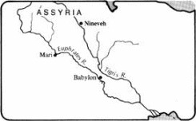

*From International Standard Bible Encyclopedia*

**Nineveh**ninʹə-və [Heb *nîn**e**wēh*; cuneiform *Ninua*,
*Ninuwa*; Gk (LXX, NT) *Nineuē*, (NT) *Nineui*, (Greek and Roman
writers) *Ninos*]; AV also NINEVE (Lk. 11:32); [Gk *Nineuitai*—‘men of
Nineveh’] (Mt. 12:41; Lk. 11:30, 32); AV, NEB, also NINEVITES. An
ancient city of Mesopotamia and capital of Assyria.

I. Etymology
------------

The word appears in the cuneiform sources as *Ninua* and *Ninuwa*. The
latter, which is the older form, is found in the Mari Letters (18th cent
b.c.) and seems to be the origin of the biblical form. Although *Ninuwa*
may be of Hurrian origin, the cuneiform ideogram, composed of the sign
for fish (*ḫa*) in an enclosure, shows that the name was early
associated with the word for “fish” (Akk *nūnu*, Heb *nûn* [*nôn*]), an
obvious allusion to the river-goddess Nina, whose emblem was the fish.

II. Biblical References
-----------------------

Nineveh is first mentioned in the Bible in Gen. 10:11f, which states
that Nimrod, a mighty hunter before the Lord, came from the land of
Shinar (Babylonia) to Assyria and there built “Nineveh, Rehoboth-Ir
[possibly a term describing Nineveh as a “city of wide streets”], and
Calah, and Resen between Nineveh and Calah; that is the great city.”
Although the last phrase is used of Nineveh in Jonah 1:2; 3:3; 4:11, in
this passage it probably refers to Calah, first, because of the word
order of the Hebrew, and second, because Calah (modern Nimrûd)
definitely outranked Nineveh in political importance at the time that
Gen. 10 was probably written down. The statement in Genesis faithfully
reflects the historical fact that Assyria was settled from Babylonia and
that from the beginning it was closely attached, politically and
culturally, to its southern neighbor.

2 K. 19:36 (par Isa. 37:37) simply states that Sennacherib after his
abortive attack on Jerusalem (19:35) returned to Nineveh, which he had
made his capital.

Two contemporary prophets, Zephaniah (2:13–15) and Nahum, told of the
fall of Nineveh (612 b.c.). Nahum’s poem, which is called “an oracle
concerning Nineveh” (Nah. 1:1), depicts in vivid and powerful language
the impending doom of the city that had been the scourge of the earth.
Its enemies are described as delirious with joy at the news of its
crushing defeat (3:19).

In striking contrast with the account in Nahum of Israel’s gloating
vengeance over Nineveh’s downfall is the story in Jonah of Nineveh’s
repentance and deliverance from the wrath of God. In this “missionary
tract,” divine mercy supersedes divine judgment upon Nineveh because the
Ninevites heeded the preaching of God’s messenger Jonah to forsake their
violent and evil ways (3:8) and turn in humble contrition to God. The
puzzling geographical notation that the great city of Nineveh was “three
days’ journey in breadth” (v 3) may refer to the larger environs of the
city known as the “Assyrian Triangle,” which stretched from Khorsabad,
about 23 km (14 mi) NE of Nineveh, to Nimrûd, about 37 km (23 mi) SE of
Nineveh. In Mt. 12:41 (par Lk. 11:30, 32) Jesus declared that the men of
Nineveh to whom Jonah preached would arise at the last judgment and
condemn the generation of Jesus’ time.

III. Location
-------------

The ancient ruins of Nineveh are located a short distance from the east
bank of the Tigris River and opposite the modern city of Mosul, which is
about 350 km (220 mi) NW of Baghdad. A small river, the Khoser, which
traverses the plain from the mountains to the Tigris, flows between the
two main tells, or mounds, of the site — Kuyunjik to the northwest and
Nebi Yûnus to the southeast. The outline of the city walls, which are
about 13 km (8 mi) in circumference and enclose an area of about 730 ha
(1800 acres), can still be traced.

Kuyunjik, the larger of the two tells, covers about 40 ha (100 acres) at
its base and rises abruptly from the level plain to a height of almost
30 m (90 ft). Already a ruin in the time of Xenophon, the mound was
excavated on numerous occasions between 1842 and 1932.

Tell Nebi Yûnus, “the hill of the prophet Jonah,” on the other hand, is
only half as large as Kuyunjik. With the exception of a small sounding
in 1954, it has escaped the archeologists’ spade because it is occupied
by a village, a burial ground, a mosque (formerly a Christian church),
and the traditional tomb of Jonah.

IV. Excavations
---------------

The mighty city with its huge palaces, magnificent temples, and colossal
statuary, was so completely destroyed that the very site was in doubt
until the 19th century. As the prophets had predicted (Zeph. 2:13–15;
Nah. 3:7), Nineveh became “a desolation, a dry waste like a desert,” and
passed into oblivion for 2500 years.

The exploration of the site of Nineveh began in 1820 with C. J. Rich,
Resident of the British East India Company at Baghdad. His excellent
description of the Nineveh ruins included a map of the mounds. Rich was
the first orientalist to arouse European interest in the lost
civilizations of Mesopotamia.

A. H. Layard, the English archeologist and “father of Assyriology,”
discovered the great palace of Sennacherib king of Assyria (705–681
b.c.) in the southern corner of Kuyunjik in 1847. Excavations two years
later revealed that this massive structure had at least seventy-one
rooms, 3010 m (9880 ft) of walls covered with sculptured slabs, and
twenty-seven gateways formed by colossal winged bulls and lion-sphinxes.

After Layard left Mesopotamia H. Rassam, a native Christian, carried on
his work and in 1853 laid bare another great palace in the northern part
of the tell that belonged to the Assyrian king Ashurbanipal (669–633
b.c.). The palace yielded vast treasures of sculpture and other works of
art, and, most spectacular of all, the Royal Library with thousands of
clay tablets (see VII below). The publication of these priceless texts
was begun by G. Smith, an assistant in the British Museum.

Excavations continued sporadically at Kuyunjik after Layard and Rassam
under the direction of E. A. W. Budge (1888–1891), L. W. King (1903),
and R. C. Thompson (1927–1932), who with Hutchinson, Hamilton, and
Mallowan explored the mound more scientifically and excavated the temple
of Nabû.

V. History
----------

Although there is archeological evidence that the site of Nineveh was
occupied as early as 5000 b.c., not until the 3rd millennium b.c. did
signs of its importance as a religious, cultural, and political center
begin to appear. Maništusu, a successor of Sargon I, erected a temple of
Ishtar at Nineveh during the Semitic dynasty of Akkad (ca 2360–2180).
Its many restorations during the next two thousand years of Nineveh’s
history not only attest to the importance of this shrine of the city’s
main deity but also indicate that this may be the oldest building at
Kuyunjik. A beautifully wrought lifesize bronze head, probably
representing Sargon himself, was discovered in a sounding at Nineveh.

By 2000 Nineveh had merchants in an Assyrian colony at Kultepe in
Cappadocia, where a text with the earliest known ideogram for Nineveh
was discovered.

In the Early Assyrian period King Šamši-Adad I (1748–1716) rebuilt the
temple of Ishtar at Nineveh and conquered the rival city of Mari, where
he installed his son Yasmah-Adad as governor. In the correspondence
between the king and his son at Mari the name of Nineveh occurs several
times (ARM, I, 35, 41, etc.). Shortly after the death of Samsi-Adad,
however, Hammurabi king of Babylon subdued Assyria and made it a vassal
state, as the prologue to his famous law code indicates (ANET, p. 165).

In the Middle Assyrian Kingdom (14th–12th cents b.c.) Nineveh was the
palace-city of several kings. Inscriptions discovered on the site show
that Shalmaneser I (1265–1235), Tukulti-Ninurta I (1234–1197), and
Tiglath-pileser I (1118–1078) had palaces at Nineveh, and that the
temple of Ishtar, built a thousand years earlier, had been restored
several times by the kings of this period.

Building inscriptions from both Kuyunjik and Nebi Yûnus and
archeological evidence show that thirteen kings who ruled Assyria from
the middle of the 2nd millennium to the end of the 7th cent b.c. built
palaces in Nineveh. Although Nineveh shared the splendor of other royal
cities of Assyria — Asshur, Nimrûd (Calah), and Khorsabad (Dūr-Šarrukin)
— throughout the centuries, not until the days of Sennacherib (705–681)
did it become the capital of the land and one of the architectural
wonders of the world.

Sennacherib pulled down the old palace and built his new one on a
platform well above the level of the city. The site of the palace at the
southern end of Kuyunjik has been dug extensively, but its full
magnitude has not yet been determined. The remains of its scores of
spacious rooms, large halls and courts, decorated walls with the
sculptured history of Sennacherib’s domestic accomplishments and
military victories, and numerous entrances, guarded by colossal winged
bulls weighing as much as 30 metric tons and by huge lion-sphinxes, give
mute testimony to its majestic splendor. Clay tablets covered the floor
of two palace rooms to a depth of a half-meter; the tablets were part of
the Royal Library, whose main treasures were found in the palace of
Ashurbanipal (669–633). Sennacherib was not exaggerating when he called
his residence “the palace without a rival.”

Sennacherib enlarged and beautified the city with temples, broad
streets, and public gardens. Unique in the Near East were the dimensions
and design of his aqueduct, which by its system of dams brought fresh
water into the city from the mountains to the east. The king also built
massive walls and fortifications around the city for protection against
his enemies. Only Babylon in the ancient world surpassed Sennacherib’s
capital in magnificence and beauty.

After Sennacherib’s death his son Esarhaddon ruled Assyria (681–669).
Nineveh was his capital city also, but he built a new palace on the
mound now known as Nebi Yûnus. Evidence of this structure was discovered
in 1954 in a sounding made by the Director General of Antiquities in
Iraq. Because the site is covered by a village further excavations are
impossible.

Ashurbanipal, “the great and noble Osnappar” of Ezr. 4:10, succeeded his
father Esarhaddon. Besides restoring the temples of Nabû and Ishtar, he
built a new palace on the northern end of Tell Kuyunjik. H. Rassam
excavated the site in 1853–54 and found the massive sculptures
characteristic of Assyrian art and the famous “Lion Hunt” sequence
carved in relief on the walls of the palace. The relief’s realistic
depiction of animals in action has never been excelled (*see* pictures
in Ashurbanipal; Archeology of Mesopotamia. The greatest treasure from
the site was of course the library of Ashurbanipal, which included
thousands of clay tablets dealing with literary, religious, and
historical subjects (see VI below).

In August, 612 b.c., the mighty city of Nineveh fell to the combined
forces of the Babylonians under Nabopolassar and the Medes under
Cyaxares. This date has been firmly established from Babylonian sources
(the Babylonian Chronicle), which give a detailed description of the
campaign against Nineveh: “they marched along the bank of the river
Tigris and … against Nineveh … .they encamped[?] From the month of Sivan
to the month of Ab three *UŠ* [measures … they advanced?] A strong
attack they made against the city, and in the month of Ab, [the … th day
the city was captured …] a great defeat of the chief [people] was made.
On that day Sinšar-iškun, the Assyrian king.… . The great spoil of the
city and temple they carried off and [turned] the city into a ruin-mound
and heaps of debris …” (CCK, pp. 59, 61). The excavations at Kuyunjik
have remarkably corroborated this description of Nineveh’s complete
destruction.

For the next three hundred years the site was not occupied, according to
archeological evidence. Remains from the Seleucid, Roman, and Sassanian
periods found on the tell point to sporadic settlements during these
times. Benjamin of Tudela, a rabbi who visited Jewish communities in the
East in the 12th cent a.d., reported, “Nineveh now lies in utter ruins,
but numerous villages and small towns occupy its former space” (T.
Wright, ed, *Early Travels in Palestine* [1848], p. 94).

VI. Library of Nineveh
----------------------

One of the important buildings in Nineveh was the temple of Nabû on the
northern part of the tell of Kuyunjik, at the southern corner of the
palace of Ashurbanipal. R. C. Thompson discovered it in 1904–1905 and
excavated it more extensively in 1927–28. Its origin is shrouded in
mystery, but inscriptional material indicates that it was restored
during the reigns of Adadnirari III (811–783 b.c.) and Ashurbanipal.

Nabû son of Marduk, the Nebo of Isa. 46:1, was the god of writing who
knew all things. No shrine could have been more appropriate in a city
whose ruins were to yield tens of thousands of clay tablets, numerous
inscribed prisms, and long wall inscriptions. According to the colophons
of several tablets this temple had a library in which the royal writings
were deposited. Unfortunately, except for a few important fragments the
elusive treasure of tablets has never been discovered on this site. It
may lie hidden in some pocket near the temple, or it may have been
dispersed among other sites, or it may even have been destroyed in the
final sack of the city.

Large deposits of clay tablets did turn up in two places on Kuyunjik.
Layard discovered one deposit in 1850 in two chambers of Sennacherib’s
palace, and H. Rassam found the other in 1853 in the palace of
Ashurbanipal. According to R. C. Thompson 26,000 of these tablets have
been cataloged, and most have been published.

Even if not the founder of the Nineveh library, Ashurbanipal was the
real patron of science and learning. He collected the tablets for his
library from places like Borsippa, Babylon, and Nippur, and he himself
could read as well as copy these documents, as the colophon of almost
every important tablet indicates: “Palace of Ashurbanipal, king of the
world, king of Assyria … . The wisdom of Nabû … . I have inscribed upon
tablets … . that I might see them and read them I have placed them
within my palace … . Whosoever shall take (this tablet) away, or shall
write his own name beside my name, may Ashur and Ninlil in wrath and
fury cast him down, and may they blot out his name and seed from the
land.”

The tablets of the library were systematically numbered and cataloged in
series whose headings were the first words of the first tablet of the
series. The uniformity of the script and the accuracy of the texts
suggests that the tablets were copied by a school of scribes, probably
connected with the temple of Nabû.

The contents of the library may be divided into two main categories: the
royal archives, and literary works in general.

**A. Royal Archives**These archives contain letters written by the king,
and others (which are in the majority) written to the king by
sovereigns, princes, and state functionaries on all sorts of matters.
Also found were contracts made with and by the royal house and economic
texts dealing with every phase of palace life.

**B. Literary Texts**The great majority of tablets are literary texts,
which may be divided as follows.

**1. Philological**Since the Assyro-Babylonian language was written in a
script invented much earlier to record Sumerian, a non-Semitic language,
and since many Sumerian literary works had been translated into the
Assyro-Babylonian language, the scribes provided syllabaries, lexicons,
and grammars of both languages for their students. Many of these texts,
which are invaluable for the decipherment of the cuneiform script and
the grammatical study of both these languages, have been found in the
library at Nineveh.

**2. Juridical**These legal texts deal with social practices and points
of law concerning familial relationships, ownership of property,
contractual agreements, etc.

**3. Historical**The Assyrians were distinguished among the nations of
the ancient world for their historical sense. Palace walls were lined
with accounts and reliefs of military campaigns and victories, and
prisms and statuary were inscribed with royal exploits. The annals of
the kings were also written down on clay tablets, many of which were
found in the library.

**4. Religious**The religious texts from Nineveh are of primary
importance for the study of the history of religion in the Near East and
for biblical exegesis in particular. Here were first found the myths of
creation, the Flood, etc., which many scholars think the Hebrews took
over and adapted to their theology, particularly in Gen. 1–11. Also
discovered were the literary patterns of hymns, prayers, lamentations,
and wisdom motifs that were among the models for similar OT genres.
Especially interesting is the way that the Babylonians and Assyrians
adapted the ancient myths of Sumer to their own theological systems by
changing the names of the gods. For instance, the Sumerian deity Enlil,
the creator of the world and father of the gods, became Marduk in
Babylonia and Ashur in Assyria.

Among the myths discovered in the library of Nineveh are the seven
tablets of the Creation story; the twelve tablets of the Gilgamesh Epic,
which deals with the age-old quest of mankind for eternal life and
includes the Babylonian version of the biblical Flood story; the Legend
of Etana, who flew to heaven on an eagle; the Story of Adapa, who
squandered the opportunity for gaining immortality; the Myth of Zu the
bird-god, who stole the Tablets of Destiny; the Descent of Ishtar to the
Netherworld; and the legend of the birth of Sargon of Agade, who like
Moses was saved as a young child by being put into a reed basket on the
Euphrates River from which he was rescued by Akki. For the translation
of these and other myth stories, see ANET, pp. 60–119, 501–518.

Also included among the religious tablets are the omen texts, which
describe animal organs, especially the liver, and the movements of birds
and heavenly bodies; incantation or magical texts used against demons
and sicknesses of all kinds; ritual texts; and hymns, prayers, laments,
and oracles for kings in times of trouble. A large corpus of wisdom
literature includes proverbs, popular tales, and the story of the
righteous sufferer, somewhat like Job in the OT.

**5. Scientific**The five hundred tablets dealing with medicine indicate
that it was an advanced science in Assyria. Diseases of all kinds are
carefully described, and the prescriptions for their cure include some
five hundred drugs. There are texts on botany, geology, chemistry,
mathematics, and astronomy, as well as an invaluable treatise on the
components of glass and the glazes for pottery.

The clay tablets from the library of Nineveh are not only the foundation
of the science of Assyriology but also the clue to the intellectual and
spiritual life of one of the greatest civilizations of the ancient Near
East.

