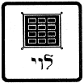
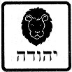
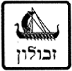
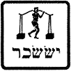
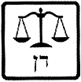
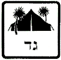
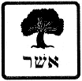
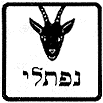
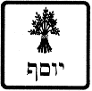
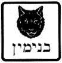

A topical study guide, as taught by Pastor Robert L. Bolender  
Austin Bible Church, 1998.

All these are the twelve tribes of Israel, and this is what their father
said to them when he blessed them. He blessed them, every one with the
blessing appropriate to him (Gen. 49:28). The writer of Hebrews reminds
us, “By faith Jacob, when he was dying” (Heb. 11:21a). The blessings
bestowed upon his children then, in Gen. 49, were given in the power of
the Holy Spirit and as direct revelation from God.

## Reuben ##

1. The first-born son of Jacob by his wife Leah (Gen. 29:31-32).

2. Was the youth who provided mandrakes for Leah (Gen. 30:14).

3. Committed adultery with Bilhah (Gen.35:22).

4. Argued against the death of Joseph (Gen. 37:21-29).

5. And the sons of Reuben: Hanoch and Pallu and Hezron and Carmi (Gen.
46:9).

6. Laments the death of Joseph (Gen. 42:22).

7. Makes a rash vow in a human-effort attempt to please Jacob (Gen.
42:37).

“Reuben, you are my first-born; My might and the beginning of my
strength, Preeminent in dignity and preeminent in power. “Uncontrolled
as water, you shall not have preeminence, Because you went up to your
father’s bed; Then you defiled it—he went up to my couch.

1. He is uncontrolled as water. This is the descriptive prophecy which
will be fulfilled in the Tribe of Reuben.

2. zj’P’ pachaz \#6349: *recklessness, wantonness, unbridled
license, frothiness* (used only here, Gen. 49:4). zj’P; pachaz
\#6348: *to be wanton, be reckless, be frothy* (Judg. 9:4;
Zeph. 3:4).

3. Two examples of these reckless descendants were Dathan and Abiram
(Num. 16), who joined with the rebellion of Korah the Levite against
Moses and Aaron.

4. The reckless Reubenites desired to remain outside of the land of
Canaan (Num. 32).

5. The wanton Reubenites were unwilling to join the struggle against
Sicera (Judg. 5:15,16).

6. Reuben never excelled in his tribal development.

a. At the beginning census (Num. 1:20), Reuben numbered 46,500.

b. In the later census (Num. 26:7), Reuben numbered 43,730.

c. By the time Moses blessed the tribes before he died, Reuben may have
been in danger of extinction, since Moses prayed, “Let Reuben live, and
not die; and let not his men be few” (Dt. 33:6).

7. Reuben produced not one single prophet, military leader, judge or
important person in the history of Israel. As a matter of fact, the most
impressive contribution made by Reuben seems to be the lending his name
to a delicious corned beef and sauerkraut sandwich![^1]

Two lessons loom large from the example of Jacob’s firstborn. The first
lesson is that long-range tragic effects can result from a fleeting act
of sin. Reuben’s few moments of unbridled passion with Bilhah were not
worth the sorrow caused to Jacob and eventually to Reuben himself. A
wise man once said, “Don’t sacrifice the permanent on the altar of the
immediate.” There are men in prison and girls in shame who learned that
lesson too late and are experiencing the permanent damage that often
results from an immediate gratification of lust.

The second lesson follows: Our sins can be forgiven, but the effects of
our sins often must still be experienced. Jewish tradition alleges that
Reuben eventually repented of his sin with Bilhah. This may have been
so, since he later saved Joseph’s life from the murderous plot of the
other jealous brothers (Gen. 37:20–30). This was not enough, however, to
remove the scar of the earlier wound, even though that wound may have
healed. “But whoso commits adultery with a woman lacks understanding; he
that doeth it destroys his own soul. A wound and dishonor shall he get;
and his reproach shall not be wiped away” (Prov. 6:32–33).

## Simeon ##

1. The second son of Jacob by his wife Leah (Gen 29:33).

2. Together with Levi, and eventually their other full brothers, exacted
revenge upon Shechem for the rape of their sister, Dinah (Gen.
34:24-31).

3. And the sons of Simeon: Jemuel (also called Nemuel) and Jamin and
Ohad and Jachin (also called Jarib) and Zohar (also called Zerah) and
Shaul the son of a Canaanite woman (Gen. 46:10).

4. Selected to remain in Egypt as a hostage in Joseph’s jail (Gen.
42:24).

## Levi ##

1. The third son of Jacob by his wife Leah (Gen 29:34).

2. Together with Simeon, and eventually their other full brothers,
exacted revenge upon Shechem for the rape of their sister, Dinah (Gen.
34:24-31).

3. And the sons of Levi: Gershon (also called Gershom), Kohath, and
Merari (Gen.46:11).

“Simeon and Levi are brothers; Their swords are implements of violence.
“Let my soul not enter into their council; Let not my glory be united
with their assembly; Because in their anger they slew men, And in their
self-will they lamed oxen. “Cursed be their anger, for it is fierce; And
their wrath, for it is cruel. I will disperse them in Jacob, And scatter
them in Israel.

1. They will be dispersed and scattered in Israel. This is the core of
the prophecy against Simeon and Levi.

2. µqeL]j’a} ’achalleqem \<piel.imperf.\> ql’j;
chalaq \#2505: (piel) *to divide, apportion, assign,
distribute, scatter*. Used 65x64vv. Abraham divided his armies (Gen.
14:15). \<Hifil.imperf.\> ÅWP puwts \#6327: (hifil) *to
scatter*.

3. The territory that Simeon would be allotted *entirely within* the
territory allotted to Judah (Josh. 19:1-9 cp. Josh. 15).

4. The tribe of Levi would have no specific territory, but would have
individual cities scattered all throughout the land of Israel (Josh.
21).

5. Like Reuben, the tribe of Simeon decreased in population between the
two censuses. In Numbers 1:23 their adult male population is recorded as
59,300, while in Numbers 26:14 (nearly forty years later) it is 22,200.

6. One of the only Simeonites that Scriptures record is Zimri, son of
Salu (Num. 25:14).

7. It is possible that the tribe of Simeon was the predominant tribe
involved in the idolatry of Baal-peor, and that they were the
predominant victims of the Divine plague (Num. 25:9).

8. During the reign of Hezekiah, a large group of Simeonites migrated
farther south to the land of Edom, where they conquered and displaced
the Amalekites who dwelt there (1 Chr. 4:38–43).

9. Certain later references suggest the possibility that many Simeonites
had also migrated to the northern kingdom, for they are mentioned in
conjunction with the tribes of Ephraim and Manasseh (2 Chr. 15:9; 34:6).

10. Jewish interpreters have taken notice of the history of Simeon. In
Jewish tradition, all poor Jews supposedly came from that ill-fated
tribe.

11. Levi would be scattered, and yet they are the objects of special
blessing! In the blessing of Moses (Dt. 33), the tribe of Simeon is not
mentioned. The tribe of Levi receives the longest blessing!
(Dt. 33:8-11).

12. The tribe of Levi seems to have been the one spiritual tribe at the
golden calf incident (Ex. 32:26). This is generally believed to be the
reason why Levi was set aside as the priestly tribe (Ex. 32:29;
Dt. 10:8,9).

Certainly Simeon and Levi were zealous, but their zeal was not channeled
into godly paths. Zeal in itself is not sufficient, even in the Lord’s
work. There are those who think that activity, devotion, commitment and
sincerity are the only necessities in serving the Lord. Such zeal,
however, can be misdirected. We must remember Paul’s earnest remark
about his Jewish kinsmen according to the flesh, “Brethren, my heart’s
desire and prayer to God for Israel is, that they might be saved. For I
bear them witness that they have a zeal for God, but not according to
knowledge” (Rom. 10:1–2).

## Judah ##

1. The fourth son of Jacob by his wife Leah (Gen 29:35).

2. Convinced his brothers to sell Joseph into slavery (Gen. 37:26,27).

3. Married a Canaanite, a daughter of Shuah of Adullam (Gen. 38:2).

4. And the sons of Judah: Er and Onan and Shelah and Perez and Zerah
(but Er and Onan died in the land of Canaan). And the sons of Perez were
Hezron and Hamul (Gen. 46:12).

5. Exhibited Godly leadership in the face of testing (Gen. 43:8-10).

6. Offered himself as a substitute for the punishment of Benjamin (Gen.
44:18-34).

7. Demonstrates leadership within the twelve tribes prior to the death
of Israel (Gen.46:28).

“Judah, your brothers shall praise you; Your hand shall be on the neck
of your enemies; Your father’s sons shall bow down to you. “Judah is a
lion’s whelp; From the prey, my son, you have gone up. He couches, he
lies down as a lion, And as a lion, who dares rouse him up? “The scepter
shall not depart from Judah, Nor the ruler’s staff from between his
feet, Until Shiloh comes, And to him *shall be*the obedience of the
peoples. “He ties *his*foal to the vine, And his donkey’s colt to the
choice vine; He washes his garments in wine, And his robes in the blood
of grapes. “His eyes are dull from wine, And his teeth white from milk.

1. They will have authority over their fellow tribes. This is the core
of the prophetic message to Judah.

a. Judah would take the lead during their wilderness marches (Num.
10:14).

b. In the allotments of land within Canaan, Judah received his portion
first (Josh. 15:1).

c. Judah had the largest population in each of the two censuses (Num. 1
& 26), 74,600 and 76,500.

2. Judah will have great military victories.

a. King David was of the tribe of Judah and achieved Israel’s greatest
conquests (2nd Sam. 8). He fulfilled the prophecy concerning
the hand of Judah on the necks of his enemies (2nd Sam.
22:41; Ps. 18:40).

b. King Solomon extended David’s territory to the greatest extent Israel
has ever achieved (1st Kings 4:20-25).

3. Judah will produce a line of kings.

a. The Lord anticipated the desire of Israel to have a king over them
(Dt. 17:14-20).

b. Israel’s first king, by human choice was of the tribe of Benjamin
(1st Sam. 9:1,2).

c. Israel’s second king, and the first by Divine choice was of the tribe
of Judah (1st Sam. 16:1-3).

d. The succession of twenty kings in the northern kingdom of Israel
(Jeroboam to Hoshea, 930-721BC) were all illegitimate, as they did not
descend from the tribe of Judah, and the family of David.

e. The succession of kings in the southern kingdom of Israel is the
legitimate line of succession.

1) They descend from David.

2) They consist of the line of Jesus Christ.

4. “Shiloh” is promised to Judah. What is Shiloh?

a. A town in Israel.

1) The town of Shiloh was the place where the Israelites set up the
Tabernacle after the conquest (Josh. 18:1).

2) It was the center of Israelite worship until the days of Samuel (1
Sam. 1:3).

3) The most recent Jewish translation of the Scriptures entitled The
Tanakh states that a literal translation of this verse is “until he
comes to Shiloh.” This interpretation is a reflection of the desire to
prevent this verse from referring to the Messiah. It has no basis in the
text itself.

b. “To whom it belongs” /lyvi

1) This interpretation presents a reference to the Messiah to whom the
scepter belongs.

2) Ezek. 21:27 is used as supporting textual evidence for this position.

3) This was the LXX interpretation. This is also the NIV rendering.

4) Unfortunately, this translation of Shiloh requires one consonental
change in order to be accurate. We cannot alter the text to agree with
the interpretation we’re trying to reach!

c. A proper name for the Messiah.

1) The Talmud lists “Shiloh” as one of the names of Messiah (Sanhedrin
98b).

2) The most ancient Jewish commentary on the Book of Genesis also adopts
this interpretation (Bereshit Rabba 99).

3) The name “Shiloh” easily could be related to the word Shalom, the
Hebrew word for *peace*.

a) This would agree with His name, Prince of Peace (Isa. 9:6).

b) This would also be in agreement with the Messianic passage in Mic.
5:5.

4) This is the sixth (out of seven) specification concerning the Christ
in Scripture.

a) Seed of the woman (Gen. 3:15).

b) Descendent of Shem (Gen. 9:26).

c) Descendant of Abraham (Gen. 12:3).

d) Descendant of Isaac (Gen. 21:12).

e) Descendant of Jacob (Gen. 25:23).

f) Descendant of Judah (Gen. 49:10).

g) Descendant of David (2nd Sam. 7:12-16).

5. Shiloh is promised

a. Obedience of the people.

b. Grapevines so abundant, they’ll be used for hitching posts.

c. Wine will be as abundant as wash-water.

d. Wine and milk will be abundant for perfect celebration and perfect
health.

e. The Millennium is in view (Isa. 61:6-7; 65:21-25; Zech. 3:10).

6. Prominent Judahites

a. Caleb (Num. 13:6).

b. Achan (Josh. 7:18).

c. Othniel, the first Judge of Israel (nephew of Caleb) (Judg. 3:9).

d. Boaz (Ruth 2:1).

7. Why was Judah selected to receive the birthright? Was he perfect? Of
course not (Gen. 38). Judah was selected by the Sovereignty of God, and
received the birthright by grace alone.

The lesson of Judah is the message of grace. Although Judah certainly
was not perfect, he saw the error of his ways, and moved on in the plan
of God. Judah illustrates the believer who accepts the responsibility of
leadership as designated by God.

Judah illustrates for us the importance of accepting the responsibility
that God delegates. Judah illustrates for us the burden to wait for
Shiloh, Who is to come.

## Zebulun ##

1. The tenth son of Jacob, and the sixth son by his wife Leah (Gen.
30:19,20).

2. And the sons of Zebulun: Sered and Elon and Jahleel (Gen. 46:14).
These are the sons of Leah, whom she bore to Jacob in Paddan-aram, with
his daughter Dinah; all his sons and his daughters
*numbered*thirty-three (Gen. 46:15).

3. Zebulun has no significant mention in Genesis apart from the group
functions he participates in with his brothers.

“Zebulun shall dwell at the seashore; And he *shall be*a haven for
ships, And his flank *shall be*toward Sidon.

1. Zebulun shall dwell at the seashore (lit. *near the seas* (pl)). The
first aspect of Jacob’s prophecy concerning Zebulun detailed the portion
of his inheritance in the land of Canaan.

2. The territory alloted to Zebulun under the distribution of the land
by Joshua was in the northwest corner of Canaan, between the
Mediterranean Sea and the Sea of Galilee (Josh. 19:10-16).

3. Zebulun was traversed by one of the great trading routes of
antiquity, the Via Maris (*way of the sea*). This caravan route reached
from Damascus in the northeast to Egypt in the southwest. Thus, lying
between two seas and on a trade route, Zebulun was heavily involved in
commercial ventures (Dt. 33:19).

4. The second element of Jacob’s prophecy is that their border shall be
towards Sidon.

a. Zebulun’s territory was separated from Sidon by the tribe of Asher
(Josh. 19:24–31).

b. Asher, however, was never able to dislodge the Canaanites who dwelt
in that coastal area north of Mount Carmel and Haifa Bay (Judg.
1:31,32).

5. One notable Zebulunite in Scripture was Elon the Zebulunite, who
judged Israel ten years (Judg. 12:11,12).

6. Zebulun is praised in the Song of Deborah (Judg. 5:18). They despised
their lives even unto death.

7. Zebulun is noted for being single-minded, or pure of heart
(1st Chr. 12:33).

This testimony of the Zebulunites’ bravery and willingness to risk their
own lives for God’s cause serves as a stirring example to today’s
soldiers for Christ. A New Testament parallel is found in that noble
word of commendation for Paul and Barnabas issued by the Jerusalem
church: “Men that have hazarded their lives for the name of our Lord
Jesus Christ” (Acts 15:26). The trail of those saints willing to
sacrifice their lives for the Lord reaches from notables of the early
Church, such as Stephen and Justin Martyr, through such modern martyrs
as the Auca missionaries and others who suffered the ultimate human
sacrifice because of their willingness to lay down their lives for the
gospel.

Singleness of heart and mind enabled Zebulun to be stable and
successful. They kept rank and did not flee the battle because their
attitude was the same as that of the Apostle Paul: “but this one thing I
do” (Phil. 3:13). A divided heart and mind produce instability: “A
double-minded man is unstable in all his ways” (Jas. 1:8). This is the
great lesson from Zebulun: courage to face the conflict due to an
unswerving commitment to the goal.

## Issachar ##

1. The ninth son of Jacob, and fifth son by his wife Leah (Gen. 30:18).

2. And the sons of Issachar: Tola and Puvvah (also called Puvah and
Puah) and Iob (also called Jashub) and Shimron (Gen. 46:13).

3. Issachar has no significant mention in Genesis apart from the group
functions he participates in with his brothers.

4. Jewish tradition held that Issachar was a student of the Torah, while
his younger brother Zebulun toiled as a merchant to support Issachar in
his studies. Although there is no scriptural foundation for this
tradition, the rabbis based it on Moses’ blessing in Deuteronomy 33:18:
“And of Zebulun he said, Rejoice, Zebulun, in thy going out [i.e.,
trading]; and, Issachar, in thy tents [i.e., studying].”

“Issachar is a strong donkey, Lying down between the sheepfolds. “When
he saw that a resting place was good And that the land was pleasant, He
bowed his shoulder to bear *burdens*, And became a slave at forced
labor.

1. The primary prophecy concerning Issachar centered on his being a
strong donkey. This is complimentary—not insulting.

2. The donkey was the primary beast of burden in the ancient world (Dt.
5:14; 22:10; 2 Sam. 19:26). It would even be a donkey’s blessing to bear
the Messiah (Zech. 9:9; Matt. 21:7).

3. The expression “lying down between the saddlebags” is indicative of
Issachar’s geographical allotment in the land of Canaan (Josh.
19:17-22). Issachar was assigned the land at the east end of the Jezreel
valley, between Mt. Tabor and Mt. Gilboa.

4. The prophecy stating “He bowed his shoulder to bear *burdens*, And
became a slave at forced labor” again is complimentary and not
insulting.

5. Tola, of Issachar, judged Israel for 23 years (Judg. 10:1,2).

6. Issachar is praised in the Song of Deborah (Judg. 5:15).

7. Issachar is described as “valiant” (1st Chr. 7:1-5).

8. The Tribe of Issachar were dispensationalists (1st Chr.
12:32).

Rather than criticizing Issachar, as some commentators are prone to do,
Jacob portrayed him as having insight and as one who carried the burdens
of others. These traits are sorely lacking and desperately needed in
God’s people today. The apostle reminds us, “Bear ye one another’s
burdens, and so fulfill the law of Christ” (Gal. 6:2). Dear reader, are
you a burden creator for others or a burden bearer? Do you help to
shoulder the heavy burdens under which some of God’s children labor, or
do you add additional burdens to already weary shoulders? God, grant us
a host of Zebuluns and Issachars in our midst—men and women who are
committed to the work and who care for the workers!

## Dan ##

1. The fifth son of Jacob, and first-born son by his concubine Bilhah
(Gen. 30:6).

2. And the sons of Dan: Hushim (also called Shuham) (Gen. 46:23).

3. Dan has no significant mention in Genesis apart from the group
functions he participates in with his brothers.

“Dan shall judge his people, As one of the tribes of Israel. “Dan shall
be a serpent in the way, A horned snake in the path, That bites the
horse’s heels, So that his rider falls backward. “For Thy salvation I
wait, O Lord.

1. Dan shall judge. This is direct application of the meaning of his
name (Gen. 30:6).

2. One of the greatest Judges in the history of Israel would be from the
tribe of Dan—Sampson (Judg. 13:2).

3. Dan shall judge as one of the tribes of Israel.

fb,ve shebet \#7626: AV - tribe 140, rod 34, sceptre 10,
staff 2, misc 4; 190

4. The serpent reference in the prophecy concerning Dan indicates that
the tribe of Dan would be involved in Satanic activity.

a. The tribe’s idolatry and substitute priesthood (Judg. 18).

1) They were dissatisfied with their God-given portion of land.

2) They conquered another land by human effort (Judg. 18:27,28).

3) They established their own religious center (Judg. 18:17-20,30-31)

4) This religious center would later serve the purposes of Jeroboam
(1st Kgs. 12:28-30).

b. It is highly likely that the False Prophet (Rev. 13:11) will be from
the tribe of Dan.

5. In the twenty different listings of the tribes, Dan is generally far
down and often is the last in the list.

a. Dan was the rear guard in the wilderness march (Num. 10:25).

b. Dan received his allotment of land last (Josh. 19:47-49).

c. Dan is entirely absent from the extensive tribal genealogies
(1st Chr. 2-10).

d. Dan is absent from the 144,000 Jews sealed in the Tribulation (Rev.
7:4-8).

e. Dan does, however, receive a tribal inheritance in the Millennial
kingdom (Ezek. 48:1-2).

6. Jacob concludes his prophecy with the prayer for Dan’s salvation
(Gen. 49:18).

## Gad ##

1. The seventh son of Jacob, and the first-born son by his concubine Zilpah
(Gen. 30:11).

2. And the sons of Gad: Ziphion (also called Zephon) and Haggi, Shuni
and Ezbon (also called Ozni), Eri and Arodi (also called Arod) and Areli
(Gen. 46:16).

3. Gad has no significant mention in Genesis apart from the group
functions he participates in with his brothers.

“As for Gad, raiders shall raid him, But he shall raid *at*their heels.

bqe[; dg¬y: aWhwÒ WNd,WgyÒ dWdGÒ dG:

1. This prophecy is the one which most plays on the person’s name. Three
of the six words in this verse stem from the root name for Gad.

2. The theme of the prophecy for God centers on the raiders he would
encounter.

3. Gad’s inheritance on the east side of the Jordan, exposed him to
raiders from Ammon and Moab.

4. Gad provided some of David’s fiercest warriors (1st Chr.
12:8).

5. Moses would also make reference to the warlike future of Gad (Dt.
33:20).

6. Jair, a Gadite, judges Israel 22 years (Judg. 10:3-5), as was
Jephthah the Gileadite (Judg. 11:1).

7. Elijah the prophet was also of Gad (1st Kings 17:1).

Though little is mentioned of the tribe of Gad in the Bible, the lessons
to be learned from them are many. Gad graduated from the proverbial
school of hard knocks. His difficult experiences produced a toughness
that only hard times can bring. The spiritual lesson gleaned from Gad is
that in the furnace of affliction we are prepared to come forth as gold.
Some of the most profitable lessons about suffering and adversity are
learned, not in the classroom, but by undergoing the experience of
suffering itself. The psalmist testifies, “It is good for me that I have
been afflicted, that I might learn thy statutes” (Ps. 119:71).

Furthermore, Gad’s constant readiness teaches us of the spiritual
preparedness necessary to face the spiritual foe. Gad, much like his
modern Israeli descendants, was constantly ready to face hostile
neighbors. Peter reminds us of a similar danger that continually lurks
around us: “Be sober, be vigilant, because your adversary, the devil,
like a roaring lion walketh about, seeking whom he may devour” (1 Pet.
5:8). Believers never can afford to be without the armor God has
provided lest we be caught off guard by one of Satan’s fiery darts (cf.
Eph. 6:10–17).

Finally, the promise to Gad is that “he shall overcome at the last”
(Gen. 49:19b). The seven churches of The Revelation each received a
promise to the overcomer (Rev. 2:7, 11, 17, 26; 3:5, 12, 21). The
overcomer is defined by John as follows: “For whatever is born of God
overcomes the world; and this is the victory that overcomes the world,
even our faith. Who is he that overcomes the world, but he that
believeth that Jesus is the Son of God?” (1 Jn. 5:4–5). Whatever trials
are faced by believers, we can rest assured that “in all these things we
are more than conquerors through him that loved us” (Rom. 8:37).

## Asher ##

1. The eighth son of Jacob, and the second son by his concubine Zilpah
(Gen. 30:12,13).

2. And the sons of Asher: Imnah and Ishvah and Ishvi and Beriah and
their sister Serah. And the sons of Beriah: Heber and Malchiel (Gen.
46:17). These are the sons of Zilpah, whom Laban gave to his daughter
Leah; and she bore to Jacob these sixteen persons (Gen. 46:18).

3. Asher has no significant mention in Genesis apart from the group
functions he participates in with his brothers.

“As for Asher, his food shall be rich, And he shall yield royal
dainties.

1. The main point of the prophecy concerning Asher centered on the
richness of his food.

2. Asher never developed militarily, and could not dislodge the
Canaanites from the territory allotted to them (Judg. 1:31,32).

3. Asher produced no Judges, or military heros. The only significant
Asherite in Scripture is Anna the Prophetess who greeted Christ in the
temple (Lk. 2:36-38).

4. The word for “rich” is the feminine form of the word for oil. ÷m,v,
shemen \#8081: *fat, oil*. The oil of Asher was, and
continues to be famous throughout Israel. Moses’ prophecy concerning
Asher also made reference to the tribe’s olive oil (Dt. 33:24).

The lesson of this prophecy is that Asher will be blessed with an
abundance which he will share with others. The Apostle Paul expressed it
this way: “Let him that stole steal no more but, rather, let him labor,
working with his hands the thing which is good, that he may have to give
to him that needeth” (Eph. 4:28). We are to share with others that with
which God has blessed us, not hoard it for ourselves (Lk. 16:9–12; 1
Tim. 6:16–18). Furthermore, the fruitfulness of Asher is associated with
oil, which is often a scriptural symbol of the Holy Spirit. In a similar
way, believers today are to bear fruit—the fruit of the Holy Spirit
(Gal. 5:22–23).

## Naphtali ##

1. The sixth son of Jacob, and the second son by his concubine Bilhah
(Gen. 30:7,8).

2. And the sons of Naphtali: Jahzeel and Guni and Jezer and Shillem
(Gen. 46:24). These are the sons of Bilhah, whom Laban gave to his
daughter Rachel, and she bore these to Jacob; *there were*seven persons
in all (Gen. 46:25).

“Naphtali is a doe let loose, He gives beautiful words.

1. Jewish tradition holds that Naphtali, the son of Jacob was a very
swift runner. He supposedly ran all the way from Egypt to Canaan
carrying the news to the elderly Israel that his son Joseph was still
alive.

2. The swift doe, with beautiful words has one fulfillment in Deborah
and Barak (Judg. 4:6; 5:1-31). Barak was of the tribe of Naphtali.
Naphtali was a tribe that was swift to run to the battle against Sisera
(Judg. 5:18).

3. The swift doe, with beautiful words has another, greater fulfillment
in the disciples of Christ. Jesus Christ summoned his twelve disciples,
and began their training in the region of Naphtali (Matt. 4:13‑15).
Their feet, who preached good news, are pronounced “blessed” (Rom.
10:15).

The feet of the hind are swift. The Book of Romans speaks about two
different types of feet. Romans 3:15 condemns the feet that “are swift
to shed blood;” while, on the other hand, Romans 10:15 commends those
who preach the gospel with these words: “How beautiful are the feet of
them that preach the gospel of peace, and bring glad tidings of good
things!” What a contrast, and what a lesson to those of us who are
followers of Jesus. Are our feet as swift to tell someone about the
gospel as they are to share some damaging gossip?

## Joseph ##

1. The eleventh son of Jacob, and first-born son by his wife Rachel
(Gen. 30:24).

2. Now to Joseph in the land of Egypt were born Manasseh and Ephraim,
whom Asenath, the daughter of Potiphera, priest of On, bore to him (Gen.
46:20).

3. Joseph was the spiritual assistant to Israel (Gen. 37:2,3,13,14).

4. Joseph was sold into slavery in Egypt (Gen. 37:28; 39:1).

5. Joseph was imprisoned in the royal prison (Gen. 39:20).

6. Joseph was freed and exalted to royalty (Gen. 41:38-40).

7. Joseph was given a wife from Egyptian nobility (Gen. 41:45).

8. Joseph provided for his father, and family in Egypt (Gen. 47:1-12).

9. Joseph died at the age of 110, and was buried as an Egyptian monarch
(Gen. 50:26).

“Joseph is a fruitful bough, A fruitful bough by a spring; Its branches
run over a wall. “The archers bitterly attacked him, And shot at him and
harassed him; But his bow remained firm, And his arms were agile, From
the hands of the Mighty One of Jacob (From there is the Shepherd, the
Stone of Israel), From the God of your father who helps you, And by the
Almighty who blesses you With blessings of heaven above, Blessings of
the deep that lies beneath, Blessings of the breasts and of the womb.
“The blessings of your father Have surpassed the blessings of my
ancestors Up to the utmost bound of the everlasting hills; May they be
on the head of Joseph, And on the crown of the head of the one
distinguished among his brothers.

1. Joseph’s fruitfulness has already been exhibited in God’s blessing of
his life, and the naming of Ephraim (Gen. 41:52).

2. Joseph’s future fruitfulness is seen by the booming populations of
the tribes of Manasseh and Ephraim. In Numbers 1, the total population
of Ephraim and Manasseh (i.e., the *tribe* of Joseph) is 75,900,
compared to the 74,600 of the next largest tribe, Judah. In Numbers 26,
their total population was 85,200 while Judah’s was 76,500. Jacob
prophesied that the tribes of Ephraim and Manasseh would “grow into a
multitude in the midst of the earth” (Gen. 48:16).

3. The promise of blessings is seen in both tribes of Ephraim and
Manasseh.

a. Manasseh had the largest territory of any tribe, and extended its
boundaries on either side of the Jordan river.

b. Ephraim became so prominent, that in many of the later prophets, the
northern ten tribes of Israel are referred to as Ephraim (Hos. 11:3;
12:1; Jer. 31:9,20).

After meditating on the faithful life and fruitfulness of Joseph, one
final lesson emerges. Joseph is a convincing example of the truth stated
in 1 Peter 5:6: “Humble yourselves, therefore, under the mighty hand of
God, that he may exalt you in due time.” Humanly speaking, it must have
been extremely difficult to wait for God’s timing after having been
unjustly sold as a slave, unjustly imprisoned for remaining pure and
unjustly forgotten by an acquaintance whom he had helped. Most of us
would have cried out, Why me? Yet, Joseph waited on God during his
trials without seeking either revenge or advancement. Finally, in His
timing, God exalted His faithful servant and lifted him to a place of
honor where he could be a blessing to others.

Our responsibility is not to be ambitious and self-seeking. It is to be
faithful. His job is to hand out the promotions. Joseph faithfully
waited in prison before he was lifted to the throne. Elijah faithfully
waited at Cherith before he triumphed at Carmel. Moses faithfully
labored in Median before he challenged the power of Egypt. Jesus
faithfully carried the cross before He wore the crown.

This is a principle of spiritual growth—“thou hast been faithful over a
few things, I will make thee ruler over many things” (Mt. 25:21,23).

May this great lesson of Joseph’s faithfulness in trial not be lost on
our impatient and ambitious egos!

## Benjamin ##

1. The twelfth son of Jacob, and second son by his wife Rachel (Gen.
35:18).

2. And the sons of Benjamin: Bela and Becher and Ashbel, Gera and
Naaman, Ehi (also called Ahiram) and Rosh, Muppim (also called
Shephupham and Shuppim) and Huppim (also called Hupham) and Ard (Gen.
46:21). These are the sons of Rachel, who were born to Jacob; *there
were*fourteen persons in all (Gen. 46:22).

3. Benjamin was the son of Jacob that Joseph desired to keep with him in
Egypt, and so had the silver cup planted within his bags (Gen. 44:2ff.).

“Benjamin is a ravenous wolf; In the morning he devours the prey, And in
the evening he divides the spoil.”

1. The central theme of Jacob’s prophecy concerning Benjamin is his
vicious, warlike nature.

2. The first prominent example of a vicious Benjamite is Ehud (Judg.
3:12-30).

3. The next prominent example of vicious Benjamites is the tragedy of
the Levite concubine (Judg. 19; 20:21,25).

4. The next prominent example of a vicious Benjamite is Saul, son of
Kish, King of Israel (1st Sam. 9:21; 11:1-11; 14:47b.).

5. Saul’s son, Jonathan is another vicious wolf of a Benjamite
(1st Sam. 14).

6. Esther and Mordecai were also vicious wolves of Benjamin who faught
for their people (Est. 2:5).

7. The greatest vicious wolf of Benjamin in all of Scripture was Saul of
Tarsus (Rom. 11:1; Phil. 3:5; Gal. 1:13; Acts 8:3; 9:1,2; 22:4;
26:9-10).

Matthew Henry has written graphically, “Blessed Paul was of this tribe
and he did, in the morning of his day, devour the prey as a persecutor,
but in the evening he divided the spoil as a preacher.”

God can mold and utilize any temperament—whether it be phlegmatic,
choleric, sanguine or melancholy—when that person has surrendered
completely to the Lord. God transformed the Benjamite Paul, not by
drastically altering his temperament, but by refining and rechanneling
his misguided zeal into a God-honoring direction.

Let us determine in our hearts to be clay in the Potter’s hand, willing
to be molded for His purposes. May God grant us a host of Benjamins who
will tear in pieces the armies of darkness!

All the persons belonging to Jacob, who came to Egypt, his direct
descendants, not including the wives of Jacob’s sons, *were*sixty-six
persons in all, All the persons of the house of Jacob, who came to
Egypt, *were*seventy (Gen. 46:27).

In verse 26 the number of descendants is said to be **66,** whereas the
number in verse 27 is **70.** The first number represents those who
traveled with Jacob to Egypt, and the second number includes the
children and grandchildren already in Egypt. The following tabulation
shows how these two figures are determined:[^2]

<table class="table">
<tbody>
<tr class="odd">
<td align="left">
Leah’s children and grandchildren (v. 15)
</td>
<td align="left">
33
</td>
</tr>
<tr class="even">
<td align="left">
Zilpah’s children and grandchildren (v. 18)
</td>
<td align="left">
16
</td>
</tr>
<tr class="odd">
<td align="left">
Rachel’s children and grandchildren (v. 22)
</td>
<td align="left">
14
</td>
</tr>
<tr class="even">
<td align="left">
Bilhah’s children and grandchildren (v. 25)
</td>
<td align="left">
7
</td>
</tr>
<tr class="odd">
<td align="left">
 
</td>
<td align="left">
<strong>70</strong>
</td>
</tr>
<tr class="even">
<td align="left">
Dinah (v. 15)
</td>
<td align="left">
+1
</td>
</tr>
<tr class="odd">
<td align="left">
 
</td>
<td align="left">
<strong>71</strong>
</td>
</tr>
<tr class="even">
<td align="left">
Er and Onan (who died in Canaan; v. 12);
</td>
<td align="left">
-2
</td>
</tr>
<tr class="odd">
<td align="left">
Joseph and his two sons, already in Egypt (v. 20)
</td>
<td align="left">
-3
</td>
</tr>
<tr class="even">
<td align="left">
Those who went to Egypt with Jacob (v. 26)
</td>
<td align="left">
<strong>66</strong>
</td>
</tr>
<tr class="odd">
<td align="left">
Joseph, Manasseh, Ephraim, Jacob (v. 27)
</td>
<td align="left">
+4
</td>
</tr>
<tr class="even">
<td align="left">
Jacob and his progeny in Egypt (v. 27)
</td>
<td align="left">
<strong>70</strong>
</td>
</tr>
</tbody>
</table>

The significance of these names, though, must be understood in the
context of Num. 26, as being the sons (Tribes) of Israel, and grandsons
(Families) of Israel which would be significant in the early history of
the Nation of Israel.

[^1]: Varner, William, Jacob’s dozen: a prophetic look at
the tribes of Israel, © 1987, The Friends of Israel Gospel Ministry,
inc. All of the shaded paragraphs in this study guide are direct
quotations from Varner. The icon graphics for each tribe are likewise
from Varner’s work.

[^2]: Tabulation taken from The Bible Knowledge
Commentary : an exposition of the scriptures / by Dallas Seminary
faculty ; editors, John F. Walvoord, Roy B. Zuck.

